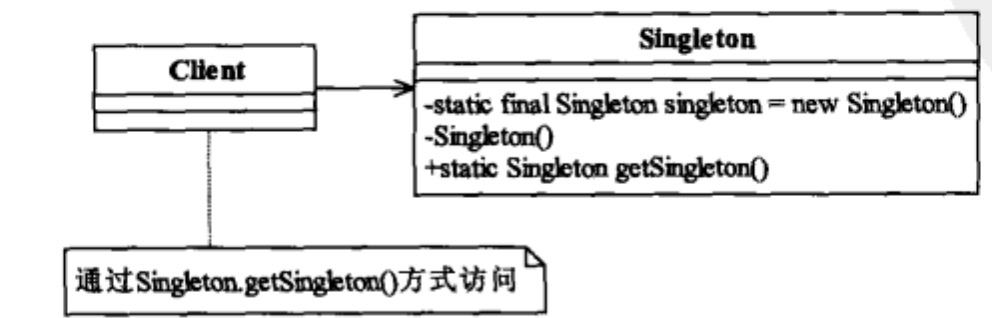
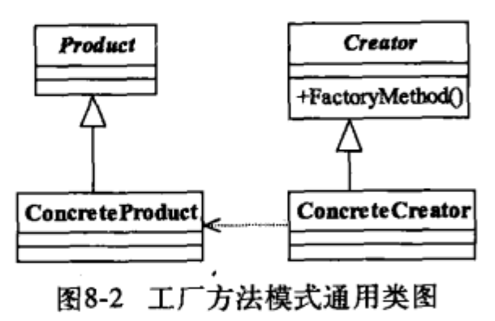
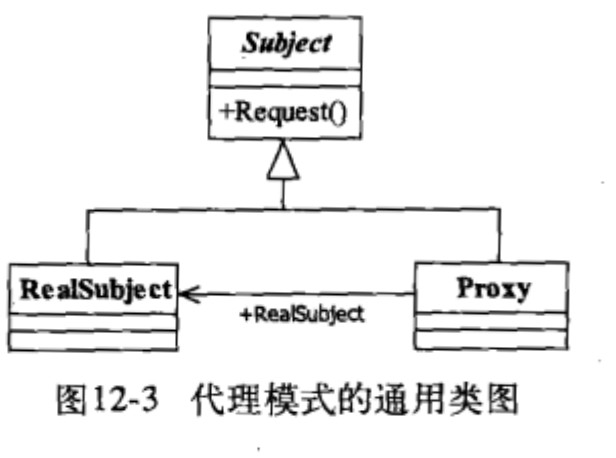
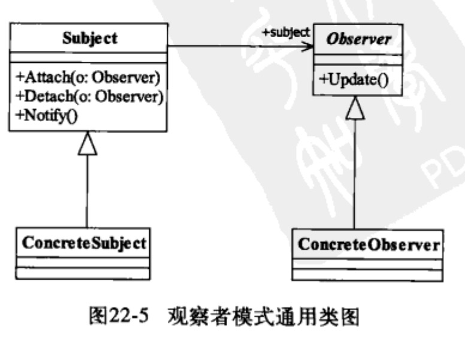
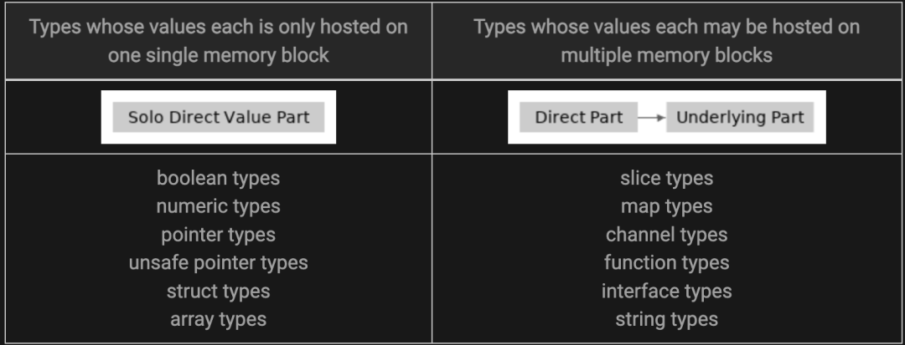

# 如何真正写好Golang代码?

## Golang 实现SOLID 设计原则

> 本章节按照设计模式中的核心设计原则介绍在Go语言中的实现。

### 单一职责原则

类的设计尽量做到只有一个原因引起变化。 在交易的场景中，我们需要做一些交易存储、验证，我们可以声明交易的结构体，这个结构体是为了存储每笔交易。但是验证的功能我们可以拆开，这样代码更具有维护性、测试的编写也更简单方便。

```go
type Trade struct {  
    TradeID int  
    Symbol string  
    Quantity float64  
    Price float64  
}  
  
type TradeRepository struct {  
    db *sql.DB  
}  
  
func (tr *TradeRepository) Save(trade *Trade) error {  
    _, err := tr.db.Exec("INSERT INTO trades (trade_id, symbol, quantity, price) VALUES (?, ?, ?, ?)", trade.TradeID, trade.Symbol, trade.Quantity, trade.Price)  
    if err != nil {  
        return err  
    }  
    return nil  
}  
  
type TradeValidator struct {}  
  
func (tv *TradeValidator) Validate(trade *Trade) error {  
    if trade.Quantity <= 0 {  
        return errors.New("Trade quantity must be greater than zero")  
    }  
    if trade.Price <= 0 {  
        return errors.New("Trade price must be greater than zero")  
    }  
    return nil  
}
```

### 开闭原则

对扩展开放，对修改关闭。实现常见的方法是，通过接口或者多态继承。 当我们的系统要增加期权交易的功能时，我们可以扩展接口实现，声明TradeProcessor，而不是在声明一个统一的处理器中，在里面写各种的兼容逻辑。

```go
type TradeProcessor interface {  
    Process(trade *Trade) error  
}  
  
type FutureTradeProcessor struct {}  
  
func (ftp *FutureTradeProcessor) Process(trade *Trade) error {  
    // process future trade  
    return nil  
}  
  
type OptionTradeProcessor struct {}  
  
func (otp *OptionTradeProcessor) Process(trade *Trade) error {  
    // process option trade  
    return nil  
}
```

### 里氏替换原则

所有引用父类的地方必须能透明地使用其子类的对象。 里氏替换可以简单的理解为开闭原则的一种拓展，目的是通过父子类继承部分实现子类替换父类，为了更好实现代码可扩展性。

Golang没有明确的继承机制，但是可以通过Trade接口当做面向对象对象的父类，FutureTrade是具体的实现，通过这样的机制可以实现里氏替换。当其它函数需要调用Trade时，可以完全替换为FutureTrade是完全没有任何问题的。

```go
type Trade interface {  
    Process() error  
}  
  
type FutureTrade struct {  
    Trade  
}  
  
func (ft *FutureTrade) Process() error {  
    // process future trade  
    return nil  
}
```

### 接口隔离原则

建立单一接口，不要建立臃肿庞大的接口；即接口要尽量细化，同时接口中的方法要尽量少。 Go中接口方法越少越好，这样有利于封装、隔离。

示例中，定义Trade接口，OptionTrade接口，只有当我们进行期权交易时可以实现隐含波动率。这样做到了接口的隔离，如果我们在Trade接口中定义了CalculateImpliedVolatility方法，这样无关的期货交易也需要实现CalculateImpliedVolatility方法。

```go
type Trade interface {  
    Process() error  
}  
  
type OptionTrade interface {  
    CalculateImpliedVolatility() error  
}  
  
type FutureTrade struct {  
    Trade  
}  
  
func (ft *FutureTrade) Process() error {  
    // process future trade  
    return nil  
}  
  
type OptionTrade struct {  
    Trade  
}  
  
func (ot *OptionTrade) Process() error {  
    // process option trade  
    return nil  
}  
  
func (ot *OptionTrade) CalculateImpliedVolatility() error {  
    // calculate implied volatility  
    return nil  
}
```

### 依赖倒置原则

依赖接口不依赖实例。 当我们进行处理交易需要将交易信息存储时，我们只需要指定我们实际存储的操作结构实现TradeService接口，这样我们的TradeProcessor结构体可以根据实际需要指定我们存储的数据库类型。

```go
type TradeService interface {  
    Save(trade *Trade) error  
}  
  
type TradeProcessor struct {  
    tradeService TradeService  
}  
  
func (tp *TradeProcessor) Process(trade *Trade) error {  
    err := tp.tradeService.Save(trade)  
    if err != nil {  
        return err  
    }  
    // process trade  
    return nil  
}  
  
type SqlServerTradeRepository struct {  
    db *sql.DB  
}  
  
func (str *SqlServerTradeRepository) Save(trade *Trade) error {  
    _, err := str.db.Exec("INSERT INTO trades (trade_id, symbol, quantity, price) VALUES (?, ?, ?, ?)", trade.TradeID, trade.Symbol, trade.Quantity, trade.Price)  
    if err != nil {  
        return err  
    }  
    return nil  
}  
  
type MongoDbTradeRepository struct {  
    session *mgo.Session  
}  
  
func (mdtr *MongoDbTradeRepository) Save(trade *Trade) error {  
    collection := mdtr.session.DB("trades").C("trade")  
    err := collection.Insert(trade)  
    if err != nil {  
        return err  
    }  
    return nil  
}
```

## Golang实现常见设计模式

> Golang不是按照面具有向对象思想的语言去设计，但是面向对象中的一些设计模式的思想也可以在Golang中实现。本章参考设计模式之禅书籍中的常用设计模式，举例说明Golang中实现方式。

### 单例设计模式

全局只存在一个单例，new创建的单例只存在一个。 类图（摘自设计模式之禅）：



应用场景： 全局只能存在一个对象，用于生成全局的序列号、IO资源访问、全局配置信息等等。 golang实现: 并发场景下需要注意正确的实现方式：

```go
var once sync.Once  
var instance interface{}  
func GetInstance() *singleton {  
	once.Do(func() {  
		instance = &singleton{}  
	})  
	return instance  
}
```

有限多列模式作为单例模式扩展，全局只存在固定的数量的模式，这种有限的多例模式。一般这种模式使用的比较多，也可以配合下文所提到的工厂模式构建，例如采用了多个链接的数据库连接池等等。 相关详细介绍： [Golang 多例模式与单例模式](https://medium.com/@hafizputraludyanto/singleton-vs-multiton-golang-1fed3e984c36)

### 工厂模式

定义一个用于创建对象的接口，让子类决定实例化哪一个类。

类图：



示例：

```go
package main

// Factory interface

type simpleInterest struct {
	principal      int
	rateOfInterest int
	time           int
}

type compoundInterest struct {
	principal      int
	rateOfInterest int
	time           int
}

// Interface
type InterestCalculator interface {
	Calculate()
}

func (si *simpleInterest) Calculate() {
	// logic to calculate simple interest
}

func (si *compoundInterest) Calculate() {
	// logic to calculate compound interest
}

func NewCalculator(kind string) InterestCalculator {
	if kind == "simple" {
		return &amp
		amp
		simpleInterest{}
	}
	return &amp
	amp
	compoundInterest{}
}

func Factory_Interface() {
	siCalculator := NewCalculator("simple")
	siCalculator.Calculate() // Invokes simple interest calculation logic
	ciCalculator := NewCalculator("compound")
	ciCalculator.Calculate() // Invokes compound interest calculation logic
}
```

工厂模式是典型的解耦框架。高层模块只需要知道产品的抽象类。其他的实现都不用关心，符合迪米特法则，符合依赖倒置原则只依赖产品的抽象，符合里氏替换原则，使用产品子类替换产品的父类。

### 代理模式

其他对象提供一种代理以控制对这个对象的访问。

类图：



示例：

```go
// zkClient backend request struct.  
type zkClient struct {  
	ServiceName string  
	Client      client.Client  
	opts        []client.Option  
}  
  
// NewClientProxy create new zookeeper backend request proxy,  
// required parameter zookeeper name service: trpc.zookeeper.xxx.xxx.  
func NewClientProxy(name string, opts ...client.Option) Client {  
	c := &zkClient{  
		ServiceName: name,  
		Client:      client.DefaultClient,  
		opts:        opts,  
	}  c.opts = append(c.opts, client.WithProtocol("zookeeper"), client.WithDisableServiceRouter())  
	return c  
}  
  
// Get execute zookeeper get command.  
func (c *zkClient) Get(ctx context.Context, path string) ([]byte, *zk.Stat, error) {  
	req := &Request{  
		Path: path,  
		Op:   OpGet{},  
	}
	rsp := &Response{}  
	ctx, msg := codec.WithCloneMessage(ctx)  
	defer codec.PutBackMessage(msg)  
	msg.WithClientRPCName(fmt.Sprintf("/%s/Get", c.ServiceName))  
	msg.WithCalleeServiceName(c.ServiceName)  
	msg.WithSerializationType(-1) // non-serialization  
	msg.WithClientReqHead(req)  
	msg.WithClientRspHead(rsp)  
	if err := c.Client.Invoke(ctx, req, rsp, c.opts...); err != nil {  
		return nil, nil, err  
	}  
	return rsp.Data, rsp.Stat, nil  
}
```

代理的目的是在目标对象方法的基础上做增强。这种增强本质通常就是对目标对象方法进行拦截和过滤。

### 观察者模式

对象间一种一对多的依赖关系，使得每当一个对象改变状态，则所有依赖于它的对象都会得到通知并被自动更新。

类图：



示例：

```go
package main  
  
import "fmt"  
  
type Item struct {  
    observerList []Observer  
    name         string  
    inStock      bool  
}  
  
func newItem(name string) *Item {  
    return &amp;amp;Item{  
        name: name,  
    }  
}  
func (i *Item) updateAvailability() {  
    fmt.Printf("Item %s is now in stock\n", i.name)  
    i.inStock = true  
    i.notifyAll()  
}  
func (i *Item) register(o Observer) {  
    i.observerList = append(i.observerList, o)  
}  
  
func (i *Item) notifyAll() {  
    for _, observer := range i.observerList {  
        observer.update(i.name)  
    }  
}
```

使用场景，事件多级触发，关联行为，跨系统消息的交换场景，级联通知情况下，运行效率和开发效率可能会有问题。

## Golang 易疏忽规范

> 本章的规范是按照腾讯Golang代码规范标准梳理出的一些关键且容易疏忽的规范。

### 声明

1. 错误使用util命名的包，不容易正常识别功能的用途，导致util包越来越臃肿。
2. slice的创建使用`var arr []int`，初始化切片使用 `var s []string` 而不是 `s := make([]string)`，初始化，如果确定大小建议使用make初始化。
3. `import .` 只能用于测试文件，且必须是为了解决循环依赖，才能使用。

### 函数定义

1. 不要通过参数返回数据。
2. 尽量用error表示执行是否成功，而不是用bool或者int。
3. 多使用指针接收器，尽量避免使用值接收器。

### 函数实现

1. 除0、1、“”不要使用字面量。
2. if else 通常可以简写为 if return。
3. 尽量将 if 和变量定义应该放在一行。 bad case:

```go
err := r.updateByAttaIDs(fMd5OneTime, sMd5OneTime)  
if err != nil {
}
```

4. 不要添加没必要的空行。
5. 使用 == "" 判断字符串是否为空。
6. 通过%v打印错误信息，%v建议加:。
7. Fail Fast原则，如果出现失败应该立即返回error，如果继续处理，则属于特殊情况需要添加注释。

### 命名规范

1. array 和 map 的变量命名时，添加后缀 s。
2. _, xxx for xxxs 一般要求 xxx 相同。
3. 正则表达式变量名以RE结尾。
4. 不要用注释删除代码。
5. TODO格式： TODO(rtx_name): 什么时间/什么时机，如何解决。 19.导出的函数/变量的职责必须与包&文件职责高度一致。

### 基本类型
1. 时间类型尽量使用内置定义，如，time.Second，不要使用 int。
2. 建议所有不对外开源的工程的 module name 使用 xxxxxx/group/repo ，方便他人直接引用。
3. 应用服务接口建议有 README.md。

### 安全问题

1. 代码中是否存在token 密码是否加密。
2. 日志中是否输出用户敏感信息。
3. PB是否开启validation。
4. 字符串占位符，如果输入数据来自外部，建议使用%q进行安全转义。

## Golang 编码陷阱

### 值拷贝

值拷贝是Go采取参数传值策略，因此涉及到传值时需要注意。

```go
package main  
  
import (  
    "fmt"  
)  
  
func main() {  
    x := [3]int{1, 2, 3}  
  
    func(arr [3]int) {  
        arr[0] = 7  
        fmt.Println(arr)  
    }(x)  
  
    fmt.Println(x)  // 1 2 3  
}
```

有人可能会问，我记得我传map、slice怎么不会有类似的问题？底层实现本质是指针指向了存储区域，变量代表了这个指针。



### 管道操作

管道操作，谨记口诀:"读关闭空值，读写空阻塞，写关闭异常，关闭空、关闭已关闭异常"。个人建议管道除非在一些异步处理的场景建议使用外，其它场景不建议过多使用，有可能会影响代码的可读性。 检测管道关闭示例：

```go
func IsClosed(ch <-chan T) bool {  
	select {  
	case <-ch:  
		return true  
	default:  
	}  
	return false  
}
```

关闭channel的原则：我们只应该在发送方关闭，当channel只有一个发送方时。

### 匿名函数变量捕获

匿名函数捕获的数据是变量的引用，在一些开发的场景中，异步调用函数的输出不符合预期的场景。

```go
package main

import (
	"fmt"
	"sync"
)

type A struct {
	id int
}

func main() {
	channel := make(chan A, 5)

	var wg sync.WaitGroup

	wg.Add(1)
	go func() {
		defer wg.Done()
		for a := range channel {
			wg.Add(1)
			go func() {
				defer wg.Done()
				fmt.Println(a.id) // 输出的数字是无法确定的，输出依赖具体的调度时机。
				// go vet 提示 loop   variable a captured by func literal
			}()
		}
	}()

	for i := 0; i < 10; i++ {
		channel <- A{id: i}
	}
	close(channel)

	wg.Wait()
}
```

### defer执行流程

defer执行流程，第一步return执行将结果写入返回值，第二步执行defer会被按照先进后出的顺序执行，第三步返回当前结果。

示例1：这里返回引用，我们达到了defer修改返回值的目的，如果我们这里不是以引用返回会产生什么结果呢？这里需要留意之前说的Go里是值拷贝，如果不是引用返回这里返回的是0。

```go
package main  
  
import (  
    "fmt"  
)  
  
func main() {  
    fmt.Println("c return:", *(c())) // 打印结果为 c return: 2  
}  
  
func c() *int {  
    var i int  
    defer func() {  
        i++  
        fmt.Println("c defer2:", i) // 打印结果为 c defer: 2  
    }()  
  
    defer func() {  
        i++  
        fmt.Println("c defer1:", i) // 打印结果为 c defer: 1  
    }()  
  
    return i  
}
```

示例2 ：实际返回的为1，原因是我们采用了命名返回变量，返回时值的空间已预分配好了

```go
package main  
  
import "fmt"  
  
func main() {  
    fmt.Println(test())  
}  
  
func test() (result int) {  
    defer func() {  
        result++  
    }()  
  
    return 0 // result = 0  
    // result++  
}
```

### recover正确执行方式

recover函数在defer捕获异常时必须在defer函数里调用，否则是无效调用。

```go
// 无效  
func main() {  
    recover()  
    panic(1)  
}  
  
// 无效  
func main() {  
    defer recover()  
    panic(1)  
}  
  
// 无效  
func main() {  
    defer func() {  
        func() { recover() }()  
    }()  
    panic(1)  
}  
  
// 有效  
func main() {  
    defer func() {  
        recover()  
    }()  
    panic(1)  
}
```

### sync.Mutex错误传递

sync.Mutex的拷贝，导致锁失效引发race condition。传参时我们需要通过指针进行传递。

示例：

```go
package main

import (
	"fmt"
	"sync"
	"time"
)

type Container struct {
	sync.Mutex // <-- Added a mutex
	counters   map[string]int
}

func (c Container) inc(name string) {
	c.Lock() // <-- Added locking of the mutex
	defer c.Unlock()
	c.counters[name]++
}

func main() {
	c := Container{counters: map[string]int{"a": 0, "b": 0}}

	doIncrement := func(name string, n int) {
		for i := 0; i < n; i++ {
			c.inc(name)
		}
	}

	go doIncrement("a", 100000)
	go doIncrement("a", 100000)

	// Wait a bit for the goroutines to finish
	time.Sleep(300 * time.Millisecond)
	fmt.Println(c.counters)
}
```

## Golang 编码相关工具

> 编码工具很关键，建议集成到发布流水线里，对代码进行静态检查、代码优化。以防将有问题的代码发布至正式环境导致故障。

### go vet

vet 检查go 的源码并报告可以的问题，我们可以在提交代码前、或者是在流水线配置Go代码的强制检验。

```
asmdecl      report mismatches between assembly files and Go declarations  
assign       check for useless assignments  
atomic       check for common mistakes using the sync/atomic package  
bools        check for common mistakes involving boolean operators  
buildtag     check that +build tags are well-formed and correctly located  
cgocall      detect some violations of the cgo pointer passing rules  
composites   check for unkeyed composite literals  
copylocks    check for locks erroneously passed by value  
httpresponse check for mistakes using HTTP responses  
loopclosure  check references to loop variables from within nested functions  
lostcancel   check cancel func returned by context.WithCancel is called  
nilfunc      check for useless comparisons between functions and nil  
printf       check consistency of Printf format strings and arguments  
shift        check for shifts that equal or exceed the width of the integer  
slog         check for incorrect arguments to log/slog functions  
stdmethods   check signature of methods of well-known interfaces  
structtag    check that struct field tags conform to reflect.StructTag.Get  
tests        check for common mistaken usages of tests and examples  
unmarshal    report passing non-pointer or non-interface values to unmarshal  
unreachable  check for unreachable code  
unsafeptr    check for invalid conversions of uintptr to unsafe.Pointer  
unusedresult check for unused results of calls to some functions
```

### goimports

goimports可以合理的整合包的分组，也可以将其纳入到项目流水线当中。

### gofmt

大部分的格式问题可以通过 gofmt 解决， gofmt 自动格式化代码，保证所有的 go 代码与官方推荐的格式保持一致。

## 如何做好CR？

> CR的目的是让我们的代码更具有规范、排查出错误、代码设计的统一，从而降低不好代码所带来的误解、重复、错误等问题。无论是Contributor或者是Code Reviewer，都有职责去执行好CR的每个环节，这样我们才能写出更好更优秀的代码。

### 前置工作

1. 发起人自己先做一次review。
2. 做好单测、自测，不要依赖CodeReview机制排查问题。
3. 是否有现成的依赖包、工具、复用的代码使用。
4. 仓库配置相应的代码质量检测、单测覆盖率检测流水线。

### 发起Codereview

1. 准备好本次CR的背景知识，如需求文档、设计文档等。
2. COMMIT里详细介绍本次改动的目的。
3. 控制规模，一次提交最好能在30分钟内review完成。

### CodeReviewer

1. 友好语气。
2. 认真提出合理的建议与改进方案，是对代码编写者的尊重。
3. 避免纯主观判断。
4. 不要高高在上。
5. 不要吝啬称赞。
6. 适度容忍、没有必要必须完美。
7. 无重要的设计、bug可以先approve，后续有时间修改。

### 冲突解决

1. 寻求第三人评估。
2. 组内讨论。

## 结语

受限于篇幅原因本文还有许多内容没有给大家展开做详细介绍，文末的参考文献中引用了许多优秀的文章，可以通过这些链接进行进一步学习。最后希望读者能从本篇文章有所收货，知易行难，与君共勉。

## 参考文献

- [设计模式之禅](https://awesome-programming-books.github.io/design-pattern/%E8%AE%BE%E8%AE%A1%E6%A8%A1%E5%BC%8F%E4%B9%8B%E7%A6%85.pdf)
- [tRPC-Go源码](https://github.com/trpc-group/trpc-go/blob/main/README.zh_CN.md)
- [SOLID Principles: Explained with Golang Examples - DEV Community](https://dev.to/ansu/solid-principles-explained-with-golang-examples-5eh)
- https://devcharmander.medium.com/design-patterns-in-golang-factory-6164c4e0b43f
- [Observer in Go / Design Patterns](https://refactoring.guru/design-patterns/observer/go/example)
- [GitHub - teivah/100-go-mistakes: 📖 100 Go Mistakes and How to Avoid Them](https://github.com/teivah/100-go-mistakes)
- https://medium.com/globant/go-method-receiver-pointer-vs-value-ffc5ab7acdb
- [Golang Common Examples and Pitfalls - SoByte](https://www.sobyte.net/post/2022-06/go-example-pitfalls/)
- [How to Gracefully Close Channels -Go 101](https://go101.org/article/channel-closing.html)