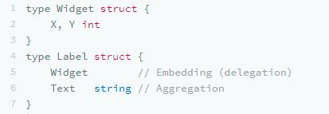
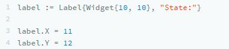
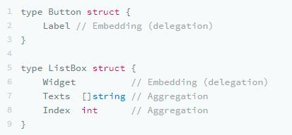
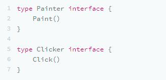
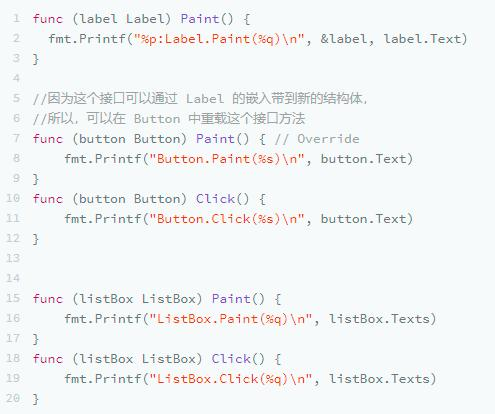
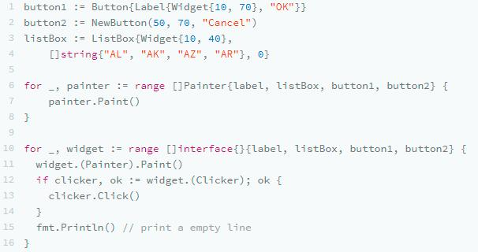
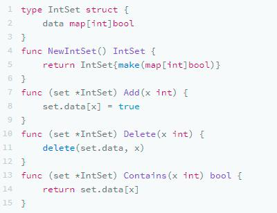
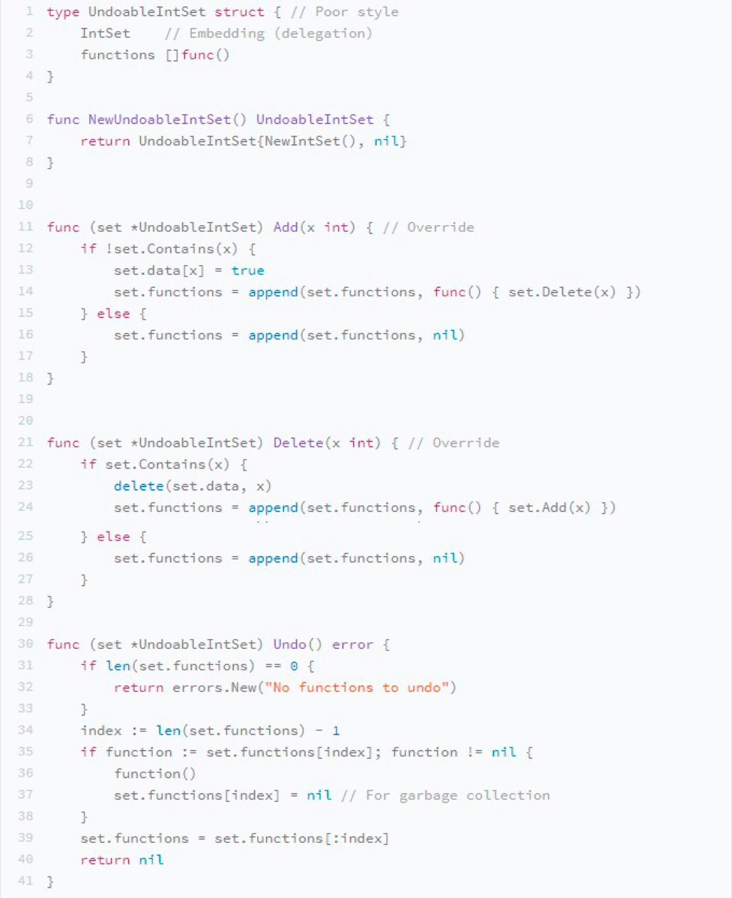
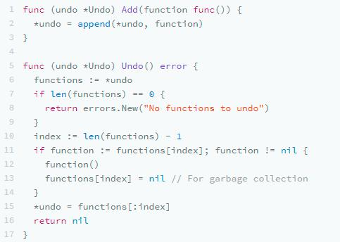
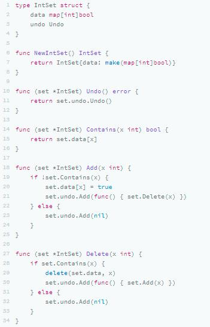

控制反转（Inversion of Control，loC ）是一种软件设计的方法，它的主要思想是把控制逻辑与业务逻辑分开，不要在业务逻辑里写控制逻辑，因为这样会让控制逻辑依赖于业务逻辑，而是反过来，让业务逻辑依赖控制逻辑。
我之前在《[IoC/DIP 其实是一种管理思想](https://coolshell.cn/articles/9949.html)》这篇文章中，举过一个开关和电灯的例子。其实，这里的开关就是控制逻辑，电器是业务逻辑。我们不要在电器中实现开关，而是要把开关抽象成一种协议，让电器都依赖它。这样的编程方式可以有效降低程序复杂度，并提升代码重用度。

面向对象的设计模式我就不提了，我们来看看 Go 语言使用 Embed 结构的一个示例。

## 嵌入和委托

### 结构体嵌入
在 Go 语言中，我们可以很轻松地把一个结构体嵌到另一个结构体中，如下所示：

在这个示例中，我们把 Widget嵌入到了 Label 中，于是，我们可以这样使用：

如果在Label 结构体里出现了重名，就需要解决重名问题，例如，如果成员 X 重名，我们就要用 label.X表明是自己的X ，用 label.Wedget.X 表明是嵌入过来的。

有了这样的嵌入，我们就可以像 UI 组件一样，在结构的设计上进行层层分解了。比如，我可以新写出两个结构体 Button 和 ListBox：

### 方法重写

然后，我们需要两个接口：用 Painter 把组件画出来；Clicker 用于表明点击事件。

当然，对于 Lable 来说，只有 Painter ，没有Clicker；对于 Button 和 ListBox来说，Painter 和Clicker都有。
我们来看一些实现：

说到这儿，我要重点提醒你一下，Button.Paint() 接口可以通过 Label 的嵌入带到新的结构体，如果 Button.Paint() 不实现的话，会调用 Label.Paint() ，所以，在 Button 中声明 Paint() 方法，相当于 Override。

### 嵌入结构多态

从下面的程序中，我们可以看到整个多态是怎么执行的。

我们可以使用接口来多态，也可以使用泛型的 interface{} 来多态，但是需要有一个类型转换。

### 反转控制

我们再来看一个示例。
我们有一个存放整数的数据结构，如下所示：

其中实现了 `Add()` 、`Delete()` 和 `Contains()` 三个操作，前两个是写操作，后一个是读操作。

### 实现 Undo 功能

现在，我们想实现一个 Undo 的功能。我们可以再包装一下 IntSet ，变成 UndoableIntSet ，代码如下所示：

我来解释下这段代码。
* 我们在 UndoableIntSet 中嵌入了IntSet ，然后 Override 了 它的 Add()和 Delete() 方法；
* Contains() 方法没有 Override，所以，就被带到 UndoableInSet 中来了。
* 在 Override 的 Add()中，记录 Delete 操作；
* 在 Override 的 Delete() 中，记录 Add 操作；
* 在新加入的 Undo() 中进行 Undo 操作。

用这样的方式为已有的代码扩展新的功能是一个很好的选择。这样，就可以在重用原有代码功能和新的功能中达到一个平衡。但是，这种方式最大的问题是，Undo 操作其实是一种控制逻辑，并不是业务逻辑，所以，在复用 Undo 这个功能时，是有问题的，因为其中加入了大量跟 IntSet 相关的业务逻辑。

### 反转依赖

现在我们来看另一种方法。
我们先声明一种函数接口，表示我们的 Undo 控制可以接受的函数签名是什么样的：

有了这个协议之后，我们的 Undo 控制逻辑就可以写成下面这样：

看到这里，你不必觉得奇怪， Undo 本来就是一个类型，不必是一个结构体，是一个函数数组也没有什么问题。
然后，我们在 IntSet 里嵌入 Undo，接着在 Add() 和 Delete() 里使用刚刚的方法，就可以完成功能了。

这个就是控制反转，不是由控制逻辑 Undo 来依赖业务逻辑 IntSet，而是由业务逻辑 IntSet 依赖 Undo 。这里依赖的是其实是一个协议，**这个协议是一个没有参数的函数数组**。可以看到，这样一来，我们 Undo 的代码就可以复用了。