Go 语言的代码生成主要还是用来解决编程泛型的问题。泛型编程主要是解决这样一个问题：因为静态类型语言有类型，所以，相关的算法或是对数据处理的程序会因为类型不同而需要复制一份，这样会导致数据类型和算法功能耦合。

我之所以说泛型编程可以解决这样的问题，就是说，在写代码的时候，不用关心处理数据的类型，只需要关心相关的处理逻辑。

泛型编程是静态语言中非常非常重要的特征，如果没有泛型，我们就很难做到多态，也很难完成抽象，这就会导致我们的代码冗余量很大。

## 现实中的类比

为了帮你更好地理解，我举个现实当中的例子。我们用螺丝刀来做打比方，螺丝刀本来只有一个拧螺丝的作用，但是因为螺丝的类型太多，有平口的，有十字口的，有六角的……螺丝还有不同的尺寸，这就导致我们的螺丝刀为了要适配各种千奇百怪的螺丝类型（样式和尺寸），也是各种样式的。

而真正的抽象是，螺丝刀不应该关心螺丝的类型，它只要关注自己的功能是不是完备，并且让自己可以适配不同类型的螺丝就行了，这就是所谓的泛型编程要解决的实际问题。

## Go 语方的类型检查

因为 Go 语言目前并不支持真正的泛型，所以，只能用 interface{ } 这样的类似于 void* 的过度泛型来玩，这就导致我们要在实际过程中进行类型检查。

Go 语言的类型检查有两种技术，一种是 Type Assert，一种是 Reflection。

## Type Assert

这种技术，一般是对某个变量进行 .(type)的转型操作，它会返回两个值，分别是 variable 和 error。 variable 是被转换好的类型，error 表示如果不能转换类型，则会报错。

在下面的示例中，我们有一个通用类型的容器，可以进行 Put(val)和 Get()，注意，这里使用了 interface{ }做泛型。

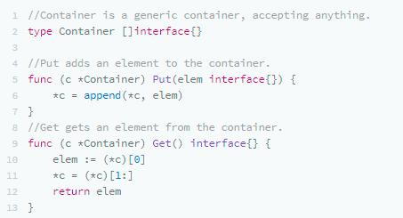

我们可以这样使用：

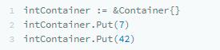

但是，在把数据取出来时，因为类型是 interface{ } ，所以，你还要做一个转型，只有转型成功，才能进行后续操作（因为 interface{ }太泛了，泛到什么类型都可以放）。

下面是一个 Type Assert 的示例：

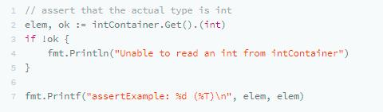

## Reflection

对于 Reflection，我们需要把上面的代码修改如下：

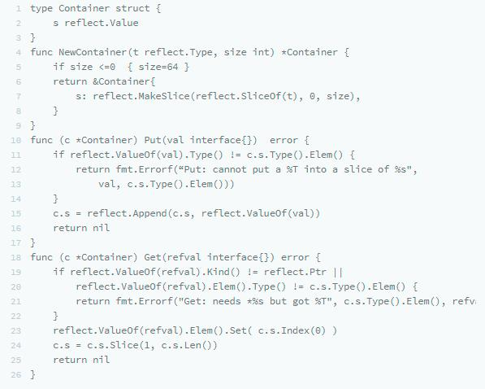

这里的代码并不难懂，这是完全使用 Reflection 的玩法，我简单解释下。

- 在 NewContainer()时，会根据参数的类型初始化一个 Slice。
- 在 Put()时，会检查 val 是否和 Slice 的类型一致。
- 在 Get()时，我们需要用一个入参的方式，因为我们没有办法返回 reflect.Value 或 interface{}，不然还要做 Type Assert。
- 不过有类型检查，所以，必然会有检查不对的时候，因此，需要返回 error。

于是，在使用这段代码的时候，会是下面这个样子：

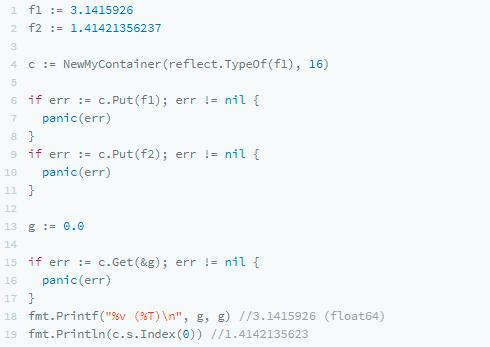

可以看到，Type Assert 是不用了，但是用反射写出来的代码还是有点复杂的。那么，有没有什么好的方法？

## 他山之石

对于泛型编程最牛的语言 C++ 来说，这类问题都是使用 Template 解决的。

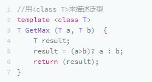

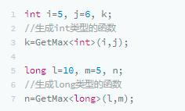

C++ 的编译器会在编译时分析代码，根据不同的变量类型来自动化生成相关类型的函数或类，在 C++ 里，叫模板的具体化。

这个技术是编译时的问题，所以，我们不需要在运行时进行任何的类型识别，我们的程序也会变得比较干净。

那么，我们是否可以在 Go 中使用 C++ 的这种技术呢？答案是肯定的，只是 Go 的编译器不会帮你干，你需要自己动手。

Go Generator

要玩 Go 的代码生成，你需要三个东西：

- 一个函数模板，在里面设置好相应的占位符；
- 一个脚本，用于按规则来替换文本并生成新的代码；
- 一行注释代码。

### 函数模板

我们把之前的示例改成模板，取名为 container.tmp.go 放在 ./template/下：

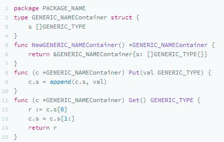

可以看到，函数模板中我们有如下的占位符：

- PACKAGE_NAME：包名
- GENERIC_NAME ：名字
- GENERIC_TYPE ：实际的类型

其它的代码都是一样的。

### 函数生成脚本

然后，我们有一个叫gen.sh的生成脚本，如下所示：

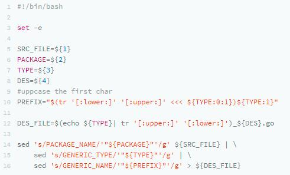

这里需要 4 个参数：

- 模板源文件；
- 包名；
- 实际需要具体化的类型；
- 用于构造目标文件名的后缀。

然后，我们用 sed 命令去替换刚刚的函数模板，并生成到目标文件中。

### 生成代码

接下来，我们只需要在代码中打一个特殊的注释：

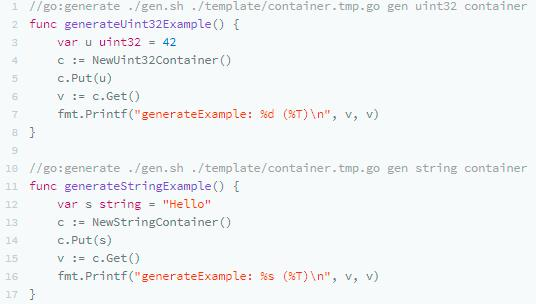

其中，

- 第一个注释是生成包名 gen，类型是 uint32，目标文件名以 container 为后缀。
- 第二个注释是生成包名 gen，类型是 string，目标文件名是以 container 为后缀。

然后，在工程目录中直接执行 go generate 命令，就会生成两份代码：

一份文件名为 uint32_container.go：

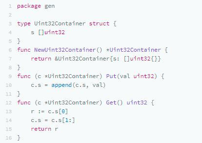

另一份的文件名为 string_container.go：

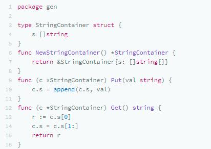

这两份代码可以让我们的代码完全编译通过，付出的代价就是需要多执行一步 go generate 命令。

### 新版 Filter

现在我们再回头看看上节课里的那些用反射整出来的例子，你就会发现，有了这样的技术，我们就不用在代码里，用那些晦涩难懂的反射来做运行时的类型检查了。我们可以写出很干净的代码，让编译器在编译时检查类型对不对。

下面是一个 Fitler 的模板文件 filter.tmp.go：

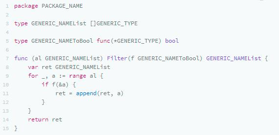

这样，我们可以在需要使用这个的地方，加上相关的 Go Generate 的注释：

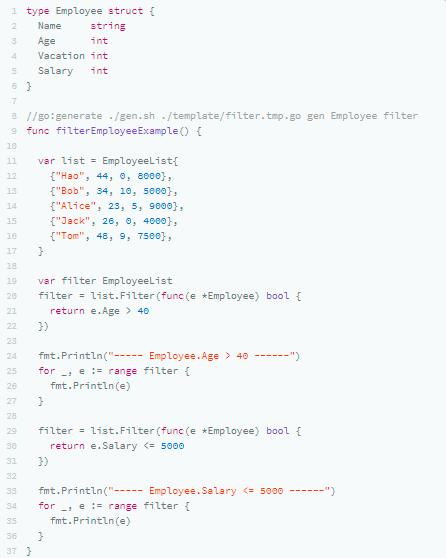

### 第三方工具

我们并不需要自己手写 gen.sh 这样的工具类，我们可以直接使用第三方已经写好的工具。我给你提供一个列表。

- [Genny](https://github.com/cheekybits/genny)
- [Generic](https://github.com/taylorchu/generic)
- [GenGen](https://github.com/joeshaw/gengen)
- [Gen](https://github.com/clipperhouse/gen)