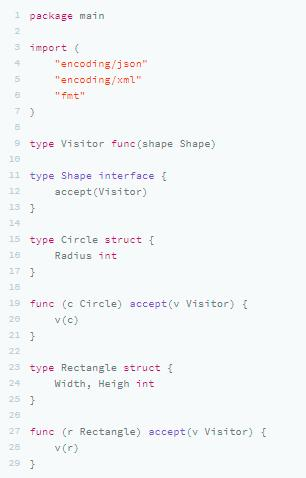
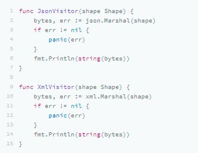
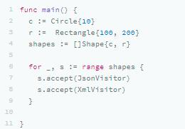
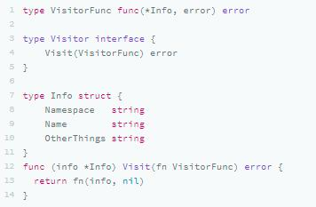
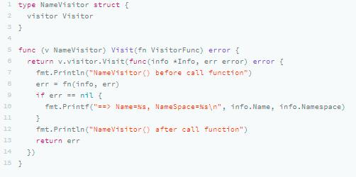
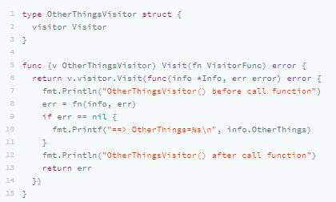
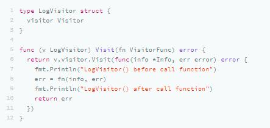
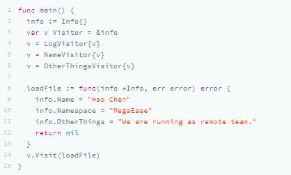
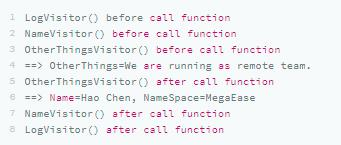
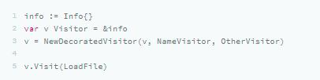

这节课，我们来重点讨论一下，Kubernetes 的 kubectl 命令中的使用到的一个编程模式：Visitor（其实，kubectl 主要使用到了两个，一个是 Builder，另一个是 Visitor）。

本来，Visitor 是面向对象设计模式中一个很重要的设计模式（可以看下 Wikipedia Visitor Pattern 词条），这个模式是将算法与操作对象的结构分离的一种方法。这种分离的实际结果是能够在不修改结构的情况下向现有对象结构添加新操作，是遵循开放 / 封闭原则的一种方法。这节课，我们重点学习一下 kubelet 中是怎么使用函数式的方法来实现这个模式的。

## 一个简单示例

首先，我们来看一个简单设计模式的 Visitor 的示例。

- 我们的代码中有一个Visitor的函数定义，还有一个Shape接口，这需要使用 Visitor函数作为参数。
- 我们的实例的对象 Circle和 Rectangle实现了 Shape 接口的 accept() 方法，这个方法就是等外面给我们传递一个 Visitor。

然后，我们实现两个 Visitor：一个是用来做 JSON 序列化的；另一个是用来做 XML 序列化的。

下面是使用 Visitor 这个模式的代码：

其实，这段代码的目的就是想解耦数据结构和算法。虽然使用 Strategy 模式也是可以完成的，而且会比较干净，**但是在有些情况下，多个 Visitor 是来访问一个数据结构的不同部分，这种情况下，数据结构有点像一个数据库，而各个 Visitor 会成为一个个的小应用**。 kubectl就是这种情况。

## Kubernetes 相关背景

接下来，我们再来了解一下相关的知识背景。

- Kubernetes 抽象了很多种的 Resource，比如 Pod、ReplicaSet、ConfigMap、Volumes、Namespace、Roles……种类非常繁多，这些东西构成了 Kubernetes 的数据模型（你可以看看 Kubernetes Resources 地图 ，了解下有多复杂）。
- kubectl 是 Kubernetes 中的一个客户端命令，操作人员用这个命令来操作 Kubernetes。kubectl 会联系到 Kubernetes 的 API Server，API Server 会联系每个节点上的 kubelet ，从而控制每个节点。
- kubectl 的主要工作是处理用户提交的东西（包括命令行参数、YAML 文件等），接着会把用户提交的这些东西组织成一个数据结构体，发送给 API Server。
- 相关的源代码在 src/k8s.io/cli-runtime/pkg/resource/visitor.go 中（[源码链接](https://github.com/kubernetes/kubernetes/blob/cea1d4e20b4a7886d8ff65f34c6d4f95efcb4742/staging/src/k8s.io/cli-runtime/pkg/resource/visitor.go)）。

kubectl 的代码比较复杂，不过，简单来说，基本原理就是**它从命令行和 YAML 文件中获取信息，通过 Builder 模式并把其转成一系列的资源，最后用 Visitor 模式来迭代处理这些 Reources。**

下面我们来看看 kubectl 的实现。为了简化，我不直接分析复杂的源码，而是用一个小的示例来表明 。

## kubectl 的实现方法

### Visitor 模式定义

首先，kubectl 主要是用来处理 Info结构体，下面是相关的定义：

可以看到，

- 有一个 VisitorFunc 的函数类型的定义；
- 一个 Visitor 的接口，其中需要 Visit(VisitorFunc) error 的方法（这就像是我们上面那个例子的 Shape ）；
- 最后，为Info 实现 Visitor 接口中的 Visit() 方法，实现就是直接调用传进来的方法（与前面的例子相仿）。

我们再来定义几种不同类型的 Visitor。

#### Name Visitor

这个 Visitor 主要是用来访问 Info 结构中的 Name 和 NameSpace 成员：

可以看到，在这段代码中：

- 声明了一个 NameVisitor 的结构体，这个结构体里有一个 Visitor 接口成员，这里意味着多态；
- 在实现 Visit() 方法时，调用了自己结构体内的那个 Visitor的 Visitor() 方法，这其实是一种修饰器的模式，用另一个 Visitor 修饰了自己（关于修饰器模式，可以复习下第 7 节课）。

#### Other Visitor

这个 Visitor 主要用来访问 Info 结构中的 OtherThings 成员：

实现逻辑同上，我就不再重新讲了。

#### Log Visitor

#### 使用方代码

现在，我们看看使用上面的代码：

可以看到，

- Visitor 们一层套一层；
- 我用 loadFile 假装从文件中读取数据；
- 最后执行 v.Visit(loadfile) ，这样，我们上面的代码就全部开始激活工作了。

这段代码输出如下的信息，你可以看到代码是怎么执行起来的：

上面的代码有以下几种功效：

- 解耦了数据和程序；
- 使用了修饰器模式；
- 还做出了 Pipeline 的模式。

所以，其实我们可以重构一下上面的代码。

#### Visitor 修饰器

我们用[修饰器模式](https://coolshell.cn/articles/17929.html)来重构一下上面的代码。

这段代码并不复杂，我来解释下。

- 用一个 DecoratedVisitor 的结构来存放所有的VistorFunc函数；
- NewDecoratedVisitor 可以把所有的 VisitorFunc转给它，构造 DecoratedVisitor 对象；
- DecoratedVisitor实现了 Visit() 方法，里面就是来做一个 for-loop，顺着调用所有的 VisitorFunc。

这样，我们的代码就可以这样运作了：

是不是比之前的那个简单？需要注意的是，这个DecoratedVisitor 同样可以成为一个 Visitor 来使用。上面的这些代码全部存在于 kubectl 的代码中，只要你看懂了这里面的代码逻辑，就一定能看懂 kubectl 的代码。