这节课，我们来学习一下函数式编程中非常重要的 Map、Reduce、Filter 这三种操作。这三种操作可以让我们轻松灵活地进行一些数据处理，毕竟，我们的程序大多数情况下都在倒腾数据。尤其是对于一些需要统计的业务场景来说，Map、Reduce、Filter 是非常通用的玩法。

话不多说，我们先来看几个例子。

## 基本示例

### Map 示例

在下面的程序代码中，我写了两个 Map 函数，这两个函数需要两个参数：

- 一个是字符串数组 [] string，说明需要处理的数据是一个字符串；
- 另一个是一个函数 func(s string) string 或 func(s string) int。

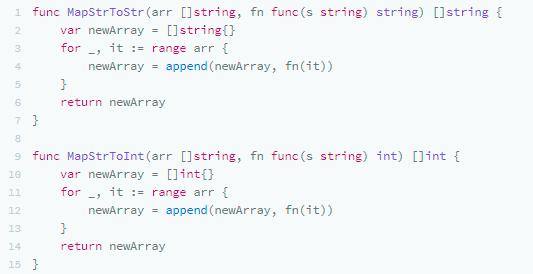

整个 Map 函数的运行逻辑都很相似，函数体都是在遍历第一个参数的数组，然后，调用第二个参数的函数，把它的值组合成另一个数组返回。

因此，我们就可以这样使用这两个函数：

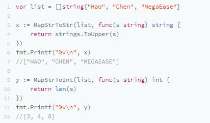

可以看到，我们给第一个 MapStrToStr() 传了功能为“转大写”的函数，于是出来的数组就成了全大写的，给MapStrToInt() 传的是计算长度，所以出来的数组是每个字符串的长度。

我们再来看一下 Reduce 和 Filter 的函数是什么样的。

### Reduce 示例

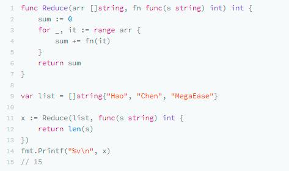

### Filter 示例

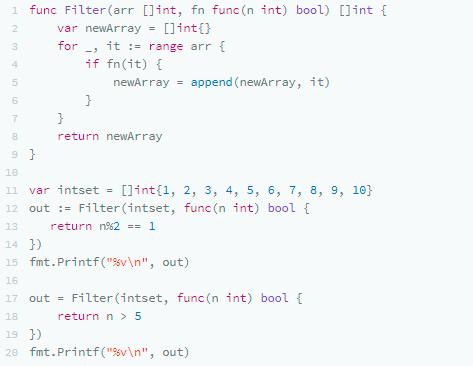

为了方便你理解呢，我给你展示一张图，它形象地说明了 Map-Reduce 的业务语义，在数据处理中非常有用。

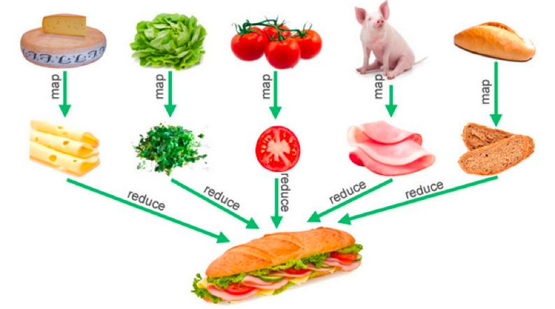

### 业务示例

通过刚刚的一些示例，你现在应该有点明白了，Map、Reduce、Filter 只是一种控制逻辑，真正的业务逻辑是以传给它们的数据和函数来定义的。

是的，这是一个很经典的“业务逻辑”和“控制逻辑”分离解耦的编程模式。

接下来，我们来看一个有业务意义的代码，来进一步帮助你理解什么叫“控制逻辑”与“业务逻辑”分离。

**员工信息**

首先，我们有一个员工对象和一些数据：

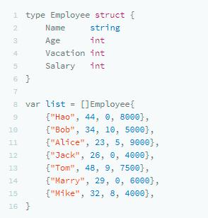

**相关的 Reduce、Fitler 函数**

然后，我们有下面的几个函数：

简单说明一下：

- EmployeeConutIf 和 EmployeeSumIf 分别用于统计满足某个条件的个数或总数。它们都是 Filter + Reduce 的语义。
- EmployeeFilterIn 就是按某种条件过滤，就是 Fitler 的语义。

各种自定义的统计示例

于是，我们就可以有接下来的代码了。

**1. 统计有多少员工大于 40 岁**

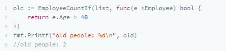

**2. 统计有多少员工的薪水大于 6000**

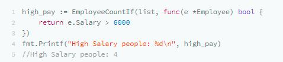

**3. 列出有没有休假的员工**

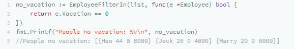

**4. 统计所有员工的薪资总和**

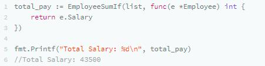

**5. 统计 30 岁以下员工的薪资总和**

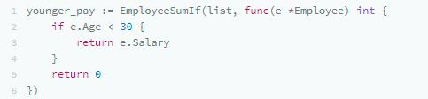

## 泛型 Map-Reduce

刚刚的 Map-Reduce 都因为要处理数据的类型不同，而需要写出不同版本的 Map-Reduce，虽然它们的代码看上去是很类似的。所以，这里就要提到泛型编程了。

### 简单版 Generic Map

我在写这节课的时候，Go 语言还不支持泛型（注：Go 开发团队技术负责人 Russ Cox 在 2012 年 11 月 21golang-dev 上的 mail 确认了 Go 泛型将在 Go 1.18 版本落地，时间是 2022 年 2 月）。所以，目前的 Go 语言的泛型只能用 interface{} + reflect来完成。interface{} 可以理解为 C 中的 void*、Java 中的 Object ，reflect是 Go 的反射机制包，作用是在运行时检查类型。

下面，我们来看一下，一个非常简单的、不做任何类型检查的泛型的 Map 函数怎么写。

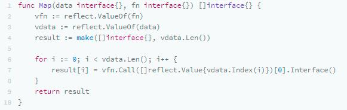

我来简单解释下这段代码。

- 首先，我们通过 reflect.ValueOf() 获得 interface{} 的值，其中一个是数据 vdata，另一个是函数 vfn。
- 然后，通过 vfn.Call() 方法调用函数，通过 []refelct.Value{vdata.Index(i)}获得数据。

Go 语言中的反射的语法有点令人费解，不过，简单看一下手册，还是能够读懂的。反射不是这节课的重点，我就不讲了。如果你还不太懂这些基础知识，课下可以学习下相关的教程。

于是，我们就可以有下面的代码——不同类型的数据可以使用相同逻辑的Map()代码。

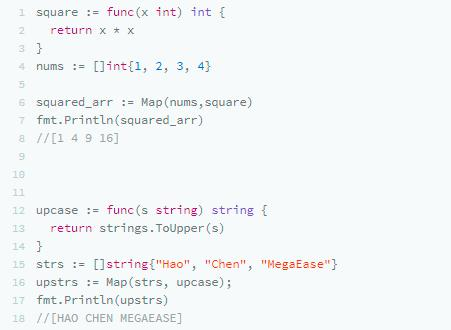

但是，因为反射是运行时的事，所以，如果类型出问题的话，就会有运行时的错误。比如：

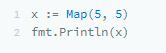

代码可以很轻松地编译通过，但是在运行时却出问题了，而且还是 panic 错误……

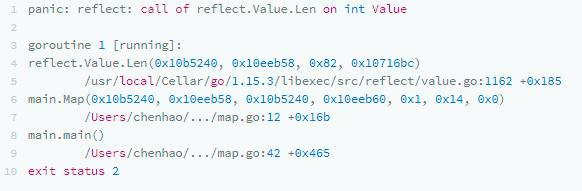

### 健壮版的 Generic Map

所以，如果要写一个健壮的程序，对于这种用interface{} 的“过度泛型”，就需要我们自己来做类型检查。来看一个有类型检查的 Map 代码：

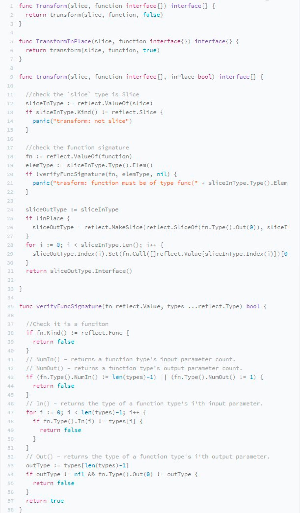

代码一下子就复杂起来了，可见，复杂的代码都是在处理异常的地方。我不打算 Walk through 所有的代码，别看代码多，还是可以读懂的。

我来列一下代码中的几个要点。

- 代码中没有使用 Map 函数，因为和数据结构有含义冲突的问题，所以使用Transform，这个来源于 C++ STL 库中的命名。
- 有两个版本的函数，一个是返回一个全新的数组 Transform()，一个是“就地完成” TransformInPlace()。
- 在主函数中，用 Kind() 方法检查了数据类型是不是 Slice，函数类型是不是 Func。
- 检查函数的参数和返回类型是通过 verifyFuncSignature() 来完成的：NumIn()用来检查函数的“入参”；NumOut() ：用来检查函数的“返回值”。
- 如果需要新生成一个 Slice，会使用 reflect.MakeSlice() 来完成。

好了，有了这段代码，我们的代码就很可以很开心地使用了：

**1. 可以用于字符串数组：**

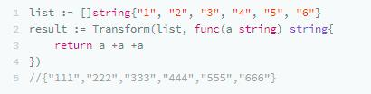

**2. 可以用于整形数组：**

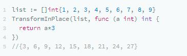

**3. 可以用于结构体：**

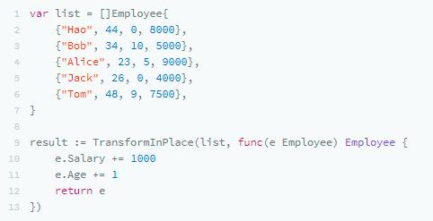

### 健壮版的 Generic Reduce

同样，泛型版的 Reduce 代码如下：

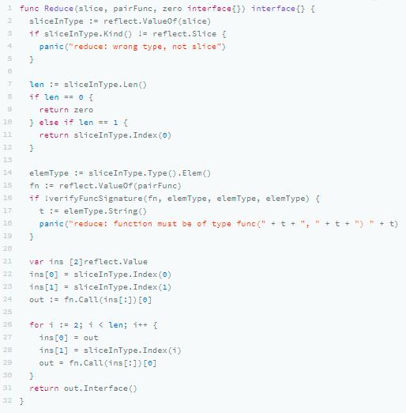

### 健壮版的 Generic Filter

同样，泛型版的 Filter 代码如下（同样分是否“就地计算”的两个版本）：

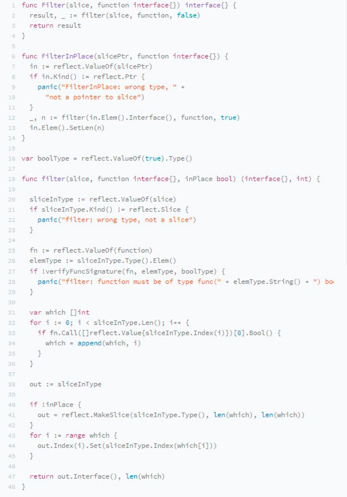

## 后记

最后，还有几个未尽事宜：使用反射来做这些东西会有一个问题，那就是代码的性能会很差。所以，上面的代码不能用在需要高性能的地方。怎么解决这个问题，我会在下节课给你介绍下。

这节课中的代码大量地参考了 Rob Pike 的版本，你可以点击这个链接查看： https://github.com/robpike/filter。

其实，在全世界范围内，有大量的程序员都在问 Go 语言官方什么时候在标准库中支持 Map、Reduce。Rob Pike 说，这种东西难写吗？还要我们官方来帮你们写吗？这种代码我多少年前就写过了，但是，我一次都没有用过，我还是喜欢用“For 循环”，我觉得你最好也跟我一起用 “For 循环”。

我个人觉得，Map、Reduce 在数据处理的时候还是很有用的，Rob Pike 可能平时也不怎么写“业务逻辑”的代码，所以，他可能也不太了解业务的变化有多么频繁……

当然，好还是不好，由你来判断，但多学一些编程模式，一定是对自己很有帮助的。

