这节课，着重介绍一下 Go 编程中的 Pipeline 模式。对于 Pipeline，用过 Unix/Linux 命令行的人都不会陌生，**它是一种把各种命令拼接起来完成一个更强功能的技术方法**。

现在的流式处理、函数式编程、应用网关对微服务进行简单的 API 编排，其实都是受 Pipeline 这种技术方式的影响。Pipeline 可以很容易地把代码按单一职责的原则拆分成多个高内聚低耦合的小模块，然后轻松地把它们拼装起来，去完成比较复杂的功能。

## HTTP 处理
这种 Pipeline 的模式，我在上节课中有过一个示例，我们再复习一下。

上节课，我们有很多 WithServerHead() 、WithBasicAuth() 、WithDebugLog()这样的小功能代码，在需要实现某个 HTTP API 的时候，我们就可以很轻松地把它们组织起来。

原来的代码是下面这个样子：

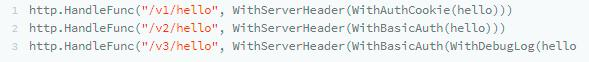

通过一个代理函数：

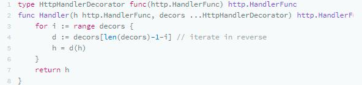

我们就可以移除不断的嵌套，像下面这样使用了：

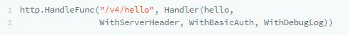

## Channel 管理

当然，如果你要写出一个泛型的 Pipeline 框架并不容易，可以使用Go Generation实现，但是，我们别忘了，Go 语言最具特色的 Go Routine 和 Channel 这两个神器完全可以用来构造这种编程。

Rob Pike 在 Go Concurrency Patterns: Pipelines and cancellation 这篇博客中介绍了一种编程模式，下面我们来学习下。

### Channel 转发函数

首先，我们需要一个 echo()函数，它会把一个整型数组放到一个 Channel 中，并返回这个 Channel。

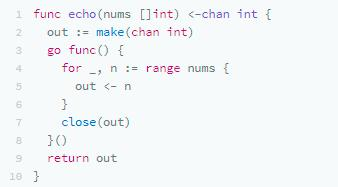

然后，我们依照这个模式，就可以写下下面的函数。

### 平方函数

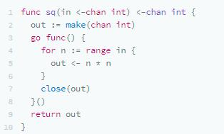

### 过滤奇数函数

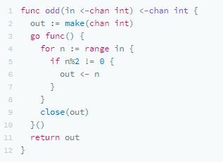

### 求和函数

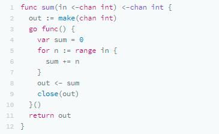

用户端的代码如下所示（注：你可能会觉得，sum()，odd() 和 sq() 太过于相似，其实，你可以通过 Map/Reduce 编程模式或者是 Go Generation 的方式合并一下）：

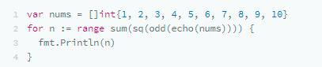

上面的代码类似于我们执行了 Unix/Linux 命令： echo $nums | sq | sum。同样，如果你不想有那么多的函数嵌套，就可以使用一个代理函数来完成。

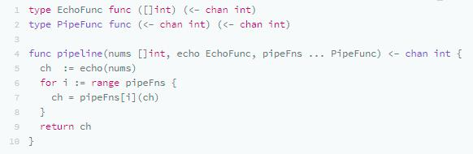

然后，就可以这样做了：

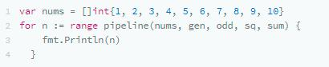

### Fan in/Out

**动用 Go 语言的 Go Routine 和 Channel 还有一个好处，就是可以写出 1 对多，或多对 1 的 Pipeline，也就是 Fan In/ Fan Out**。下面，我们来看一个 Fan in 的示例。

假设我们要通过并发的方式对一个很长的数组中的质数进行求和运算，我们想先把数组分段求和，然后再把它们集中起来。

下面是我们的主函数：

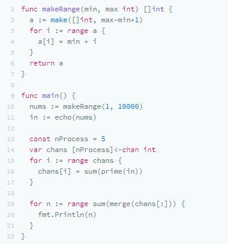

再看我们的 prime() 函数的实现 ：

我来简单解释下这段代码。

- 首先，我们制造了从 1 到 10000 的数组；
- 然后，把这堆数组全部 echo到一个 Channel 里—— in；
- 此时，生成 5 个 Channel，接着都调用 sum(prime(in)) ，于是，每个 Sum 的 Go Routine 都会开始计算和；
- 最后，再把所有的结果再求和拼起来，得到最终的结果。

其中的 merge 代码如下：

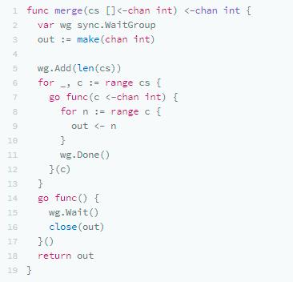

整个程序的结构如下图所示：

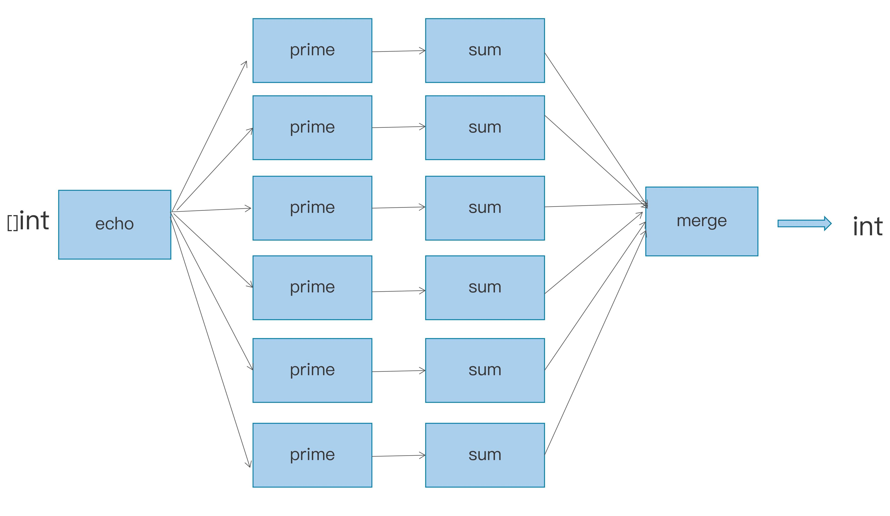

