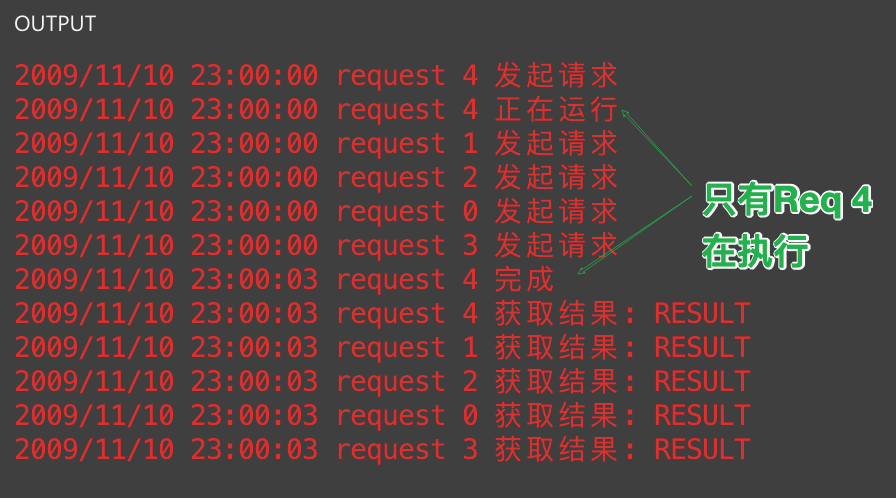

# Go 并发库 - singlelight
## singleflight的作用

防止缓存击穿

## 什么是缓存击穿

在高并发系统中，会有大量请求同时请求一个热点key的情况，这时这个key失效了，导致大量的请求直接访问数据库。上述现象就是缓存击穿，其后果就是大量请求同时访问数据库时，导致数据库压力剧增。

## 解决方案

1、缓存中的热点数据可以设置成永不过期。但是这个方法有两个问题，①不是所有场景都适用，需要区分场景，比如秒杀场景中，热点数据的缓存时间要覆盖整个活动。②数据更新时，需要一个后台线程更新缓存中的数据。

2、使用互斥锁，在第一个请求查询数据库时，加锁，阻塞其他请求，第一个请求会将数据加载到缓存中，结束后，释放锁，其他阻塞的请求直接在缓存中查询数据，这样可以达到保护数据库的目的。但是这个方法也有问题，阻塞其他线程会降低系统吞吐。

3、本文介绍的singleflight。其中原理和方法二类似，但是由于singleflight是go语言支持的，所以他锁住的不是线程，是更加轻量的goroutine。并且后续goroutine不需要在缓存中获取数据，可以直接返回第一个goroutine获取到的数据。

## singleflight基本原理


请求1、2、3同时请求相同的key，singleflight机制只会让请求1访问DB，请求1返回的value不仅返回给客户端1，也作为请求2、请求3的结果返回给客户端。这里的多请求理解为多个gotoutine并发执行。

### 示例代码

```go
package main

import (
   "golang.org/x/sync/singleflight"
   "log"
   "sync"
   "time"
)

func main() {
   var group singleflight.Group
   var wg sync.WaitGroup
   gonum := 5
   wg.Add(gonum)
   key := "requestKey"
   for i := 0; i < gonum; i++ { //模拟多个协程同时请求
      go func(requestID int) {
         defer wg.Done()
         value, _ := mainproc(&group, requestID, key)
         log.Printf("request %v 获取结果: %v", requestID, value)
      }(i)
   }
   wg.Wait()
}

func mainproc(group *singleflight.Group, requestID int, key string) (string, error) {
   log.Printf("request %v 发起请求", requestID)
   value, _, _ := group.Do(key, func() (ret interface{}, err error) { //do的入参key，可以直接使用缓存的key，这样同一个缓存，只有一个协程会去读DB
      log.Printf("request %v 正在运行", requestID)
      time.Sleep(3 * time.Second)
      log.Printf("request %v 完成", requestID)
      return "RESULT", nil
   })
   return value.(string), nil
}
```

### 运行结果
> 运行地址：https://goplay.tools/snippet/8OcW2bAaoDq




## 源码解析

关于error处理相关内容就不做介绍了，源码中也有很详细的英文注释。

官方文档：[https://pkg.go.dev/golang.org/x/sync/singleflight](https://link.zhihu.com/?target=https%3A//pkg.go.dev/golang.org/x/sync/singleflight)

### 1、数据结构

Group：实现singleflight机制的对象，多个请求共用一个group，其中的mu字段保证并发安全，m字段存请求(key)和对应的call对象(value)，多个请求访问同一个key时，m就保证了每个key只有一个call对象。

```go
type Group struct {
   mu sync.Mutex       // 锁，保证m的并发安全
   m  map[string]*call // 存请求(key)和对应的调用信息(value)包括返回结果等。
}
```

Call：调用信息，包括结果和一些统计字段。多个请求的key相同，只会有一个call

```go
type call struct {
   // 通过wg的机制可以保证阻塞相同key的其他请求。
   wg sync.WaitGroup

   // 请求返回结果，保证在wg done之前只写入一次，且在wg done之后才会读
   val interface{}
   err error

   // 当前key是否调用了Forget方法
   forgotten bool

   // 统计相同key的次数
   dups  int
   // 请求返回结果，但是DoChan方法调用，用channel进行通知。
   chans []chan<- Result
}
```

Result：请求的返回结果
```go
type Result struct {
   // 返回值
   Val interface{}
   Err error
   // 是否共享(多个相同key的请求等待)
   Shared bool
}
```

### 2、方法

Do方法：singleflight的核心方法，执行给定的函数，并返回结果，一个key返回一次，重复的key会等待第一个返回后，返回相同的结果。

DoCall方法：与Do方法作用一样，区别在于执行函数非阻塞，所有的结果通过chan传给各个请求。

```go
/*
Do 执行给定的函数，并返回结果，一个key返回一次，重复的key会等待第一个返回后，返回相同的结果。
入参：key 请求标识，用于区分是否是相同的请求；fn 要执行的函数
返回值：v 返回结果；err 错误信息；shared 是否是共享的结果，是否将v提供给多个请求
*/
func (g *Group) Do(key string, fn func() (interface{}, error)) (v interface{}, err error, shared bool) {
   // 相当于给map加锁
   g.mu.Lock()
   // 懒加载，如果g中还没有map，就初始化一个map
   if g.m == nil {
      g.m = make(map[string]*call)
   }
   // key有对应的value，说明有相同的key只在执行，当前的请求需要等待。
   if c, ok := g.m[key]; ok {
      c.dups++      // 相同的请求数+1
      g.mu.Unlock() // 不需要写入，直接释放锁
      c.wg.Wait()   // 等待

      // 省略一些错误逻辑处理。。。
      ......
      return c.val, c.err, true
   }
   // 当前的key没有对应value
   c := new(call) // 新建当前key的call实例
   c.wg.Add(1)    // 只有1个请求执行，只需要Add(1)
   g.m[key] = c   // 写入map
   g.mu.Unlock()  // 写入完成释放锁

   g.doCall(c, key, fn)            // 执行
   return c.val, c.err, c.dups > 0 // >0 表示当前值需要共享给其他正在等待的请求。
}

/*
DoChan 与Do方法作用相同，区别是返回的是chan，可以在有数据时直接填入chan中，避免阻塞。
*/
func (g *Group) DoChan(key string, fn func() (interface{}, error)) <-chan Result {
   ch := make(chan Result, 1)
   ......
   if c, ok := g.m[key]; ok {
      c.dups++
      // 等待的请求将自己的ch添加到call实例中的chans列表中，方便有结果时返回
      c.chans = append(c.chans, ch)
      // 因为结果通过ch传递，所以不需要c.wg.Wait()
      ......
      return ch
   }
   c := &call{chans: []chan<- Result{ch}}
   ......

   // 因为使用chan传输数据，是非阻塞式的，可以使用其他的goroutine执行处理函数。
   go g.doCall(c, key, fn)

   return ch
}
```

doCall：执行处理函数fn。 省略了很多错误处理。

```go
/*
doCall 执行处理函数
入参：c key的实例；key 请求的标识；fn 处理函数
返回结果都存在c实例中。
*/
func (g *Group) doCall(c *call, key string, fn func() (interface{}, error)) {
   ......
   defer func() {
      ......
      // 当前的处理函数运行完成，执行wg done
      c.wg.Done()
      // 加锁，删除刚执行的key/value
      g.mu.Lock()
      defer g.mu.Unlock()
      // 当前key没有执行Forget，就可以删除key了
      if !c.forgotten {
         delete(g.m, key)
      }

      if e, ok := c.err.(*panicError); ok {
         ......
      } else {
         // Normal return
         // 当执行DoChan方法时，chans存了Result列表，将结果添加到每个需要结果的ch中。
         for _, ch := range c.chans {
            ch <- Result{c.val, c.err, c.dups > 0}
         }
      }
   }()

   func() {
      ......
      // 执行处理函数。
      c.val, c.err = fn()
      ......
   }()
   ......
}
```

Forget方法：丢弃当前正在处理的key

```go
// Forget 方法的作用是当前key由于超时等原因被主动丢弃，
// 后续相同key的请求会重新运行，而被丢弃的请求可能还正在执行。
// 作用是防止当前请求故障而导致所有相同key的请求都阻塞住。
func (g *Group) Forget(key string) {
   g.mu.Lock()
   // 如果当前key存在，需要将对应的forgotten标志位改为true，标识当前key又有其他请求执行。
   if c, ok := g.m[key]; ok {
      c.forgotten = true
   }
   delete(g.m, key)
   g.mu.Unlock()
}
```

为了避免处理函数异常而导致大量请求阻塞或者收不到结果，可以灵活使用Forget方法。

## 总结

singleflight方法可以很好的解决缓存击穿的问题，但是为了避免阻塞大量请求导致系统等待goroutine激增，任然需要灵活使用DoCall方法和Forget方法。