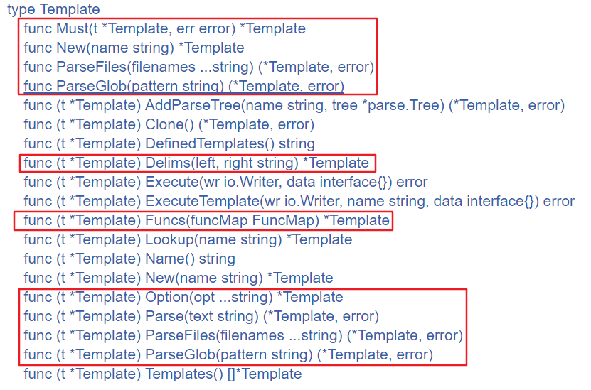
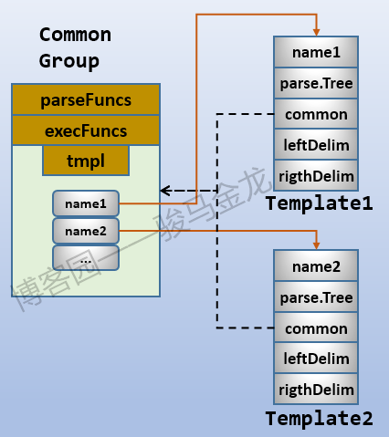
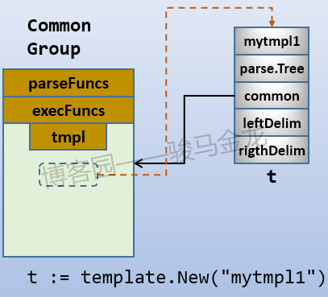
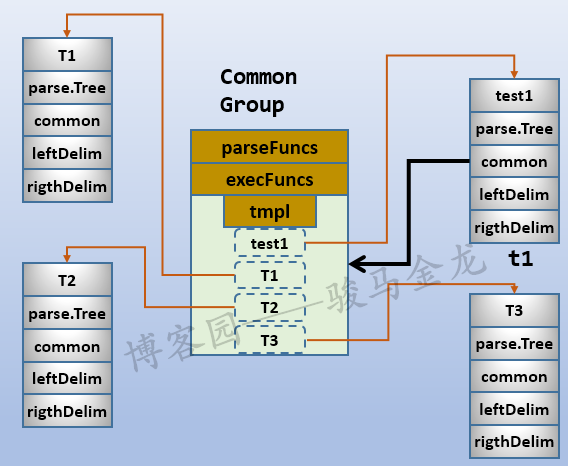
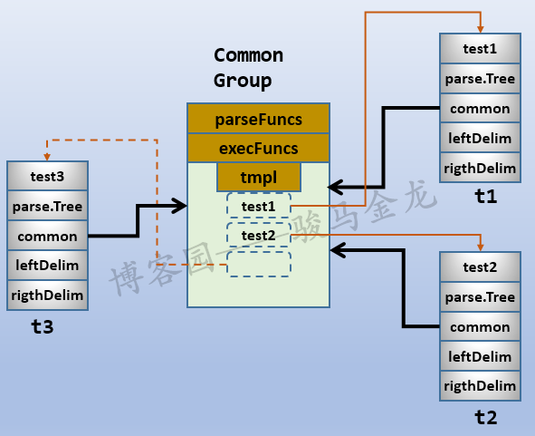
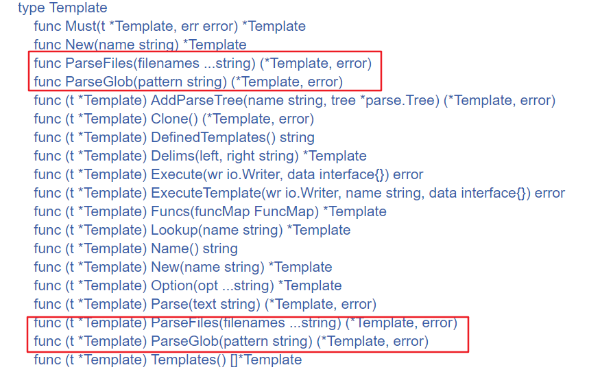
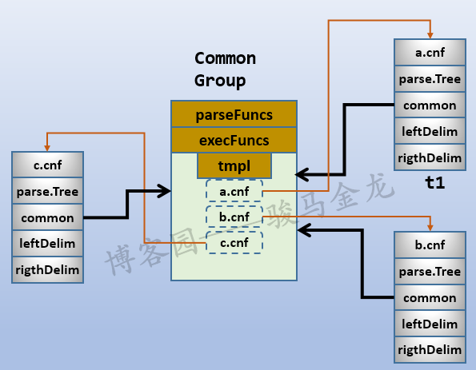

# 深入剖析 template

本文只关注Go text/template的底层结构，带上了很详细的图片以及示例帮助理解，有些地方也附带上了源码进行解释。有了本文的解释，对于Go template的语法以及html/template的用法，一切都很简单。

## 入门示例

```go
package main

import (
	"html/template"
	"os"
)

type Person struct {
	Name string
	Age    int
}

func main() {
	p := Person{"longshuai", 23}
	tmpl, err := template.New("test").Parse("Name: {{.Name}}, Age: {{.Age}}")
	if err != nil {
		panic(err)
	}
	err = tmpl.Execute(os.Stdout, p)
	if err != nil {
		panic(err)
	}
	fmt.Println(tmpl)
}
```

上面定义了一个Person结构，有两个**大写字母开头**(意味着这俩字段是导出的)的字段Name和Age。然后`main()`中创建了Person的实例对象p。

紧接着使用t`emplate.New()`函数创建了一个空Template实例(对象)，然后通过这个template实例调用`Parse()`方法，`Parse()`方法用来解析、评估模板中需要执行的action，其中需要评估的部分都使用`{{}}`包围，并将评估后(解析后)的结果赋值给tmpl。

最后调用`Execute()`方法，该方法将数据对象Person的实例p应用到已经解析的tmpl模板，最后将整个应用合并后的结果输出到`os.Stdout`。

上面的示例很简单，两个注意点：

1. **流程：构建模板对象New()-->解析数据Parse()-->应用合并Execute()**
2. Parse()解析的对象中包含了`{{}}`，其中使用了点(.)，`{{.Name}}`代表Execute()第二个参数p对象的Name字段，同理`{{.Age}}`

也就是说，`{{.}}`代表的是要应用的对象，类似于java/c++中的this，python/perl中的self。

更通用地，`{{.}}`表示的是所处作用域的当前对象，而不仅仅只代表Execute()中的第二个参数对象。例如，本示例中`{{.}}`代表顶级作用域的对象p，如果Parse()中还有嵌套的作用域range，则`{{.}}`代表range迭代到的每个元素对象。如果了解perl语言，`{{.}}`可以理解为默认变量`$_`。

## 模板关联(associate)

template中有不少函数、方法都直接返回`*Template`类型。



上图中使用红色框线框起来一部分返回值是`*Template`的函数、方法。对于函数，它们返回一个Template实例(假设为t)，对于使用t作为参数的Must()函数和那些框起来的Template方法，它们返回的`*Template`**其实是原始实例t**。

例如：

```css
t := template.New("abc")
tt,err := t.Parse("xxxxxxxxxxx")
```

这里的t和tt其实都指向同一个模板对象。

这里的**t称为模板的关联名称**。通俗一点，就是创建了一个模板，关联到变量t上。但**注意，t不是模板的名称，因为Template中有一个未导出的name字段，它才是模板的名称**。可以通过Name()方法返回name字段的值，而且仔细观察上面的函数、方法，有些是以name作为参数的。

之所以要区分模板的关联名称(t)和模板的名称(name)，是因为**一个关联名称t(即模板对象)上可以"包含"多个name，也就是多个模板，通过t和各自的name，可以调用到指定的模板**。

## 模板结构详解

首先看Template结构：

```go
type Template struct {
	name string
	*parse.Tree
	*common
	leftDelim  string
	rightDelim string
}
```

name是这个Template的名称，Tree是解析树，common是另一个结构，稍后解释。leftDelim和rightDelim是左右两边的分隔符，默认为`{{`和`}}`。

这里主要关注name和common两个字段，name字段没什么解释的。common是一个结构：

```go
type common struct {
	tmpl   map[string]*Template // Map from name to defined templates.
	option option
	muFuncs    sync.RWMutex // protects parseFuncs and execFuncs
	parseFuncs FuncMap
	execFuncs  map[string]reflect.Value
}
```

这个结构的第一个字段tmpl是一个Template的map结构，key为template的name，value为Template。也就是说，一个common结构中可以包含多个Template，而Template结构中又指向了一个common结构。所以，common是一个模板组，在这个模板组中的(tmpl字段)所有Template都共享一个common(模板组)，模板组中包含parseFuncs和execFuncs。

大概结构如下图：



除了需要关注的name和common，parseFuncs和execFuncs这两个字段也需要了解下，它们共同成为模板的FuncMap。

### New()函数和init()方法

**使用template.New()函数可以创建一个空的、无解析数据的模板，同时还会创建一个common，也就是模板组**。

```go
func New(name string) *Template {
	t := &Template{
		name: name,
	}
	t.init()
	return t
}
```

其中t为模板的关联名称，name为模板的名称，t.init()表示如果模板对象t还没有common结构，就构造一个新的common组：

```go
func (t *Template) init() {
	if t.common == nil {
		c := new(common)
		c.tmpl = make(map[string]*Template)
		c.parseFuncs = make(FuncMap)
		c.execFuncs = make(map[string]reflect.Value)
		t.common = c
	}
}
```

也就是说，**template.New()函数不仅创建了一个模板，还创建了一个空的common结构(模板组)。需要注意，新创建的common是空的，只有进行模板解析(Parse()，ParseFiles()等操作)之后，才会将模板添加到common的tmpl字段(map结构)中**。

所以，下面的代码：

```cpp
tmpl := template.New("mytmpl1")
```

执行完后将生成如下结构，其中tmpl为模板关联名称，mytmpl1为模板名称。



因为还没有进行解析操作，所以上图使用虚线表示尚不存在的部分。

实际上，在template包中，很多涉及到操作Template的函数、方法，都会调用init()方法保证返回的Template都有一个有效的common结构。当然，因为init()方法中进行了判断，对于已存在common的模板，不会新建common结构。

假设现在执行了Parse()方法，将会把模板name添加到common tmpl字段的map结构中，其中模板name为map的key，模板为map的value。

例如：

```cpp
func main() {
	t1 := template.New("test1")
	tmpl,_ := t1.Parse(
			`{{define "T1"}}ONE{{end}}
			{{define "T2"}}TWO{{end}}
			{{define "T3"}}{{template "T1"}} {{template "T2"}}{{end}}
			{{template "T3"}}`)
	fmt.Println(t1)
	fmt.Println(tmpl)
	fmt.Println(t1.Lookup("test1"))  // 使用关联名称t1检索test1模板
	fmt.Println(t1.Lookup("T1"))
	fmt.Println(tmpl.Lookup("T2")) // 使用关联名称tmpl检索T2模板
	fmt.Println(tmpl.Lookup("T3"))
}
```

上述代码的执行结果：注意前3行的结果完全一致，所有行的第二个地址完全相同。

```x86asm
&{test1 0xc0420a6000 0xc0420640c0  }
&{test1 0xc0420a6000 0xc0420640c0  }
&{test1 0xc0420a6000 0xc0420640c0  }
&{T1 0xc0420a6100 0xc0420640c0  }
&{T2 0xc0420a6200 0xc0420640c0  }
&{T3 0xc0420a6300 0xc0420640c0  }
```

首先使用template.New()函数创建了一个名为test1的模板，同时创建了一个模板组(common)，它们关联在t1变量上。

然后调用Parse()方法，在Parse()的待解析字符串中使用define又定义了3个新的模板对象，模板的name分别为T1、T2和T3，其中T1和T2嵌套在T3中，因为调用的是t1的Parse()，所以这3个新创建的模板都会关联到t1上。

也就是说，现在t1上关联了4个模板：test1、T1、T2、T3，它们全都共享同一个common。因为已经执行了Parse()解析操作，这个Parse()会将test1、T1、T2、T3的name添加到common.tmpl的map中。也就是说，common的tmpl字段的map结构中有4个元素。

结构如下图：



必须注意，虽然test1、T1、T2、T3都关联在t1上，但t1只能代表test1(所以上图中只有test1下面标注了t1)，因为t1是一个Template类型。可以认为test1、T1、T2、T3这4个模板共享一个组，但T1、T2、T3都是对外部不可见的，只能通过特殊方法的查询找到它们。

另外，前文说过，template包中很多返回`*Template`的函数、方法返回的其实是原始的t(看源代码即可知道)，这个规则也适用于这里的Parse()方法，所以tmpl和t1这两个变量是完全等价的，都指向同一个template，即test1。所以前面的执行结果中前3行完全一致。

再回头看上面代码的执行结果，假设结果中的每一行都分为3列，**第一列为template name，第二个字段为parseTree的地址，第三列为common结构的地址**。因为tmpl1、t1都指向test1模板，所以前3行结果完全一致。因为test1、T1、T2、T3共享同一个common，所以第三列全都相同。因为每个模板的解析树不一样，所以第二列全都不一样。

### New()方法

除了template.New()函数，还有一个Template.New()方法：

```scss
// New allocates a new, undefined template associated with the given one and with the same
// delimiters. The association, which is transitive, allows one template to
// invoke another with a {{template}} action.
func (t *Template) New(name string) *Template {
	t.init()
	nt := &Template{
		name:       name,
		common:     t.common,
		leftDelim:  t.leftDelim,
		rightDelim: t.rightDelim,
	}
	return nt
}
```

看注释很难理解，但是看它的代码，结合前文的解释，New()方法的作用很明显。

首先t.init()保证有一个有效的common结构，然后构造一个新的Template对象nt，这个nt除了name和解析树parse.Tree字段之外，其它所有内容都和t完全一致。换句话说，nt和t共享了common。

也就是说，New()方法使得名为name的nt模板对象加入到了关联组中。更通俗一点，**通过调用`t.New()`方法，可以创建一个新的名为name的模板对象，并将此对象加入到t模板组中**。

这和New()函数的作用基本是一致的，只不过New()函数是构建新的模板对象并构建一个新的common结构，而New()方法则是构建一个新的模板对象，并加入到已有的common结构中。

只是还是要说明，因为New()出来的新对象在执行解析之前(如Parse())，它们暂时都还不会加入到common组中，在New()出来之后，仅仅只是让它指向已有的一个common结构。

所以：

```mipsasm
t1 := template.New("test1")
t1 = t1.Parse(...)
t2 := t1.New("test2")
t2 = t2.Parse(...)
t3 := t1.New("test3")
```

结构图：



如果t1和t2的Parse()中，都定义一个或多个name相同的模板会如何？例如：

```mipsasm
t1 := template.New("test1")
t2 := t1.New("test2")
t1, _ = t1.Parse(
	`{{define "T1"}}ONE{{end}}
	{{define "T2"}}TWO{{end}}
	{{define "T3"}}{{template "T1"}} {{template "T2"}}{{end}}
	{{template "T3"}}`)
t2, _ = t2.Parse(
	`{{define "T4"}}ONE{{end}}
	{{define "T2"}}TWOO{{end}}
	{{define "T3"}}{{template "T4"}} {{template "T2"}}{{end}}
	{{template "T3"}}`)

	_ = t1.Execute(os.Stdout, "a")
	_ = t2.Execute(os.Stdout, "a")
```

在上面的t1和t2中，它们共享同一个common，且t1.Parse()中定义了T1、T2和T3，t2.Parse()中定义了T4、T2和T3，且两个T2的解析内容不一样(解析树不一样)。

因为T1、T2、T3、T4都会加入到t1和t2共享的common中，所以无论是通过t1还是通过t2这两个关联名称都能找到T1、T2、T3、T4。但是后解析的会覆盖先解析的，也就是说，无论是`t1.Lookup("T2")`还是`t2.Lookup("T2")`得到的T2对应的template，都是在t2.Parse()中定义的。当`t1.Execute()`的时候，会得到t2中定义的T2的值。

```sql
ONE TWOO
ONE TWOO
```

## Parse()

Parse(string)方法用于解析给定的文本内容string。用法上很简单，前面也已经用过几次了，没什么可解释的。重点在于它的作用。

当创建了一个模板对象后，会有一个与之关联的common(如果不存在，template包中的各种函数、方法都会因为调用init()方法而保证common的存在)。**只有在Parse()之后，才会将相关的template name放进common中，表示这个模板已经可用了，或者称为已经定义了(defined)，可用被Execute()或ExecuteTemplate()，也表示可用使用Lookup()和DefinedTemplates()来检索模板**。另外，调用了Parse()解析后，会将给定的FuncMap中的函数添加到common的FuncMap中，只有添加到common的函数，才可以在模板中使用。

Parse()方法是解析字符串的，且只解析New()出来的模板对象。如果想要解析文件中的内容，见后文ParseFiles()、ParseGlob()。

## Lookup()、DefinedTemplates()和Templates()方法

这三个方法都用于检索已经定义的模板，Lookup()根据template name来检索并返回对应的template，DefinedTemplates()则是返回所有已定义的templates。Templates()和DefinedTemplates()类似，但是它返回的是`[]*Template`，也就是已定义的template的slice。

前面多次说过，只有在解析之后，模板才加入到common结构中，才算是已经定义，才能被检索或执行。

当检索不存在的templates时，Lookup()将返回nil。当common中没有模板，DefinedTemplates()将返回空字符串""，Templates()将返回空的slice。

```mipsasm
func main() {
	t1 := template.New("test1")
	t2 := t1.New("test2")
	t1, _ = t1.Parse(
		`{{define "T1"}}ONE{{end}}
		{{define "T2"}}TWO{{end}}
		{{define "T3"}}{{template "T1"}} {{template "T2"}}{{end}}
		{{template "T3"}}`)
	t2, _ = t2.Parse(
		`{{define "T4"}}ONE{{end}}
		{{define "T2"}}TWOO{{end}}
		{{define "T3"}}{{template "T4"}} {{template "T2"}}{{end}}
		{{template "T3"}}`)

	fmt.Println(t1.DefinedTemplates())
	fmt.Println(t2.DefinedTemplates())
	fmt.Println(t2.Templates())
}
```

返回结果：

```perl
; defined templates are: "T1", "T2", "T3", "test1", "T4", "test2"
; defined templates are: "test1", "T4", "test2", "T1", "T2", "T3"
[0xc04201c280 0xc042064100 0xc04201c1c0 0xc04201c2c0 0xc04201c300 0xc042064080]
```

从结果可见，返回的顺序虽然不一致，但包含的template name是完全一致的。

## Clone()方法

`Clone()`方法用于克隆一个完全一样的模板，包括**common结构也会完全克隆**。

```mipsasm
t1 := template.New("test1")
t1 = t1.Parse(...)
t2 := t1.New("test2")
t2 = t2.Parse(...)

t3, err := t1.Clone()
if err != nil {
	panic(err)
}
```

这里的t3和t1在内容上完全一致，但在内存中它们是两个不同的对象。但无论如何，目前t3中会包含t1和t2共享的common，即使t2中定义了`{{define "Tx"}}...{{end}}`，这个Tx也会包含在t3中。

因为是不同的对象，所以修改t3，不会影响t1/t2。

看下面的例子：

```fsharp
func main() {
	t1 := template.New("test1")
	t2 := t1.New("test2")
	t1, _ = t1.Parse(
		`{{define "T1"}}ONE{{end}}
		{{define "T2"}}TWO{{end}}
		{{define "T3"}}{{template "T1"}} {{template "T2"}}{{end}}
		{{template "T3"}}`)
	t2, _ = t2.Parse(
		`{{define "T4"}}ONE{{end}}
		{{define "T2"}}TWOO{{end}}
		{{define "T3"}}{{template "T4"}} {{template "T2"}}{{end}}
		{{template "T3"}}`)

	t3, err := t1.Clone()
	if err != nil {
		panic(err)
	}

    // 结果完全一致
	fmt.Println(t1.Lookup("T4"))
	fmt.Println(t3.Lookup("T4"))
    
    // 修改t3
	t3,_ = t3.Parse(`{{define "T4"}}one{{end}}`)
    // 结果将不一致
	fmt.Println(t1.Lookup("T4"))
	fmt.Println(t3.Lookup("T4"))
}
```

## Must()函数

正常情况下，很多函数、方法都返回两个值，一个是想要返回的值，一个是err信息。template包中的函数、方法也一样如此。

但有时候不想要err信息，而是直接取第一个返回值，并赋值给变量。操作大概是这样的：

```go
t1 := template.New("ttt")
t1,err := t1.Parse(...)
if err != nil {
    panic(err)
}
...
```

Must()函数将上面的过程封装了，使得Must()可以简化上面的操作：

```go
func Must(t *Template, err error) *Template {
	if err != nil {
		panic(err)
	}
	return t
}
```

当某个返回`*Template,err`的函数、方法需要直接使用时，可用将其包装在Must()中，它会自动在有err的时候panic，无错的时候只返回其中的`*Template`。

这在赋值给变量的时候非常简便，例如：

```cpp
var t = template.Must(template.New("name").Parse("text"))
```

## ParseFiles()和ParseGlob()

Parse()只能解析字符串，要解析文件中的内容，需要使用ParseFiles()或ParseGlob()。

template包中有ParseFiles()和ParseGlob()函数，也有ParseFiles()和ParseGlob()方法。



这两个函数和这两个方法的区别，看一下文档就很清晰：

```vhdl
$ go doc template.ParseFiles
func ParseFiles(filenames ...string) (*Template, error)
    ParseFiles creates a new Template and parses the template definitions from
    the named files. The returned template's name will have the (base) name and
    (parsed) contents of the first file. There must be at least one file. If an
    error occurs, parsing stops and the returned *Template is nil.

$ go doc template.template.ParseFiles
func (t *Template) ParseFiles(filenames ...string) (*Template, error)
    ParseFiles parses the named files and associates the resulting templates
    with t. If an error occurs, parsing stops and the returned template is nil;
    otherwise it is t. There must be at least one file.
```

解释很清晰。ParseFiles()函数是直接解析一个或多个文件的内容，并返回第一个文件名的basename作为Template的名称，也就是说这些文件的template全都关联到第一个文件的basename上。ParseFiles()方法则是解析一个或多个文件的内容，并将这些内容关联到t上。

看示例就一目了然。

例如，当前go程序的目录下有3个文件：a.cnf、b.cnf和c.cnf，它们的内容无所谓，反正空内容也可以解析。

```scss
func main() {
	t1,err := template.ParseFiles("a.cnf","b.cnf","c.cnf")
	if err != nil {
		panic(err)
	}
	fmt.Println(t1.DefinedTemplates())
	fmt.Println()
	fmt.Println(t1)
	fmt.Println(t1.Lookup("a.cnf"))
	fmt.Println(t1.Lookup("b.cnf"))
	fmt.Println(t1.Lookup("c.cnf"))
}
```

输出结果：

```x86asm
; defined templates are: "a.cnf", "b.cnf", "c.cnf"

&{a.cnf 0xc0420ae000 0xc042064140  }
&{a.cnf 0xc0420ae000 0xc042064140  }
&{b.cnf 0xc0420bc000 0xc042064140  }
&{c.cnf 0xc0420bc100 0xc042064140  }
```

从结果中可以看到，已定义的template name都是文件的basename，且t1和a.cnf这个template是完全一致的，即t1是文件列表中的第一个模板对象。

结构如下图：



理解了ParseFiles()函数，理解ParseFiles()方法、ParseGlob()函数、ParseGlob()方法，应该不会再有什么问题。但是还是有需要注意的地方：

```scss
func main() {
	t1 := template.New("test")
	t1,err := t1.ParseFiles("a.cnf","b.cnf","c.cnf")
	if err != nil {
		panic(err)
	}
    // 先注释下面这行
	//t1.Parse("")
	fmt.Println(t1.DefinedTemplates())
	fmt.Println()
	fmt.Println(t1)
	fmt.Println(t1.Lookup("a.cnf"))
	fmt.Println(t1.Lookup("b.cnf"))
	fmt.Println(t1.Lookup("c.cnf"))
}
```

执行结果：

```x86asm
; defined templates are: "a.cnf", "b.cnf", "c.cnf"

&{test <nil> 0xc0420640c0  }
&{a.cnf 0xc0420b0000 0xc0420640c0  }
&{b.cnf 0xc0420be000 0xc0420640c0  }
&{c.cnf 0xc0420be100 0xc0420640c0  }
```

发现template.New()函数创建的模板对象test并没有包含到common中。为什么？

因为t.ParseFiles()、t.ParseGlob()方法的解析过程是独立于t之外的，它们只解析文件内容，不解析字符串。而New()出来的模板，需要Parse()方法来解析才会加入到common中。

将上面的注释行取消掉，执行结果将如下：

```x86asm
; defined templates are: "a.cnf", "b.cnf", "c.cnf", "test"

&{test 0xc0420bc200 0xc0420640c0  }
&{a.cnf 0xc0420ae000 0xc0420640c0  }
&{b.cnf 0xc0420bc000 0xc0420640c0  }
&{c.cnf 0xc0420bc100 0xc0420640c0  }
```

具体原因可分析parseFiles()源码：

```go
func parseFiles(t *Template, filenames ...string) (*Template, error) {
	if len(filenames) == 0 {
		// Not really a problem, but be consistent.
		return nil, fmt.Errorf("template: no files named in call to ParseFiles")
	}
	for _, filename := range filenames {
		b, err := ioutil.ReadFile(filename)
		if err != nil {
			return nil, err
		}
		s := string(b)

		// name为文件名的basename部分
		name := filepath.Base(filename)

		var tmpl *Template
		if t == nil {
			t = New(name)
		}
		// 如果调用t.Parsefiles()，则t.Name不为空
		// name也就不等于t.Name
		// 于是新New(name)一个模板对象给tmpl
		if name == t.Name() {
			tmpl = t
		} else {
			tmpl = t.New(name)
		}
		// 解析tmpl。如果选中了上面的else分支，则和t无关
		_, err = tmpl.Parse(s)
		if err != nil {
			return nil, err
		}
	}
	return t, nil
}
```

## Execute()和ExecuteTemplate()

这两个方法都可以用来应用已经解析好的模板，应用表示对需要评估的数据进行操作，并和无需评估数据进行合并，然后输出到io.Writer中：

```go
func (t *Template) Execute(wr io.Writer, data interface{}) error
func (t *Template) ExecuteTemplate(wr io.Writer, name string, data interface{}) error
```

两者的区别在于Execute()是应用整个common中已定义的模板对象，而ExecuteTemplate()可以选择common中某个已定义的模板进行应用。

例如：

```cpp
func main() {
	t1 := template.New("test1")
	t1, _ = t1.Parse(`{{define "T1"}}ONE{{end}}
		{{- define "T2"}}TWO{{end}}
		{{- define "T3"}}{{template "T1"}} {{template "T2"}}{{end}}
		{{- template "T3"}}`)
	
	_ = t1.Execute(os.Stdout,"")
	fmt.Println()
	fmt.Println("-------------")
	_ = t1.ExecuteTemplate(os.Stdout, "T2", "")
}
```

输出结果：

```markdown
ONE TWO
-------------
TWO
```

## FuncMap和Funcs()

template内置了一系列函数，但这些函数毕竟有限，可能无法满足特殊的需求。template允许我们定义自己的函数，添加到common中，然后就可以在待解析的内容中像使用内置函数一样使用自定义的函数。

自定义函数的优先级高于内置的函数优先级，即先检索自定义函数，再检索内置函数。也就是说，如果自定义函数的函数名和内置函数名相同，则内置函数将失效。

本文只对此稍作解释，本文的重点不是template的具体语法和用法。

在common结构中，有一个字段是FuncMap类型的：

```go
type common struct {
	tmpl   map[string]*Template
	option option
	muFuncs    sync.RWMutex // protects parseFuncs and execFuncs
	parseFuncs FuncMap
	execFuncs  map[string]reflect.Value
}
```

这个类型的定义为：

```go
type FuncMap map[string]interface{}
```

它是一个map结构，key为模板中可以使用的函数名，value为函数对象(为了方便称呼，这里直接成为函数)。函数必须只有1个值或2个值，如果有两个值，第二个值必须是error类型的，当执行函数时err不为空，则执行自动停止。

函数可以有多个参数。假如函数str有两个参数，在待解析的内容中调用函数str时，如果调用方式为`{{str . "aaa"}}`，表示第一个参数为当前对象，第二个参数为字符串"aaa"。

假如，要定义一个将字符串转换为大写的函数，可以：

```go
import "strings"
func upper(str string) string {
	return strings.ToUpper(str)
}
```

然后将其添加到FuncMap结构中，并将此函数命名为"strupper"，以后在待解析的内容中就可以调用"strupper"函数。

```cpp
funcMap := template.FuncMap{
	"strupper": upper,
}
```

或者，直接将匿名函数放在FuncMap内部：

```go
funcMap := template.FuncMap{
	"strupper": func(str string) string { return strings.ToUpper(str) },
}
```

现在只是定义了一个FuncMap实例，这个实例中有一个函数。还没有将它关联到模板，严格地说还没有将其放进common结构。要将其放进common结构，调用Funcs()方法(其实调用此方法也没有将其放进common，只有在解析的时候才会放进common)：

```scss
func (t *Template) Funcs(funcMap FuncMap) *Template
```

例如：

```go
funcMap := template.FuncMap{
	"strupper": func(str string) string { return strings.ToUpper(str) },
}
t1 := template.New("test")
t1 = t1.Funcs(funcMap)
```

这样，和t1共享common的所有模板都可以调用"strupper"函数。

注意，必须在解析之前调用Funcs()方法，在解析的时候会将函数放进common结构。

下面是完整的示例代码：

```go
package main

import (
	"os"
	"strings"
	"text/template"
)

func main() {
	funcMap := template.FuncMap{
		"strupper": upper,
	}
	t1 := template.New("test1")
	tmpl, err := t1.Funcs(funcMap).Parse(`{{strupper .}}`)
	if err != nil {
		panic(err)
	}
	_ = tmpl.Execute(os.Stdout, "go programming")
}

func upper(str string) string {
	return strings.ToUpper(str)
}
```

上面调用了`{{strupper .}}`，这里的strupper是我们自定义的函数，"."是它的参数(注意，参数不是放进括号里)。这里的"."代表当前作用域内的当前对象，对于这个示例来说，当前对象就是那段字符串对象"go programming"。