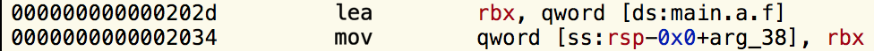
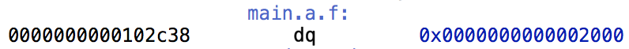
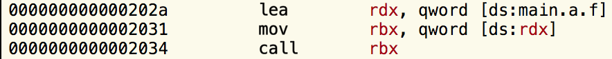

# Monkey 在 Go 中的应用

> 1. 应用：[Github](https://github.com/bouk/monkey)
> 2. 原文：[Monkey Patching in Go](https://bou.ke/blog/monkey-patching-in-go/)  

许多人认为猴子补丁仅限于 Ruby 和 Python 等动态语言。然而事实并非如此，因为计算机只是愚蠢的机器，我们总是可以让它们做我们想做的事！让我们看看 Go 函数是如何工作的以及如何在运行时修改它们。本文将使用大量英特尔汇编语法，因此我假设您已经可以阅读它或者在阅读时使用[参考](https://software.intel.com/en-us/articles/introduction-to-x64-assembly)。

**如果您对它的工作原理不感兴趣，而只想进行猴子修补，那么您可以[在这里](https://github.com/bouk/monkey)找到该库。**

让我们看看下面的代码反汇编后会产生什么：

```go
package main

func a() int { return 1 }

func main() {
  print(a())
}
```

[当编译并通过Hopper](https://hopperapp.com/)查看时，上面的代码将生成以下汇编代码：


我将参考屏幕左侧显示的各种指令的地址。

我们的代码从 procedure 开始`main.main`，其中指示`0x2010`设置`0x2026`堆栈。[您可以在此处](https://dave.cheney.net/2013/06/02/why-is-a-goroutines-stack-infinite)阅读有关此内容的更多信息，在本文的其余部分中我将忽略该代码。

Line是对 line 处`0x202a`函数的调用，它只是简单地移入堆栈并返回。然后将该值传递给 的行。`main.a0x20000x10x202f0x2037runtime.printint`

够简单的！现在我们来看看 Go 中函数值是如何实现的。

## 函数值在 Go 中如何工作

考虑以下代码：

```go
package main

import (
  "fmt"
  "unsafe"
)

func a() int { return 1 }

func main() {
  f := a
  fmt.Printf("0x%x\n", *(*uintptr)(unsafe.Pointer(&f)))
}
```

我在第 11 行所做的是分配`a`给`f`，这意味着`f()`现在将调用`a`. 然后我使用[不安全的](https://golang.org/pkg/unsafe/)Go包直接读取存储在`f`. 如果您有 C 背景，您可能希望`f`只是一个函数指针`a`，从而打印出这段代码`0x2000`（如我们上面看到的位置`main.a`）。当我在我的机器上运行它时，我得到了`0x102c38`，这是一个与我们的代码根本不相近的地址！反汇编后，上面第 11 行会发生以下情况：



这引用了一个名为 的东西`main.a.f`，当我们查看该位置时，我们会看到以下内容：



啊哈！`main.a.f`位于`0x102c38`且包含`0x2000`，这是 的位置`main.a`。它似乎`f`不是指向函数的指针，而是指向函数指针的指针。让我们修改代码来弥补这一点。

```go
package main
 
import (
  "fmt"
  "unsafe"
)
 
func a() int { return 1 }
 
func main() {
  f := a
  fmt.Printf("0x%x\n", **(**uintptr)(unsafe.Pointer(&f)))
}
```

现在将按`0x2000`预期打印 。[我们可以在这里](https://github.com/golang/go/blob/e9d9d0befc634f6e9f906b5ef7476fbd7ebd25e3/src/runtime/runtime2.go#L75-L78)找到关于为什么要实现这一点的线索。Go 函数值可以包含额外的信息，这就是闭包和绑定实例方法的实现方式。

让我们看看调用函数值是如何工作的。`f`我将在分配后更改要调用的代码。

```go
package main

func a() int { return 1 }

func main() {
	f := a
	f()
}
```

当我们拆解它时，我们得到以下内容：



`main.a.f`被加载到`rdx`，然后无论`rdx`指向什么都被加载到`rbx`，然后被调用。函数值的地址总是被加载到 中`rdx`，被调用的代码可以使用它来加载它可能需要的任何额外信息。此额外信息是指向绑定实例方法的实例的指针和匿名函数的闭包。如果你想了解更多，我建议你拿出一个反汇编程序并深入研究！

让我们利用新获得的知识在 Go 中实现猴子补丁。

## 在运行时替换函数

我们想要实现的是打印出以下代码`2`：

```go
package main

func a() int { return 1 }
func b() int { return 2 }

func main() {
	replace(a, b)
	print(a())
}
```

现在我们如何实施呢`replace`？我们需要修改函数`a`以跳转到`b`的代码而不是执行它自己的主体。`b`本质上，我们需要用 this 来替换它，它加载into的函数值`rdx`，然后跳转到 指向的位置`rdx`。

```
mov rdx, main.b.f ; 48 C7 C2 ?? ?? ?? ??
jmp [rdx] ; FF 22
```

我已将这些行在汇编时生成的相应机器代码放在它旁边（您可以使用像这样的在线汇编器轻松地进行汇编[）](https://defuse.ca/online-x86-assembler.htm)。编写生成此代码的函数现在很简单，如下所示：

```
func assembleJump(f func() int) []byte {
  funcVal := *(*uintptr)(unsafe.Pointer(&f))
  return []byte{
    0x48, 0xC7, 0xC2,
    byte(funcval >> 0),
    byte(funcval >> 8),
    byte(funcval >> 16),
    byte(funcval >> 24), // MOV rdx, funcVal
    0xFF, 0x22,          // JMP [rdx]
  }
}
```

`a`现在我们已经拥有了用跳转替换函数体所需的一切`b`！以下代码尝试将机器代码直接复制到函数体的位置。

```go
package main

import (
	"syscall"
	"unsafe"
)

func a() int { return 1 }
func b() int { return 2 }

func rawMemoryAccess(b uintptr) []byte {
	return (*(*[0xFF]byte)(unsafe.Pointer(b)))[:]
}

func assembleJump(f func() int) []byte {
	funcVal := *(*uintptr)(unsafe.Pointer(&f))
	return []byte{
		0x48, 0xC7, 0xC2,
		byte(funcVal >> 0),
		byte(funcVal >> 8),
		byte(funcVal >> 16),
		byte(funcVal >> 24), // MOV rdx, funcVal
		0xFF, 0x22,          // JMP [rdx]
	}
}

func replace(orig, replacement func() int) {
	bytes := assembleJump(replacement)
	functionLocation := **(**uintptr)(unsafe.Pointer(&orig))
	window := rawMemoryAccess(functionLocation)
	
	copy(window, bytes)
}

func main() {
	replace(a, b)
	print(a())
}
```

但是，运行此代码不起作用，并且会导致分段错误。这是因为默认情况下加载的二进制文件[不可写](https://en.wikipedia.org/wiki/Segmentation_fault#Writing_to_read-only_memory)。我们可以使用`mprotect`系统调用来禁用此保护，代码的最终版本正是这样做的，导致 function`a`被 function 替换`b`，并打印 '2' 。

```go
package main

import (
	"syscall"
	"unsafe"
)

func a() int { return 1 }
func b() int { return 2 }

func getPage(p uintptr) []byte {
	return (*(*[0xFFFFFF]byte)(unsafe.Pointer(p & ^uintptr(syscall.Getpagesize()-1))))[:syscall.Getpagesize()]
}

func rawMemoryAccess(b uintptr) []byte {
	return (*(*[0xFF]byte)(unsafe.Pointer(b)))[:]
}

func assembleJump(f func() int) []byte {
	funcVal := *(*uintptr)(unsafe.Pointer(&f))
	return []byte{
		0x48, 0xC7, 0xC2,
		byte(funcVal >> 0),
		byte(funcVal >> 8),
		byte(funcVal >> 16),
		byte(funcVal >> 24), // MOV rdx, funcVal
		0xFF, 0x22,          // JMP rdx
	}
}

func replace(orig, replacement func() int) {
	bytes := assembleJump(replacement)
	functionLocation := **(**uintptr)(unsafe.Pointer(&orig))
	window := rawMemoryAccess(functionLocation)
	
	page := getPage(functionLocation)
	syscall.Mprotect(page, syscall.PROT_READ|syscall.PROT_WRITE|syscall.PROT_EXEC)
	
	copy(window, bytes)
}

func main() {
	replace(a, b)
	print(a())
}
```

## 将其包装在一个漂亮的库中

我将上面的代码放入[一个易于使用的库中](https://github.com/bouk/monkey)。它支持32位、逆向补丁和修补实例方法。我写了几个例子并将它们放在自述文件中。

## 结论

只要有强大的意志，必有一条路为你开！程序可以在运行时修改自身，这使我们能够实现诸如猴子修补之类的酷技巧。

我希望您从这篇博文中得到一些有用的东西，我知道我制作它很有趣！