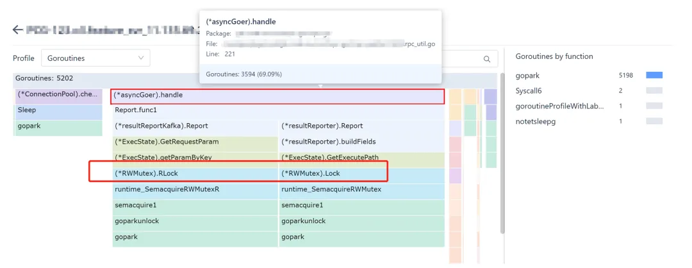
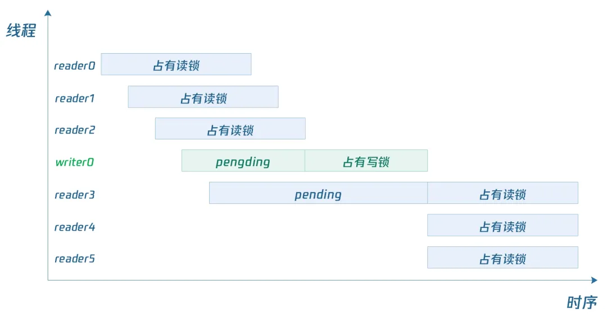
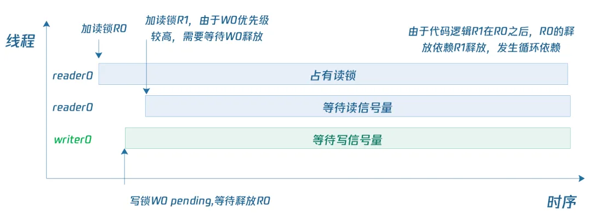

# 多线程读写锁产生死锁的故障解决方案

> 文章来源：[https://mp.weixin.qq.com/s/m6JPAkwUdNivsOGft-lR8w](https://mp.weixin.qq.com/s/m6JPAkwUdNivsOGft-lR8w)

多线程环境下，读写锁是一种常用的同步原语，适用于多读者-多写者的经典问题；合理的使用可以在保证数据一致性的前提下，大幅提升读性能，但不合理的使用可能会导致死锁。本文从一次协程泄露问题入手，分析golang读写锁可能产生死锁的场景，希望读者可以避坑。

### 一、故障背景

近期线上某个trpc-go服务一直在OOM，据以往查障经验，golang服务发生内存持续上涨大概率是由两个原因导致:

1. 请求量过大，服务处理不过来，造成协程积压，或者资源积压；
    
2. 协程泄露，由于未正确关闭、或者协程阻塞等原因，导致协程积压。
    

123平台容器监控如下：


### 二、排查思路

#### 1. 检查请求量级

第一时间排查了一下服务的请求量和CPU/内存情况，发现**请求量并未上涨**，内存上涨的同时，CPU并未线性相关上涨，但是**协程数一直在上涨**；这里就排除了请求积压这个原因。


#### 2. 检查协程泄露

在请求量并未明显上涨的前提下，协程数在上涨，比较符合**协程泄露**的现象；于是借助123平台的pprof工具，采样观测了一下协程积压情况，如下：



发现协程大量积压**在gopark函数等待**上，证明大量协程正**挂起等待**，根据调用栈定位到业务代码分别是对一个**读写锁**的**读锁、写锁**加锁行为：

```go
(*RWMutex).Rock()  
(*RWMutex).Lock()
```
#### 3. 定位协程泄漏点

定位到这里其实已经基本猜到是由于读写锁的阻塞导致协程泄露，遂review代码，两个竞态的协程分别按顺序执行的加锁行为如下：（1）协程A：读锁-加锁，第一次。


（2）协程A：读锁-加锁，第二次：


（3）协程B：写锁-加锁


回想操作系统原理中，死锁产生的4个必要条件：

**互斥（Mutual Exclusion）**：至少有一个资源必须处于非共享模式，也就是说，在一段时间内只能有一个进程使用该资源。如果其他进程请求该资源，请求者只能等待，直到资源被释放。

**占有并等待（Hold and Wait）**：一个进程至少持有一个资源，并且正在等待获取额外的资源，这些额外资源被其他进程持有。**非抢占（No Preemption）**：资源不能被强制从一个进程中抢占，只能由持有资源的进程主动释放。

**循环等待（Circular Wait）**：必须存在一个进程—资源的环形链，其中每个进程至少持有一个资源，但又等待另一个被链中下一个进程持有的资源。

互斥、非抢占、占有并等待在现代编程语言中的同步语法中都是容易满足的，问题就出在**循环等待**上，在读写锁的使用上，经常出现死锁的情况是:

协程A：读锁 - 加锁 协程A：写锁 - 加锁

一般是**同一个协程**在**持有锁(读/写)**的情况下，**请求写锁**，这个时候写锁因为持有的锁并未释放，而永久等待，陷入死锁困境；回过头去review代码，并未出现这种情况，但是**RLock重入了一次**，仔细阅读了golang官方文档，**禁止RLock的递归调用**，换句话说是在同一协程下，读锁未UnLock的情况下，禁止重复调用RLock(当然也不能调用Lock)，否则可能**导致死锁**：

A RWMutex must not be copied after first use.

If any goroutine calls [RWMutex.Lock](https://pkg.go.dev/sync#RWMutex.Lock) while the lock is already held by one or more readers, concurrent calls to [RWMutex.RLock](https://pkg.go.dev/sync#RWMutex.RLock) will block until the writer has acquired (and released) the lock, to ensure that the lock eventually becomes available to the writer. Note that this prohibits recursive read-locking.

排查至此，问题已经明确，是有**重入读锁**导致的**死锁**，进而引发的协程泄露。

  
### 三、读写锁原理

#### 1. 读写锁适用场景

深究死锁产生的原因，不得不探究一下读写锁的适用场景。在大多数编程语言中，如果存在多线程对数据的竞争，最常用的一个方案是数据加**互斥锁/排它锁(Mutex)**，互联网业务特点，在对数据的操作上，普遍是**读远多于写**，如果所有对数据的操作都互斥，即便是没有写行为，大量并发的**读操作也会退化成成串行访问**。这个时候就需要差异化对待读、写行为，使用更**‘细粒度’**的锁-读写锁(共享锁)，基本特性概括如下：

- 读锁和读锁 - 不互斥
- 读锁和写锁 - 互斥
- 写锁和写锁 - 互斥

这样就可以在持有写锁时，任何**读/写行为**都会被阻塞；且未持有写锁时，任何**读行为**都不会被阻塞；即保护了数据，又保证了性能；听起来很“完美”的解决方案，但经常写技术方案的同学都知道，_没有最好的技术方案，只有合适的技术方案_。既然根据读、写操作对锁进行了区分，那么针对不同的业务场景(读密集 or 写密集)，不同的设计取向(性能优先 or 一致性优先)，必然面临一个问题：**读写锁获取锁的优先级是怎样的**?

#### 2. 优先级策略

针对reader-writer问题，基于对读和写操作的优先级，读写锁的设计和实现也分成三类:

**Read-preferring：** 读优先策略，可实现最大并发性，但如果读操作密集，会导致写锁饥饿。因为只要一个读取线程持有锁，写入线程就无法获取锁。如果有源源不断的读操作，写锁只能等待所有读锁释放后才能获取到。

**Writer-preferring：**写优先的策略，可以保证即便在读密集的场景下，写锁也不会饥饿；只要有一个写锁申请加锁，那么就会阻塞后续的所有读锁加锁行为（已经获取到读锁的reader不受影响，写锁仍然要等待这些读锁释放之后才能加锁）。

**Unspecified(不指定)：**不区分reader和writer优先级，中庸之道，读写性能不是最优，但是可以避免饥饿问题。

#### 3. 源码分析

golang标准库里读写锁的实现(RWMutex)，采用了writer-preferring的策略，使用Mutex实现写-写互斥，通过信号量等待和唤醒实现读-写互斥，RWMutex定义如下：
```go
type RWMutex struct {  
  w           Mutex        // 互斥锁，用于写锁互斥  
  writerSem   uint32       // writer信号量，读锁RUnlock时释放，可以唤醒等待写加锁的线程  
  readerSem   uint32       // reader信号量，写锁Unlock时释放，可以唤醒等待读加锁的线程  
  readerCount atomic.Int32 // 所有reader的数量(包括等待读锁和已经获得读锁)  
  readerWait  atomic.Int32 // 已经获取到读锁的reader数量，writer需要等待这个变量归0后才可以获得写锁  
}
```
##### （1）读锁-加锁

readerCount是一个有多重含义的变量，在没有写锁的情况下，每次读锁加锁，都会原子+1；每次读锁释放，readerCount会原子-1，所以在没有写锁的情况下readerCount=获取到的读锁的reader数量；但是**当存写锁pending时，都会将readerCount置为负数**，所以这里判断为负数时，直接进入信号量等待。

```go
func (rw *RWMutex) RLock() {  
        // ...  
 if rw.readerCount.Add(1) < 0 {  
               // 当有writer在pending时，readerCount会被加一个很大的负数，保证readerCount变成负数  
               // 有writer在等待锁，需要等待reader信号量  
  runtime_SemacquireRWMutexR(&rw.readerSem, false, 0)  
 }  
 // ...  
}
```

##### （2）读锁-释放

reader释放读锁时，优先将readerCount-1，这时如果还是负数，证明有写锁在pending，这个时候需要释放信号量，以便唤醒等待写锁的writer；当然，前提需要所有已经获得读锁的reader都释放读锁后（readerWait == 0），那问题来了，为什么需要先检查readerCount，再对readerWait-1，**实际上readerWait只有在有写锁在pending时才会生效，否则，readerCount就等于已经获得读锁的reader数量。**

```go
func (rw *RWMutex) RUnlock() {  
        // ...  
        if r := rw.readerCount.Add(-1); r < 0 {  
  // 这里将相对slow的代码封装起来，以便RUnlock()可以被更多场景内联，提升程序性能  
                // Outlined slow-path to allow the fast-path to be inlined  
  rw.rUnlockSlow(r)  
 }  
 // ...  
}  
func (rw *RWMutex) rUnlockSlow(r int32) {  
 // ...  
 // readerWait变量,记录真正获得读锁的reader数量，当这个变量规0时，需要释放信号量，以便唤醒等到写锁的writer  
 if rw.readerWait.Add(-1) == 0 {  
  // The last reader unblocks the writer.  
  runtime_Semrelease(&rw.writerSem, false, 1)  
 }  
}
```

##### （3）写锁-加锁

写锁间的互斥需要依赖互斥量，所以首先需要对w进行竞争加锁；当获取到w之后，证明可以独占写操作；这个时候再来检查读锁的情况；这里不得不感慨golang底层库的实现之精妙，在一个计数值上赋予了多重含义，将readerCount加一个**巨大的、固定的负数**可以保证readerCount为负数，这样就可以在**标记有一个写锁在pending的同时，**也不会丢失readerCount的数量。

```go
func (rw *RWMutex) Lock() {  
 // ...  
 rw.w.Lock() // 写锁互斥  
 // 将readerCount加一个巨大的、固定的负数，保证readerCount为负数  
        // r代表readerCount变成负数的那一刻的readCount，代表了请求写锁那一刻'注定'能获取读锁的reader数量,在此之后的reader不管怎么对readerCount+1，都会阻塞到信号量等待上；  
        // 所以r的值就是在加写锁的那一刻，已经获得读锁的reader数量  
 r := rw.readerCount.Add(-rwmutexMaxReaders) + rwmutexMaxReaders  
 // 当有reader已经获得读锁时，需要等待信号量  
 if r != 0 && rw.readerWait.Add(r) != 0 {  
  runtime_SemacquireRWMutex(&rw.writerSem, false, 0)  
 }  
 // ...  
}
```

r代表着在写锁加锁的**那一刻（是一个瞬时值，可能会变）**，已经获得读锁的reader数量，通过过对readerWait赋值和判断，决定是否需要等待信号量；那么问题来了，既然r是一个瞬时值，如果r已经变了，怎么保证readerWait是准的，例如：

在执行这行代码时，r=5，代表有5个reader获得了读锁，此时readerWait == 0：

```go
r := rw.readerCount.Add(-rwmutexMaxReaders) + rwmutexMaxReaders
```

而在执行下面这行之前，有2个reader已经释放读锁，此时readerWait == -2，再执行下面这样代码后，readerWait == 3，这样设计的精妙之处就在于，**不管readerWait中间如何变化，只要在使用的那一刻他是最终准确的就可以**，所以严格意义上讲readerWait记录的是已经持有读锁的reader数量，或者"**自有写锁pending那一刻来，被释放的读锁的负数量**"

```go
if r != 0 && rw.readerWait.Add(r) != 0 {
```

这也是在读锁释放时，必须要判断readerWait == 0，而不是 <=0 的原因：

```go
if rw.readerWait.Add(-1) == 0 {
```

##### （4）写锁-释放

写锁的释放主要做3件事，将readerCount置为正数，表示新的reader可以不用等待信号量，直接获取读锁了；对正在阻塞等待信号量的reader，依次唤醒；**注意，这里的r也是一个瞬时值，代表着写锁释放那一刻，正在等待信号量的reader**,之后不管新的reader如何对readerCount+1，writer需要唤醒的reader也停留在“**写锁释放那一刻**”；最后释放互斥量，允许其他writer获取写锁。

```go
func (rw *RWMutex) Unlock() {  
 // ...  
 // 恢复readerCount为正数，表示reader可以获取读锁了  
 r := rw.readerCount.Add(rwmutexMaxReaders)  
 // 省略...  
 // 释放信号量，唤醒等待的reader  
 for i := 0; i < int(r); i++ {  
  runtime_Semrelease(&rw.readerSem, false, 0)  
 }  
 // 释放互斥量，允许其他写锁获取  
 rw.w.Unlock()  
 // ...  
}
```

golang读写锁的实现，可以保证在没有writer请求写锁时，读操作可以保证最大的性能，此时的读锁加锁-释放行为，开销非常小，仅仅是原子更新readerCount；当有writer请求写锁时，写锁的加锁-释放行为会重一些，已经获得读锁的reader也不受影响；后续再请求读锁的reader将被阻塞，直到写锁释放，大道至简。



### 四、问题总结

#### 1. 故障原因

回到故障本身，死锁的原因是读锁的重入，造成了死锁；实际上单纯的读锁重入，不会造成死锁；造成死锁的case时序可以表示如下：

- reader0：加锁R0成功
- writer0:  加写锁W0申请，标记已经有writer等待写锁，然后等待R0释放，**W0->R0**
- reader0:  尝试加锁R1，发现已经有writer在等待，因为写锁优先级较高，所以需要等待W0释放，**R1->W0**
- reader0:  由于代码逻辑上R0，R1是先后关系，所以R0需要依赖R1释放，**R0->R1**

这样就造成了死锁必要的**循环依赖**条件：R0->R1->W0->R0



#### 2. 解决方案

明确了故障原因，解决方案就显而易见了，避免**重复调用锁**就可以避免此类死锁的发生，但函数调用灵活复杂的，无法避免函数的嵌套调用，目前也没有效的手段可以在编译期发现这个问题；但我们可以通过一些范式来尽量避免，总结而言就是-**临界区一定要小：**

（1）**锁的粒度一定要小**，一方面避免粒度过大造成锁忘记释放，另一方面避免临界区过大造成资源浪费。
（2）避免在临界区**嵌套调用函数**，一般情况下，需要加锁的情况无外乎对数据的读和写操作，应当在**一眼所视范围内**对数据进行读写操作，而不是通过调用函数的方式。
（3）defer释放锁要格外小心，defer可以方便的释放锁，可以避免忘记释放锁，可能第一版代码临界区就几行，随着后续维护者的拓展，临界区变成了几十行、上百行，这个时候其实就需要review一下，**锁的保护范围到底是谁，是否粒度过大；**若粒度过大，就应该弃用defer，主动尽早释放锁。

#### 3. 拓展思考

##### golang

在排查故障的过程中，了解到golang RWMutext的使用还有几个可能踩到的坑：

（1）不可复制，复制可能导致内部计数值readCount、readWait的原子性遭到破坏，进而导致信号量的等待/释放错乱，最后导致锁被重复释放，或者锁永远被持有无法释放等异常现象。
（2）重入读锁导致死锁（本文所示）
（3）释放未加锁的RWMutex，或重复释放，本质上是对RUnlock/Unlock操作的重入，RLock/Lock的重入会导致死锁，重复解锁会导致panic，所以RLock/RUnlock、Lock/Unlock一定要成对出现。

##### pthread-c

读写锁并不是golang的原创，posix标准线程库里也有对应的实现：

```C
int pthread_rwlock_rdlock(pthread_rwlock_t *rwptr);  
int pthread_rwlock_wrlock(pthread_rwlock_t *rwptr);  
int pthread_rwlock_unlock(pthread_rwlock_t *rwptr);
```

posix标准并未指定读写锁的优先级，但允许实现者采用writer-preferring来避免writer饥饿问题，

The _pthread_rwlock_rdlock()_ function applies a read lock to the read-write lock referenced by _rwlock_. The calling thread acquires the read lock if a writer does not hold the lock and there are no writers blocked on the lock. _**It is unspecified whether the calling thread acquires the lock when a writer does not hold the lock and there are writers waiting for the lock**._ If a writer holds the lock, the calling thread will not acquire the read lock. If the read lock is not acquired, the calling thread blocks (that is, it does not return from the _pthread_rwlock_rdlock()_ call) until it can acquire the lock. Results are undefined if the calling thread holds a write lock on _rwlock_ at the time the call is made.

mplementations are allowed to favour writers over readers to avoid writer starvation

粗略追了一下glibc的源码，pthread读写锁的实现也是采用writer-preferring(__nr_writers_queued记录正在等待写锁的writer)。

```C
/* Acquire read lock for RWLOCK.  */  
int  
__pthread_rwlock_rdlock (rwlock)  
     pthread_rwlock_t *rwlock;  
{  
  int result = 0;  
  
  LIBC_PROBE (rdlock_entry, 1, rwlock);  
  
  /* Make sure we are alone.  */  
  lll_lock (rwlock->__data.__lock, rwlock->__data.__shared);  
  
  while (1)  
    {  
      /* Get the rwlock if there is no writer...  */  
      if (rwlock->__data.__writer == 0  
   /* ...and if either no writer is waiting or we prefer readers.  */  
   && (!rwlock->__data.__nr_writers_queued  
       || PTHREAD_RWLOCK_PREFER_READER_P (rwlock)))  
 {  
   /* Increment the reader counter.  Avoid overflow.  */  
   if (__builtin_expect (++rwlock->__data.__nr_readers == 0, 0))  
     {  
       /* Overflow on number of readers.  */  
       --rwlock->__data.__nr_readers;  
       result = EAGAIN;  
     }
```

##### C++

C++ 17提供了“共享锁”这种语义的同步原语shared_mutex，类似于读写锁，通过对shared_mutex加独占锁lock()和共享锁lock_shared()来实现读写锁语义，不过标准本身也没有定义读写锁优先级。

Acquires shared ownership of the mutex. If another thread is holding the mutex in exclusive ownership, a call to lock_shared will block execution until shared ownership can be acquired.

**If lock_shared is called by a thread that already owns the mutex in any mode (exclusive or shared), the behavior is undefined.**

```C++
namespace std {  
  class shared_mutex {  
  public:  
// ......  
    // exclusive ownership  
    void lock();                // blocking  
    bool try_lock();  
    void unlock();  
    // shared ownership  
    void lock_shared();         // blocking  
    bool try_lock_shared();  
    void unlock_shared();  
    // ......  
  };  
}
```

查阅了一下资料，有网友做过一些优先级相关的实验，结果如下（实验结果引用自[引用地址](https://juejin.cn/post/7066602715782381576)）：

- gcc version 9.3.0的实现中，shared_mutex是读优先的
- gcc version 10.2.0的实现中，shared_mutex是写优先的

**参考文献**

- [https://www.cnblogs.com/panlq/p/17373428.html](https://www.cnblogs.com/panlq/p/17373428.html)
- [https://draveness.me/golang/docs/part3-runtime/ch06-concurrency/golang-sync-primitives/#rwmutex](https://draveness.me/golang/docs/part3-runtime/ch06-concurrency/golang-sync-primitives/#rwmutex)
- [https://github.com/gcc-mirror/gcc/blob/master/libstdc%2B%2B-v3/include/std/shared_mutex](https://github.com/gcc-mirror/gcc/blob/master/libstdc%2B%2B-v3/include/std/shared_mutex)
- [https://blog.csdn.net/Primeprime/article/details/51981280](https://blog.csdn.net/Primeprime/article/details/51981280)