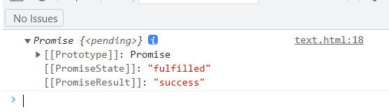

# Promise基本用法 async/await使用

## 什么是Promise

- promise是异步编程的一种解决方案 , 是一个构造函数 , 它有resolve , reject , race , all 方法 , 它的原型上有then , catch 方法
- promise有三种状态 , pending（进行中）、fulfilled（已成功）和rejected（已失败）
- 也只有两种结果 , 从pending到fulfilled , 或者从pending到rejected
- 结果是由异步操作决定的 , 无法再改变 , 所以叫 promise(承诺)
- promise还有一个特点 , 我们看下面例子
```go
var p = new Promise(function(resolve, reject) { //new一个promise 
	console.log('执行了promise');
	setTimeout(function() {
		resolve('一秒后出现');
	}, 1000)
}
```

直接打印出来  


这里我们并没有去回调promise , 它自己就已经执行了 , 所以我们在使用promise的时候 一般要把它封装到一个函数里 , 需要用的时候去调这个函数

## Promise好处
- 指定回调函数的方式更灵活
- 链式调用 , 解决回调地狱问题
  1/  什么是回调地狱 : 回调函数的连续嵌套 比如这样
```js
setTimeout(function () {
    console.log('我');
    setTimeout(function () {
	    console.log('爱');
	    setTimeout(function () {
		    console.log('米');
		    setTimeout(function () {
			    console.log('饭');
		    }, 1000);
	    }, 1000);
    }, 1000);
}, 1000);
```

  2/  回调地狱的缺点 : 不方便阅读 , 不方便异常处理
  3/  解决方式: promise链式调用
  4/  终极解决: 使用async await

- promise解决js中多个异步回调难以维护和控制的问题.

## Promise用法

先实例化Promise（`new Promise（function（resolve,reject））`）

### resolve和reject

```go
function clickPromise() {
	var p = new Promise(function(resolve, reject) { //new一个promise 
		console.log('执行了promise');
		var flag = true;
		if (flag) {
			resolve('定义这里成功');
		} else {
			reject('定义这里失败');
		}
	}
}
```

我们直接拿上面的例子来看 , 把promise封装到了函数里

- promise带着一个function参数
- 同时这个function里带着 resolve 和 reject 参数 这两个参数也是方法
- 其中 resolve代表成功 , reject代表失败
- 如果满足条件 , 状态变成fulfilled , 就执行resolve , 没有满足条件 , 状态变成rejected , 就执行reject

### then

- then是原型里面的方法 , 也有两个参数 , onfulfilled 和onrejected , 也是两个方法
- 当状态为fulfilled时 , 执行onfulfilled方法 , 状态为rejected时执行onrejected方法
- 这就相当于再次使用回调函数 , 也是promise的强大之处

```js
function clickPromise() {
	var p = new Promise(function(resolve, reject) {
		var flag = true;
		if (flag) {
			resolve('这是数据true');
		} else {
			reject('这是数据false');
		}
	});
	
	p.then(function(data) { //状态为fulfilled时执行
		console.log(data);
		console.log('这是成功操作');
	}, function(reason) { //状态为rejected时执行
		console.log(reason);
		console.log('这是失败的操作');
	});
}
```

  

当flag = false时  


### catch

与the并行的就是catch , 当状态为rejected时 , 执行catch操作

```js
function clickPromise() {
	var p = new Promise(function(resolve, reject) {
		var flag = false;
		if (flag) {
			resolve('这是数据true');
		} else {
			reject('这是数据false');
		}
	});
	
	p.then(function(data) { //状态为fulfilled时执行
		console.log(data);
		console.log('这是成功操作');
	});
	
	p.catch(function(reason) { //状态为rejected时执行
		console.log('调了catch');
		console.log(reason);
		console.log('这是失败的操作');
	});
}
```


### race

返回一个新的promise , 第一个结果就是返回的结果

```js
let p = new Promise(function(resolve , reject) {
	resolve("OK")
})

let raceP1 = Promise.resolve('success')
let raceP2 = Promise.resolve('yes')
let res = Promise.race([p , raceP1 , raceP2])
console.log(res)
```


```js
let p = new Promise(function(resolve, reject) {
	setTimeout(function() {
		resolve('OK')
	}, 1000)
})

let raceP1 = Promise.resolve('success')
let raceP2 = Promise.resolve('yes')
let res = Promise.race([p, raceP1, raceP2])
console.log(res)
```



### all

返回一个新的promise , 只有全部成功才成功, 有一个失败就失败

```js
let p = new Promise(function(resolve, reject) {
	setTimeout(function() {
		  resolve('OK')
	}, 1000)
})

let raceP1 = Promise.resolve('success')
let raceP2 = Promise.resolve('yes')
let res = Promise.all([p, raceP1, raceP2])
console.log(res)
```


```js
let p = new Promise(function(resolve, reject) {
	setTimeout(function() {
		resolve('OK')
	}, 1000)
})
let raceP1 = Promise.resolve('success')
let raceP2 = Promise.reject('yes')
let res = Promise.all([p, raceP1, raceP2])
console.log(res)
```


### async

-   什么是async

1.  async / await 是ES7提出的**处理异步的最终方法**
2.  async是一个修饰符 , 写在函数前面 , async的默认结果是resolve , 所以可以直接执行then , 返回的是then传入的参数

```js
async function fun() { 
	return 'async.then' 
} 

fun().then(function(res) {
	console.log(res)
})
```


### await

-   什么是await  
    也是一个修饰符 , 且必须写进async函数里
    
-   如果await修饰的是promise对象 , 获取到返回的结果(resolve, 或者reject结果)才会往下继续执行  
    如果不是promise对象 , 把这个非promise当作await结果

```js
async function fun() {
	await new Promise(function(resolve, reject) {
		setTimeout(function() {
			console.log('await')
		}, 2000)
	})
}

fun().then(function(res) {
	console.log(res)
})
```

两秒后输出  


### async与await结合使用

```js
function sendData() {
	return new Promise(function(resolve, reject) {
		resolve ('ok');
	})
}

async function fun() {
	let res = await sendData();
	console.log(res);
}

fun();
```


### async/await结合ajax使用

```js
function sendAjax(url) {
	return new Promise(function(resolve, reject) {
		var xhr = new XHTMLHttpRequest();
		xhr.open('GET', url, true);
		xhr.send();
		xhr.onreadystatechange = function() {
			if(xhr.readyState == 4) {
				if(xhr.status >= 200 && xhr.status <= 300) {
					resolve (xhr.response);
				}
			}else{
				reject (xhr.status)
			}
	})
}
					   
async getPromise() {
	let res = await sendAjax('/questions/');
	//执行函数
}

getProsime();
```

## 参考

- [Promise初步详解（resolve，reject，catch）](https://blog.csdn.net/weixin_41888813/article/details/82882375)  
- [ES6 Promise用法小结](https://blog.csdn.net/qq_34645412/article/details/81170576?ops_request_misc=%257B%2522request%255Fid%2522%253A%2522164481602016780366589145%2522%252C%2522scm%2522%253A%252220140713.130102334..%2522%257D&request_id=164481602016780366589145&biz_id=0&utm_medium=distribute.pc_search_result.none-task-blog-2~all~top_ulrmf~default-1-81170576.pc_search_insert_ulrmf&utm_term=promise&spm=1018.2226.3001.4187)  
- [async/await 的理解和用法](https://blog.csdn.net/qq_42941302/article/details/109245356?ops_request_misc=%257B%2522request%255Fid%2522%253A%2522164605252916780271927581%2522%252C%2522scm%2522%253A%252220140713.130102334..%2522%257D&request_id=164605252916780271927581&biz_id=0&utm_medium=distribute.pc_search_result.none-task-blog-2~all~top_positive~default-2-109245356.pc_search_insert_ulrmf&utm_term=async&spm=1018.2226.3001.4187)