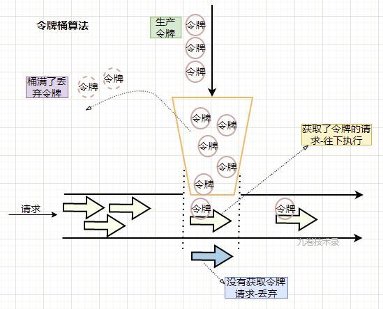

# 常用限流脚本

!> 基于 `Redis` + `Lua` 实现的分布式限流机制，目前库中已实现 `固定窗口限流`（又称计数器）、`滑动窗口限流`、`令牌桶限流`，每个限流算法均特点应用场景，各位在选取时请结合自身业务选择。

## 限流介绍

### 算法对比

| 算法 | 优点 | 缺点 | 实现状态 |
| :-- | :-- | :-- | :--: |
| 固定窗口 | 实现简单 | 临界点阈值 | ✓ |
| 滑动窗口 | 部分解决临界点 | 分多阶段，多层控制 | ✓ |
| 漏桶算法 | 固定输出流量 | 请求失败数高 | × |
| 令牌桶算法 | 流量均匀，支持一定程度突发流量 | 实现较复杂 | ✓ |

### 算法说明
#### 1. 固定窗口限流
?> 在固定窗口内对请求进行计数，然后与设置的最大请求数进行比较，如果超过了最大值，就进行限流。到达了一个固定时间窗口终点，将计数器清零，重新开始计数。


**缺点**

?> 一般窗口设置在1s的时相对好些，但当窗口设置较大时就容易出现弊端。

- 流量分布：流量在窗口内分布不均匀，流量会被集中到某个时间点；
- 资源分布：在一个较大的窗口中，已经处理完请求的资源无法被更好的释放，从而被后面的请求使用；

#### 2. 滑动窗口限流

?> 在计数器算法中，把大时间窗口在进一步划分为更细小的时间窗口格子，随着时间向前移动，大时间窗每次向前移动一个小格子，而不是大时间窗向前移动。每个小格子都有自己独立计数器，小格子会记录每个请求到达的时间点。


**缺点**

- 在瞬时流量单位（如，毫秒级）远小于滑动窗口小格子时，无法精细控制流量

#### 3. 令牌桶限流

?> 令牌桶(token burst)算法将令牌放入桶中，请求获取令牌成功才会往下走，否则丢弃掉该请求。令牌总数超过桶容量就丢弃。令牌(token)的生产速率可以根据流量灵活控制。桶的存在也使得算法对突发流量有一定的容忍能力。



## 脚本内容

### 固定窗口限流

```lua
--[[
    FileName:    FixedWindowRateLimiter.lua
    Description: 基于 Reids String 实现, 可指定时间窗口作为限流周期

    1. key       - [V] 限流 key 前缀
    2. limit     - [V] 限制数量
    3. timeRange - [-] 窗口大小
--]]

--限流KEY
local key       = KEYS[1]

--限流大小
local limit     = tonumber(ARGV[1])

--窗口大小，默认窗口1s
local timeRange = 1
if ARGV[2] == nil then
    timeRange = tonumber(ARGV[2])  --重置窗口
end

--设定过期周期(300~3600s)
local expire  = math.ceil(timeRange * 2)
if expire > 3600 then
    expire = 3600
elseif expire < 300 then
    expire = 300
end

--读取Redis中值
local current = tonumber(redis.call('GET', key) or "0")

--如果超出限流大小
if current and current >= limit then 
    return 0
end

--请求数自增
current = redis.call('INCR', key)
--第一次请求，则设置过期时间
if current == 1 then
    redis.call('EXPIRE', key, expire)
end

--返回剩余可用请求数
return limit - current
```

### 滑动窗口限流

```lua
--[[
    FileName:    SlideWindowRateLimiter.lua
    Description: 基于 Reids Hash 实现, 最小窗口限制为1s, 最大窗口限制为3600s
                流量会在时间窗口基础上再拆分为更细粒度的窗口进行存储, 流量的放开会随着时间的滚动而逐步放开流量限制

    1. key        - [V] 限流 key
    2. limitCount - [V] 单个时间窗口限制数量
    3. curTime    - [V] 当前时间, 单位秒
    4. timeRange  - [V] 时间窗口范围, 传参单位秒, 默认窗口1秒
    5. expiration - [V] 集合key过期时间
--]]

-- 滑动窗口存储Key
local key        = KEYS[1]
-- 一个时间窗口限制数量
local limitCount = tonumber(ARGV[1])
-- 获取当前时间, 单位秒
local curTime    = tonumber(ARGV[2])
-- 获取时间窗口范围, 传参单位秒, 默认窗口一秒
local timeRange  = tonumber(ARGV[3])
-- 获取集合key过期时间, 当key过期时会存在瞬时并发的情况, 因此过期时间不能太短或者改用定时清除, 传参单位秒
local expiration = tonumber(ARGV[4])
-- 根据当前时间折算出新时间值
local newTime    = curTime
-- 调整与上一个窗口间隔数值
local diffVal    = timeRange
-- 调整小窗口大小，避免产生过多字段
if timeRange > 1000 then
    newTime   = math.floor(curTime / 50)
    diffVal   = math.floor(timeRange / 10)
elseif timeRange > 100 then
    newTime   = math.floor(curTime / 10)
    diffVal   = math.floor(timeRange / 10)
end

-- 前一窗口内已访问的次数
local beforeCount  = 0
-- 获取所有访问量集合
local flatMap = redis.call('HGETALL', key)
if table.maxn(flatMap) > 0 then
    for i = 1, #flatMap, 2 do
        local ftime = tonumber(flatMap[i])
        if newTime - ftime < diffVal then
            beforeCount = beforeCount + tonumber(flatMap[i + 1])
        else
            -- 删除过期字段
            redis.call('HDEL', key, tostring(ftime))
        end
    end
end

local result = 0
if limitCount <= beforeCount then
    return result
end

-- 计算当前剩余访问量
result = limitCount - beforeCount
-- 记录当前访问量
redis.call('HINCRBY', key, tostring(newTime), '1')
-- 设置过期时间
redis.call('EXPIRE', key, expiration)

-- 返回剩余可用请求量，含本次请求
return result
```

### 令牌桶限流

```lua
--[[
    FileName:    TokenBucketRateLimiter.lua
    Description: 基于 Reids Hash 实现

    1. key                 - [V] 令牌桶的 key
    2. intervalPerPermit   - [V] 生成令牌的间隔(ms)
    3. curTime             - [V] 当前时间
    4. initTokens          - [V] 令牌桶初始化的令牌数
    5. bucketMaxTokens     - [V] 令牌桶的上限
    6. resetBucketInterval - [V] 重置桶内令牌的时间间隔
    
    7. currentTokens       - 当前桶内令牌数
    8. bucket              - 当前 key 的令牌桶对象
--]]

local key                 = KEYS[1]
local intervalPerPermit   = tonumber(ARGV[1])
local curTime             = tonumber(ARGV[2])
local initTokens          = tonumber(ARGV[3])
local bucketMaxTokens     = tonumber(ARGV[4])
local resetBucketInterval = tonumber(ARGV[5])

local currentTokens
local bucket = redis.call('HGETALL', key)

-- 若当前桶未初始化,先初始化令牌桶
if table.maxn(bucket) == 0 then
    -- 初始桶内令牌
    currentTokens = initTokens
    -- 设置桶最近的填充时间是当前
    redis.call('HSET', key, 'lastRefillTime', curTime)
    -- 如果当前令牌 == 0 ,更新桶内令牌, 返回 0
    redis.call('HSET', key, 'tokensRemaining', currentTokens)
    -- 初始化令牌桶的过期时间, 设置为间隔的 5 倍
    redis.call('PEXPIRE', key, resetBucketInterval * 5)
    -- 返回令牌数
    return math.max(1, currentTokens)
end

-- 上次填充时间
local lastRefillTime = tonumber(bucket[2])
-- 剩余的令牌数
local tokensRemaining = tonumber(bucket[4])

-- 如果当前时间小于或等于上次更新的时间, 说明刚刚初始化, 当前令牌数量等于桶内令牌数
if curTime <= lastRefillTime then
    currentTokens = tokensRemaining
-- 当前时间大于上次填充时间
else
    -- 拿到当前时间与上次填充时间的时间间隔
    local intervalSinceLast = curTime - lastRefillTime

    -- 如果当前时间间隔 大于 令牌的生成间隔
    if intervalSinceLast > resetBucketInterval then
        -- 将当前令牌填充满
        currentTokens = initTokens

        -- 更新重新填充时间
        redis.call('HSET', key, 'lastRefillTime', curTime)

    -- 如果当前时间间隔 小于 令牌的生成间隔
    else
        -- 可用的令牌数 = 向下取整数( 上次填充时间与当前时间的时间间隔 / 两个令牌许可之间的时间间隔 )
        local availableTokens = math.floor(intervalSinceLast / intervalPerPermit)

        -- 可授予的令牌 > 0 时
        if availableTokens > 0 then
            -- 生成的令牌 = 上次填充时间与当前时间的时间间隔 % 两个令牌许可之间的时间间隔
            local padMillis = math.fmod(intervalSinceLast, intervalPerPermit)

            -- 将当前令牌桶更新到上一次生成时间
            redis.call('HSET', key, 'lastRefillTime', curTime - padMillis)
        end

        -- 更新当前令牌桶中的令牌数
        currentTokens = math.min(availableTokens + tokensRemaining, bucketMaxTokens)
    end
end

if (currentTokens > 0) then
    currentTokens = currentTokens - 1
    redis.call('HSET', key, 'tokensRemaining', currentTokens) 
end

return currentTokens
```

## 限流实现

### 文件：`init.go`

```go
// Copyright(C) 2023 Baidu Inc. All Rights Reserved.
// Author: 王明(wangming07@baidu.com)
// Date: 2023/03/29

package ratelimiter

import (
	"sync"

	"icode.baidu.com/baidu/gdp/redis"
)

// ScriptShas 定义存储Sha值全局变量
var ScriptShas *ScriptSha

// redisClient 存储 Redis 资源实例
var redisClient redis.Client

// ScriptSha 定义存储Load脚本后的Sha值结构体
type ScriptSha struct {
	FixedWindow string
	SlideWindow string
	TokenBucket string
}

// Init  初始化配置
func Init(client redis.Client) {
	// 设置Redis实例
	redisClient = client

	// 启动时加载Lua脚本
	loadRedisScript(client)
}

// loadRedisScript 预加载Lua脚本
func loadRedisScript(client redis.Client) {
	var onece sync.Once
	onece.Do(func() {
		ScriptShas = &ScriptSha{}
		if res, err := LoadScript(client, FixedWindowScript); err == nil {
			ScriptShas.FixedWindow = res
		}

		if res, err := LoadScript(client, SlideWindowScript); err == nil {
			ScriptShas.SlideWindow = res
		}
		if res, err := LoadScript(client, TokenBucketScript); err == nil {
			ScriptShas.TokenBucket = res
		}
	})
}
```

### 文件：`limiter.go`

```go
// Copyright(C) 2023 Baidu Inc. All Rights Reserved.
// Author: 王明(wangming07@baidu.com)
// Date: 2023/03/29

package ratelimiter

import (
	"time"

	"github.com/spf13/cast"
	"icode.baidu.com/baidu/gdp/redis"
)

// LimiterType 定义限流器类型
type LimiterType string

// RedisKeyPrefix 限流器 Redis Key 存储前缀
const RedisKeyPrefix string = "dlimiter"

// 定义限流器类型常量
const (
	FixedWindowType LimiterType = "FixedWindow" // 固定窗口限流器
	SlideWindowType LimiterType = "SlideWindow" // 滑动窗口限流器
	TokenBucketType LimiterType = "TokenBucket" // 令牌桶限流器
)

// RateLimiter 定义限流器结构体
type RateLimiter struct {
	product     string       // [V] 业务线
	client      redis.Client // [V] Redis 客户端
	limiterType LimiterType  // [V] 限流器类型
	redisKey    string       // [X] 存储Key                    -- 内部计算获得
	currentTime int64        // [X] 当前时间, 单位秒             -- 程序内获取
	options     Options      // [-] 限流器参数
}

// Options 限流器参数
type Options struct {
	LimitCount int64 // [V] 限流大小                    -- 参数传入
	TimeRange  int64 // [V] 时间窗口大小, 单位秒, 默认1秒  -- 参数传入
	Expiration int64 // [-] Key 过期时间                -- 内部计算获得
}

// NewRateLimiter 限流器实例化
func NewRateLimiter(product string, limiterType LimiterType) *RateLimiter {
	return &RateLimiter{
		product:     product,
		client:      redisClient,
		limiterType: limiterType,
		currentTime: time.Now().Unix(),
	}
}

// SetOptions 设置限流器参数
func (r *RateLimiter) SetOptions(opt Options) *RateLimiter {
	if opt.LimitCount == 0 {
		opt.LimitCount = 1
	}
	if opt.TimeRange == 0 {
		opt.TimeRange = 1
	}

	switch r.limiterType {
	case FixedWindowType:
		// pass
	case SlideWindowType:
		// 当key过期时会存在瞬时并发的情况, 因此过期时间不能太短或者改用定时清除
		if opt.Expiration <= 3600 {
			opt.Expiration = 3600
		} else if opt.Expiration <= 14400 {
			opt.Expiration = opt.TimeRange * 2
		}
	case TokenBucketType:
		// pass
	}

	r.options = opt
	r.redisKey = r.genLimiterKey()

	return r
}

// Do 执行限流器
func (r *RateLimiter) Do() (ret int64, ok bool) {
	switch r.limiterType {
	case FixedWindowType:
		ret, ok = r.doFixedWindowLimiter()
	case SlideWindowType:
		ret, ok = r.doSlideWindowLimiter()
	case TokenBucketType:
		ret, ok = r.doTokenBucketLimiter()
	}

	return ret, ok
}

// doFixedWindowLimiter 执行固定窗口限流
func (r *RateLimiter) doFixedWindowLimiter() (int64, bool) {
	options := []interface{}{
		r.options.LimitCount,
		r.options.TimeRange,
	}
	res, err := EvalSha(r.client, r.getScriptSha(), []string{r.redisKey}, options...)
	if err != nil {
		return 0, false
	}
	ret := cast.ToInt64(res)
	return ret, ret > 0
}

// doSlideWindowLimiter 执行滑动窗口限流
func (r *RateLimiter) doSlideWindowLimiter() (int64, bool) {
	options := []interface{}{
		r.options.LimitCount,
		r.currentTime,
		r.options.TimeRange,
		r.options.Expiration,
	}
	res, err := EvalSha(r.client, r.getScriptSha(), []string{r.redisKey}, options...)
	if err != nil {
		return 0, false
	}

	ret := cast.ToInt64(res)

	return ret, ret > 0
}

// doTokenBucketLimiter 执行令牌桶限流
func (r *RateLimiter) doTokenBucketLimiter() (int64, bool) {
	// 最大令牌数   -- 对应限流大小
	bucketMaxTokens := r.options.LimitCount
	// 限流时间间隔 -- 对应时间窗口
	resetBucketInterval := r.options.TimeRange * 1000
	// 令牌的产生间隔 = 限流时间 / 最大令牌数
	intervalPerPermit := int64(1)
	if resetBucketInterval > bucketMaxTokens {
		intervalPerPermit = resetBucketInterval / bucketMaxTokens
	}
	// 初始令牌数 = 最大的突发流量的持续时间(限流时间间隔) / 令牌产生间隔
	initTokens := resetBucketInterval / intervalPerPermit
	// 用 最大的突发流量的持续时间 计算的结果更加合理,并不是每次初始化都要将桶装满
	if initTokens > bucketMaxTokens {
		initTokens = bucketMaxTokens
	}

	options := []interface{}{
		intervalPerPermit,
		r.currentTime * 1000,
		initTokens,
		bucketMaxTokens,
		resetBucketInterval,
	}
	res, err := EvalSha(r.client, r.getScriptSha(), []string{r.redisKey}, options...)
	if err != nil {
		return 0, false
	}
	return cast.ToInt64(res), true
}

// getScriptSha 获取限流器执行脚本Sha值
func (r *RateLimiter) getScriptSha() (sha1 string) {
	switch r.limiterType {
	case FixedWindowType:
		sha1 = ScriptShas.FixedWindow
	case SlideWindowType:
		sha1 = ScriptShas.SlideWindow
	case TokenBucketType:
		sha1 = ScriptShas.TokenBucket
	}

	if sha1 == "" {
		if ok := ScriptFlush(r.client); ok {
			loadRedisScript(r.client)
		}
	}

	return sha1
}

// genLimiterKey 生成存储Key
func (r *RateLimiter) genLimiterKey() string {
	suffix := ""
	switch r.limiterType {
	case FixedWindowType:
		suffix = cast.ToString(r.currentTime / r.options.TimeRange)
	}

	ret := RedisKeyPrefix + "::" + string(r.limiterType) + "::" + r.product
	if len(suffix) > 0 {
		ret += "::" + suffix
	}

	return ret
}
```

### 文件：`lua_script.go`

```go
// Copyright(C) 2023 Baidu Inc. All Rights Reserved.
// Author: 王明(wangming07@baidu.com)
// Date: 2023/03/29

package ratelimiter

// Lua 脚本常量
const (
	// 固定窗口限流脚本
	FixedWindowScript = `
		--[[
			Description: 基于 Reids String 实现, 可指定时间窗口作为限流周期

			1. key       - [V] 限流 key
			2. limit     - [V] 限流大小
			3. timeRange - [-] 窗口大小, 默认窗口1s
		--]]

		local key       = KEYS[1]
		local limit     = tonumber(ARGV[1])
		local timeRange = 1
		if ARGV[2] ~= nil then
			timeRange = tonumber(ARGV[2])
		end

		-- 设定过期周期(300~3600s)
		local expire  = math.ceil(timeRange * 2)
		if expire > 3600 then
			expire = 3600
		elseif expire < 300 then
			expire = 300
		end

		local current = tonumber(redis.call('GET', key) or "0")

		-- 超出限流大小
		if current and current >= limit then 
			return 0
		end

		current = redis.call('INCR', key)
		-- 第一次请求, 则设置过期时间
		if current == 1 then
			redis.call('EXPIRE', key, expire)
		end

		-- 返回剩余可用请求数
		return limit - current
	`
	// 滑动窗口限流脚本
	SlideWindowScript = `
		--[[
			Description: 基于 Reids Hash 实现, 最小窗口限制为1s, 最大窗口限制为3600s
						流量会在时间窗口基础上再拆分为更细粒度的窗口进行存储, 流量的放开会随着时间的滚动而逐步放开流量限制

			1. key        - [V] 限流 key
			2. limitCount - [V] 单个时间窗口限制数量
			3. curTime    - [V] 当前时间, 单位秒
			4. timeRange  - [V] 时间窗口范围, 传参单位秒, 默认窗口1秒
			5. expiration - [V] 集合key过期时间, 当key过期时会存在瞬时并发的情况, 因此过期时间不能太短或者改用定时清除
		--]]

		local key        = KEYS[1]
		local limitCount = tonumber(ARGV[1])
		local curTime    = tonumber(ARGV[2])
		local timeRange  = tonumber(ARGV[3])
		local expiration = tonumber(ARGV[4])
		local newTime    = curTime
		local diffVal    = timeRange

		if timeRange > 1000 then
			newTime   = math.floor(curTime / 50)
			diffVal   = math.floor(timeRange / 10)
		elseif timeRange > 100 then
			newTime   = math.floor(curTime / 10)
			diffVal   = math.floor(timeRange / 10)
		end

		-- 已访问的次数
		local beforeCount  = 0
		local flatMap = redis.call('HGETALL', key)
		if table.maxn(flatMap) > 0 then
			for i = 1, #flatMap, 2 do
				local ftime = tonumber(flatMap[i])
				if newTime - ftime < diffVal then
					beforeCount = beforeCount + tonumber(flatMap[i + 1])
				else
					redis.call('HDEL', key, tostring(ftime))
				end
			end
		end

		local result = 0
		if limitCount <= beforeCount then
			return result
		end

		result = limitCount - beforeCount
		redis.call('HINCRBY', key, tostring(newTime), '1')
		redis.call('EXPIRE', key, expiration)

		-- 返回剩余可用请求量，含本次请求
		return result
	`
	// 令牌桶限流脚本
	TokenBucketScript = `
		--[[
			Description: 基于 Reids Hash 实现

			1. key                 - [V] 令牌桶的 key
			2. intervalPerPermit   - [V] 生成令牌的间隔(ms)
			3. curTime             - [V] 当前时间(ms)
			4. initTokens          - [V] 令牌桶初始化的令牌数
			5. bucketMaxTokens     - [V] 令牌桶的上限
			6. resetBucketInterval - [V] 重置桶内令牌的时间间隔(ms)
			
			7. currentTokens       - 当前桶内令牌数
			8. bucket              - 当前 key 的令牌桶对象
		--]]

		local key                 = KEYS[1]
		local intervalPerPermit   = tonumber(ARGV[1])
		local curTime             = tonumber(ARGV[2])
		local initTokens          = tonumber(ARGV[3])
		local bucketMaxTokens     = tonumber(ARGV[4])
		local resetBucketInterval = tonumber(ARGV[5])

		local currentTokens
		local bucket = redis.call('HGETALL', key)

		-- 若当前桶未初始化,先初始化令牌桶
		if table.maxn(bucket) == 0 then
			-- 初始桶内令牌
			currentTokens = initTokens
			-- 设置桶最近的填充时间是当前
			redis.call('HSET', key, 'lastRefillTime', curTime)
			-- 如果当前令牌 == 0 ,更新桶内令牌, 返回 0
			redis.call('HSET', key, 'tokensRemaining', currentTokens)
			-- 初始化令牌桶的过期时间, 设置为间隔的 5 倍
			redis.call('PEXPIRE', key, resetBucketInterval * 5)
			-- 返回令牌数
			return math.max(1, currentTokens)
		end

		-- 上次填充时间
		local lastRefillTime = tonumber(bucket[2])
		-- 剩余的令牌数
		local tokensRemaining = tonumber(bucket[4])

		-- 如果当前时间小于或等于上次更新的时间, 说明刚刚初始化, 当前令牌数量等于桶内令牌数
		if curTime <= lastRefillTime then
			currentTokens = tokensRemaining
		-- 当前时间大于上次填充时间
		else
			-- 拿到当前时间与上次填充时间的时间间隔
			local intervalSinceLast = curTime - lastRefillTime

			-- 如果当前时间间隔 大于 令牌的生成间隔
			if intervalSinceLast > resetBucketInterval then
				-- 将当前令牌填充满
				currentTokens = initTokens

				-- 更新重新填充时间
				redis.call('HSET', key, 'lastRefillTime', curTime)

			-- 如果当前时间间隔 小于 令牌的生成间隔
			else
				-- 可用的令牌数 = 向下取整数( 上次填充时间与当前时间的时间间隔 / 两个令牌许可之间的时间间隔 )
				local availableTokens = math.floor(intervalSinceLast / intervalPerPermit)

				-- 可授予的令牌 > 0 时
				if availableTokens > 0 then
					-- 生成的令牌 = 上次填充时间与当前时间的时间间隔 % 两个令牌许可之间的时间间隔
					local padMillis = math.fmod(intervalSinceLast, intervalPerPermit)

					-- 将当前令牌桶更新到上一次生成时间
					redis.call('HSET', key, 'lastRefillTime', curTime - padMillis)
				end

				-- 更新当前令牌桶中的令牌数
				currentTokens = math.min(availableTokens + tokensRemaining, bucketMaxTokens)
			end
		end

		if (currentTokens > 0) then
			currentTokens = currentTokens - 1
			redis.call('HSET', key, 'tokensRemaining', currentTokens) 
		end

		return currentTokens
	`
)
```

### 文件：`redis_handler.go`

```go
// Copyright(C) 2023 Baidu Inc. All Rights Reserved.
// Author: 王明(wangming07@baidu.com)
// Date: 2023/03/29

package ratelimiter

import (
	"context"

	"icode.baidu.com/baidu/gdp/redis"
)

// LoadScript 执行脚本加载
func LoadScript(client redis.Client, script string) (string, error) {
	res, err := client.Do(context.Background(), "SCRIPT", "LOAD", script).Result()
	if _, ok := res.(string); !ok {
		return "", err
	}
	return res.(string), err
}

// ScriptExists 校验 SHA1 是否存在
func ScriptExists(client redis.Client, sha1 string) (interface{}, error) {
	return client.Do(context.Background(), "SCRIPT", "EXISTS", sha1).Result()
}

// ScriptFlush 清空脚本缓存
func ScriptFlush(client redis.Client) bool {
	res, err := client.Do(context.Background(), "SCRIPT", "FLUSH").Result()
	if err != nil || res.(string) != "ok" {
		return false
	}

	return true
}

// EvalSha 通过Sha值执行脚本
func EvalSha(client redis.Client, sha1 string, keys []string, args ...interface{}) (interface{}, error) {
	cmdArgs := make([]interface{}, 3+len(keys), 3+len(keys)+len(args))
	cmdArgs[0] = "EVALSHA"
	cmdArgs[1] = sha1
	cmdArgs[2] = len(keys)
	for i, key := range keys {
		cmdArgs[3+i] = key
	}
	cmdArgs = append(cmdArgs, args...)
	return client.Do(context.Background(), cmdArgs...).Result()
}

// Eval 执行脚本
func Eval(client redis.Client, script string, keys []string, args ...interface{}) (interface{}, error) {
	cmdArgs := make([]interface{}, 3+len(keys), 3+len(keys)+len(args))
	cmdArgs[0] = "EVAL"
	cmdArgs[1] = script
	cmdArgs[2] = len(keys)
	for i, key := range keys {
		cmdArgs[3+i] = key
	}
	cmdArgs = append(cmdArgs, args...)
	return client.Do(context.Background(), cmdArgs...).Result()
}
```

## 使用说明

### 安装

```bash
go get -u icode.baidu.com/baidu/ps-se-activity/activity-go-lib/rate_limiter@master
```

### 使用

#### 请求 `bootstrap` 目录中引入依赖

```go
import (
    "icode.baidu.com/baidu/ps-aladdin/activity/library/resource"
    // 引入限流Lib
    ratelimiter "icode.baidu.com/baidu/ps-se-activity/activity-go-lib/rate_limiter"
)

// XxxInit XxxInt 方法中增加代码
func XxxInit(ctx context.Context) {
    // Redis 资源初始化
    initRedis(ctx)
    
    // 在Redis资源初始化之后，获取使用的资源实例
    redisClient := resource.RedisCreditClient
    // 限流器初始化
    ratelimiter.Init(redisClient)
}
```

#### 业务调用

```go
import (
    ratelimiter "icode.baidu.com/baidu/ps-se-activity/activity-go-lib/rate_limiter"
)

func Demo() {
    // 固定窗口限流
    obj := ratelimiter.NewRateLimiter("credit", ratelimiter.FixedWindowType)
    rr, ok := obj.SetOptions(ratelimiter.Options{
        LimitCount: int64(5), // 限流大小
        TimeRange:  int64(2), // 窗口大小
    }).Do()

    // 滑动窗口限流
    obj2 := ratelimiter.NewRateLimiter("credit", ratelimiter.SlideWindowType)
    rr2, ok2 := obj2.SetOptions(ratelimiter.Options{
        LimitCount: int64(5),  // 限流大小
        TimeRange:  int64(20), // 窗口大小（内部会基于窗口大小动态调整小窗口大小）
    }).Do()

    // 令牌桶限流
    obj3 := ratelimiter.NewRateLimiter("credit", ratelimiter.TokenBucketType)
    rr3, ok3 := obj3.SetOptions(ratelimiter.Options{
        LimitCount: int64(5),  // 最大令牌桶个数
        TimeRange:  int64(20), // 限流时间间隔(即: 令牌生成周期)
    }).Do()
}
```

#### 限流判断

```go
func Demo() {
    obj := ratelimiter.NewRateLimiter("credit", ratelimiter.FixedWindowType)
    rr, ok := obj.SetOptions(ratelimiter.Options{
        LimitCount: int64(5), // 限流大小
        TimeRange:  int64(2), // 窗口大小
    }).Do()
    
    if ok && rr > 0 {
        // 请求可以继续执行
        .......
    }else{
        // 请求中断
        panic("hit limit")
    }
}
```