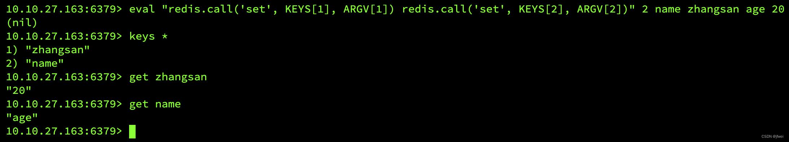
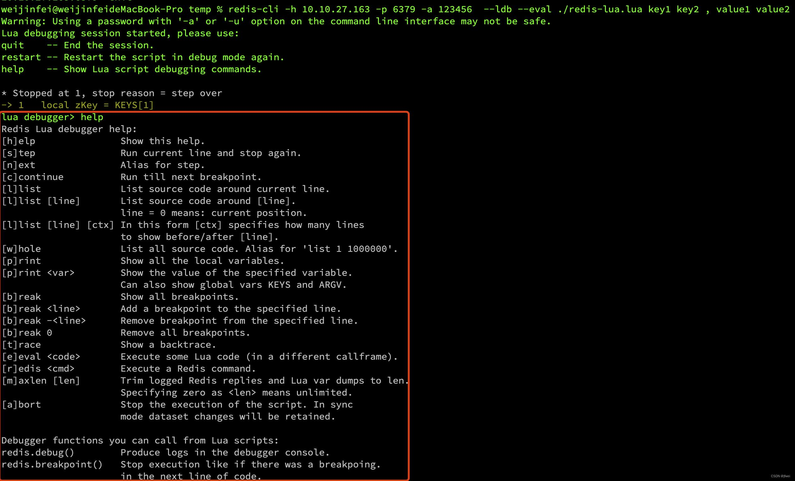
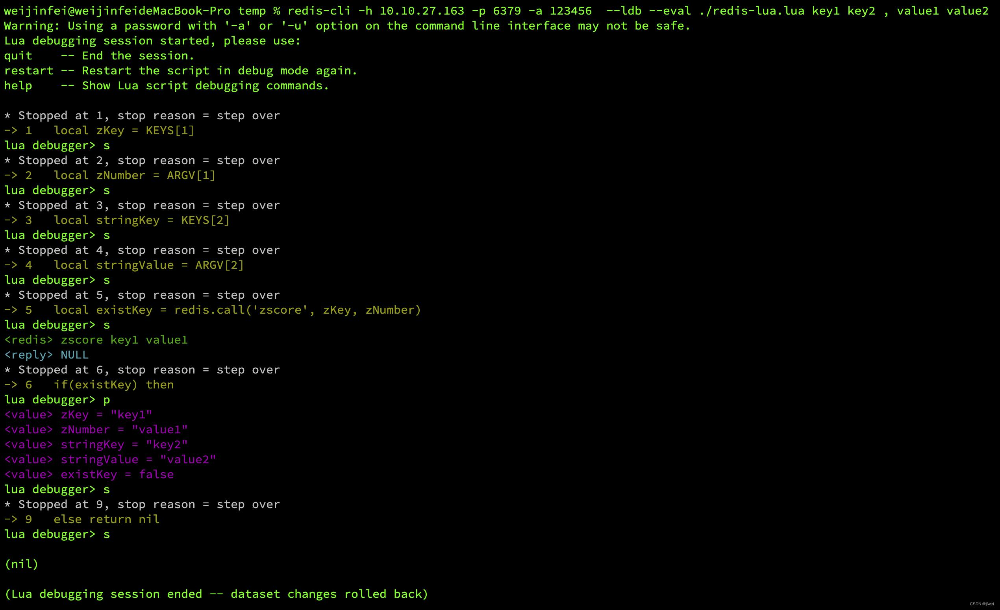

# Redis Lua脚本从入门到实践

?> 在Redis中使用Lua脚本有很多好处，本文不多说，总之一句话：**Redis中使用Lua会带来较大性能收益，且可保证原子性**.

## Lua基本语法和数据类型

没办法，学习一门语言至少需要知道它的基本语法和数据类型

### 数据类型

数据类型只熟悉以下几种即可入门

- `nil` 空
- `boolean` 布尔值
- `number` 数字
- `string` 字符串
- `table` 表

类型声明

```lua
--- 全局变量 
hello = 'world'
--- 局部变量
local age = 20
```

相信五种类型中只需介绍第五个类型table表，其余四种类型清晰易懂：

!> table是Lua中仅有的数据结构: `它可以是数组`; `也可以是键值对Map`; `也可以数组和Map混合使用`。

#### 数组使用

```lua
local table_array = {'String',1,nil,false}
print(table_array[1])
print(table_array[2])
print(table_array[3])
print(table_array[4])
--- 运行结果
--[[
String
1
nil
false
--]]
```

#### Map使用

```lua
local table_map = {id = 'abc', age = 20}
print(table_map.id)
print(table_map.age)
--- 运行结果
--[[
abc
20
--]]
```

#### 混合使用

```lua
local table_mix = {'String1','String2',1,age = 20,nil}
print(table_mix[1])
print(table_mix[3])
print(table_mix.age)
--- 运行结果
--[[
String1
1
20
--]]
```

### 基本语法

#### 判断

```lua
local age = 20
if age < 18  then
    --- todo
elseif age < 30 then
    --- todo
else
    --- todo
end
```

#### 是否为空

```lua
--在lua中，除了nil和false，其他的值都为真，包括0，可以通过nil为false这一点来判断是否为空
local temp = redis.call('get',key)
if temp then
   print('temp为非空') 
else 
   print('temp为空值') 
end
```

#### 循环

```lua
local table_cur = {'String11',3,name='zhangsan'}

for i, v in ipairs(table_cur) do
    print('i = '..i)
    print('v = '.. v)
end

print('-------------------')

for i, v in pairs(table_cur) do
    print('p i = '..i)
    print('p v = '.. v)
end
--- 运行结果
--[[
i = 1
v = String11
i = 2
v = 3
-------------------
p i = 1
p v = String11
p i = 2
p v = 3
p i = name
p v = zhangsan
--]]
```

## Redis中使用Lua

### 语法

```bash
EVAL script numkeys key [key ...] arg [arg ...]
```
- `EVAL`: 命令的关键字。
- `script`: Lua 脚本。
- `numkeys`: 指定的Lua脚本需要处理键的数量，就是 key数组的长度。
- `key`: 传递给Lua脚本零到多个键，空格隔开，在Lua 脚本中通过 KEYS[INDEX]来获取对应的值，其中1 <= INDEX <= numkeys。
- `arg`: 是传递给脚本的零到多个附加参数，空格隔开，在Lua脚本中通过ARGV[INDEX]来获取对应的值，其中1 <= INDEX <= numkeys。

### 举例

```bash
eval "redis.call('set', KEYS[1], ARGV[1]) redis.call('set', KEYS[2], ARGV[2])" 2 name zhangsan age 20
```



## Redis中Lua的Debug

?> 使用redis-cli来Debug，通过`--ldb`参数进入到debug模式，使用`-–eval`参数指定需要debug的Lua脚本，具体语法如下

### Debug语法

```bash
# 要注意DEBUG和使用EVAL执行Lua语法有点不一样，您仔细看好了：
##KEYS 和 ARG的顺序不一样 且 KEYS 和 ARG中间有逗号，且逗号两边必须各有一个空格

#EVAL语法
EVAL script numkeys key [key ...] arg [arg ...]

#DEBUG语法
redis-cli -h 10.10.27.163 -p 6379 -a 123456 --ldb --eval ./redis-lua.lua key [key ...] , arg [arg ...]
```

### Debug使用

用下面的例子进入debug后，输入`help`可看到Debug所有具体使用方式，这里简单截个图



### 举例

写一个lua脚本放到当前文件夹下，内容如下

```lua
local zKey = KEYS[1]
local zNumber = ARGV[1]
local stringKey = KEYS[2]
local stringValue = ARGV[2]
local existKey = redis.call('zscore', zKey, zNumber)

if (existKey) then
    redis.call('zincrby', zKey, 1, zNumber) 
    return redis.call('get', stringKey)
else
    return nil
end
```

开始Debug

```bash
####### 执行命令
weijinfei@weijinfeideMacBook-Pro temp % redis-cli -h 10.10.27.163 -p 6379 -a 123456  --ldb --eval ./redis-lua.lua key1 key2 , value1 value2
####### 进入debug模式
Warning: Using a password with '-a' or '-u' option on the command line interface may not be safe.
Lua debugging session started, please use:
quit    -- End the session.
restart -- Restart the script in debug mode again.
help    -- Show Lua script debugging commands.
####### debug停在第一行代码
* Stopped at 1, stop reason = step over
-> 1   local zKey = KEYS[1]
####### debug 下一步 s(tep)
lua debugger> s 
* Stopped at 2, stop reason = step over
-> 2   local zNumber = ARGV[1]
####### debug 下一步 s(tep)
lua debugger> s
* Stopped at 3, stop reason = step over
-> 3   local stringKey = KEYS[2]
####### debug 下一步 s(tep)
lua debugger> s
* Stopped at 4, stop reason = step over
-> 4   local stringValue = ARGV[2]
####### debug 下一步 s(tep)
lua debugger> s
* Stopped at 5, stop reason = step over
-> 5   local existKey = redis.call('zscore', zKey, zNumber)
####### debug 下一步 s(tep)
lua debugger> s
<redis> zscore key1 value1
<reply> NULL
* Stopped at 6, stop reason = step over
-> 6   if(existKey) then
####### debug 打印当前所有的变量 p(rint)
lua debugger> p
<value> zKey = "key1"
<value> zNumber = "value1"
<value> stringKey = "key2"
<value> stringValue = "value2"
<value> existKey = false
####### debug 下一步 s(tep)
lua debugger> s
* Stopped at 9, stop reason = step over
-> 9   else return nil
####### debug 下一步 s(tep)
lua debugger> s

(nil)

(Lua debugging session ended -- dataset changes rolled back)

```

具体过程如下图：




## 其他参考

- [详解Redis中Lua脚本的应用和实践](https://www.qetool.com/scripts/view/18770.html)
- [Redis cluster中使用lua](https://juejin.cn/post/7097947813903859743)