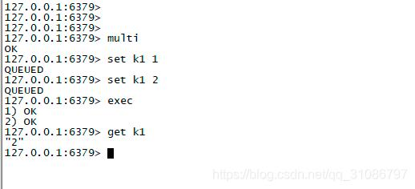
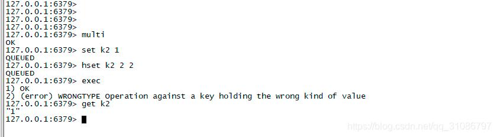
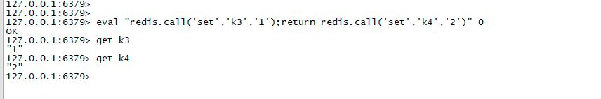
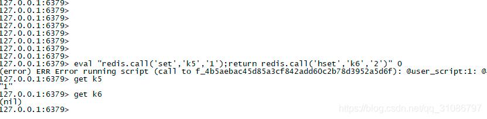
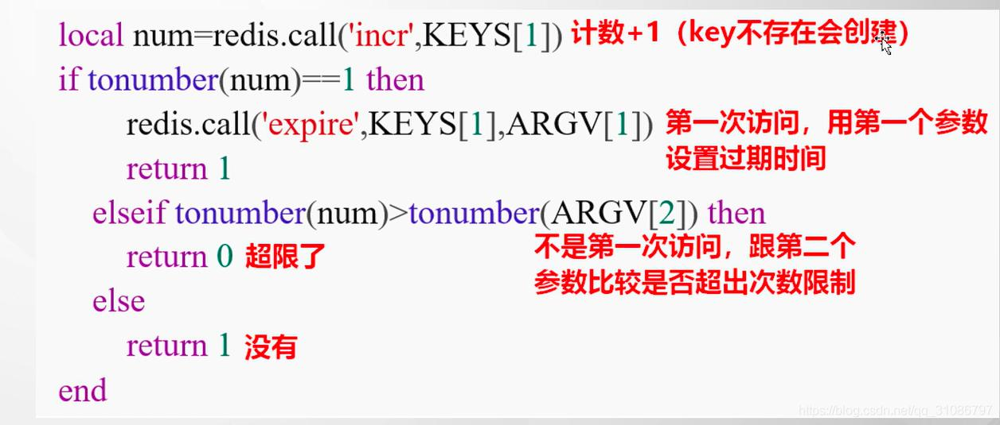

# Redis 使用 Lua 脚本回滚失败的原因

## 前言

Redis 作为当下比较热门的 nosql 缓存中间件，使用起来非常简单，但是当我们需要让多个命令保持原子性时，应该如何使用呢，本文就来介绍下

## 案例一：Redis事务操作

> Redis提供了事务操作，multi和exec指令，我们来简单的模拟一下

**首先启动Redis服务，连接到客户端**

执行完上述过程最后`get k1`的值是2，上述可以理解为multi开启了事务，只是多次set，此时的返回结果为QUEUED，代表进入了执行队列，此时还没有执行命令，直到执行exec时才会把队列的命令依次执行

**我们再按以下操作执行**

当执行`hset k2 2 2`时，此时我们的语法没有问题，但是由于k2的类型已经是`string`了，而hset又想把它当做`hash`来执行，此时就报错了，但是为什么`set k2 1`的指令还是成功了。那么就说明实际上`multi`并不能像数据库一样真正的做到事务的原子性操作

实际上`multi`指令我们并不太会去使用它

## Lua脚本

Redis提供了一种Lua脚本来执行Redis指令的方式来实现原子性操作
也就是我们编写一个Lua脚本来执行多个指令

上述操作我们在一个脚本里面执行了两个set，当执行完成后获取值发现值设置成功了

那么Lua脚本是如何保证原子性的呢，Redis底层执行命令时是单线程的，当执行一个Lua脚本时，Redis同样是单线程执行的，也就是执行Lua脚本时其他的指令是阻塞的，必须排队执行，这就是Redis如何保证Lua脚本里面的指令是一个整体而不会被其他指令干扰的

但是使用Lua脚本还是有一些坑，比如上述multi的坑

上面指令执行后让我们疑惑的事情又发生了，Lua脚本执行失败了，但是k5的值还是设置成功了。

失败的原因是hset的语法错误了

这又违背了原子性的初衷了

## 案例二：Lua对IP限流

## 原理

Redis执行Lua脚本时可以简单的认为仅仅只是把命令打包执行了，命令还是依次执行的，只不过在Lua脚本执行时是阻塞的，避免了其他指令的干扰

那么当多个指令执行时，后面的指令虽然执行失败了，但是前面的指令已经成功

!> 官方的解释就是：造成这种情况导致数据的原子性不能保证是程序员的锅，因为程序员代码写错了，比如语法错误、不应该这样执行指令等

Redis并没有严格的保证了数据的原子性操作，这样的好处在于Redis不需要像数据库一样还要保存回滚日志等，可以让Redis执行的更快

看到这大家应该都知道了Redis使用Lua脚本的简单用法以及原理了

## 总结

Redis使用Lua可以保证指令依次执行而不受其他指令干扰，但是不能保证指令最终必定是原子性的

不能保证原子性的场景主要有以下这些:

- 指令语法错误，如上述执行`redis.call(‘het’,‘k1’,‘1’)`,正确的应该是`redis.call(‘het’,‘k1’,‘1’,‘2’)`
- 语法是正确的，但是类型不对，比如对已经存在的`string`类型的key，执行`hset`等
- 服务器挂掉了，比如lua脚本执行了一半，但是服务器挂掉了

