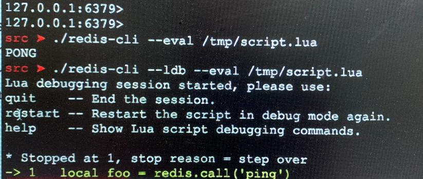
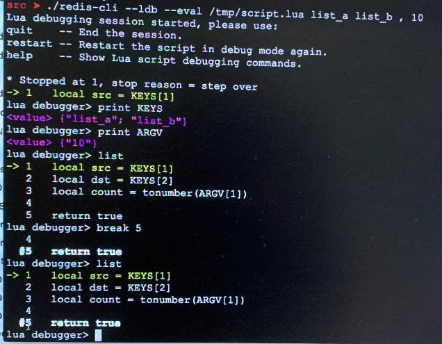
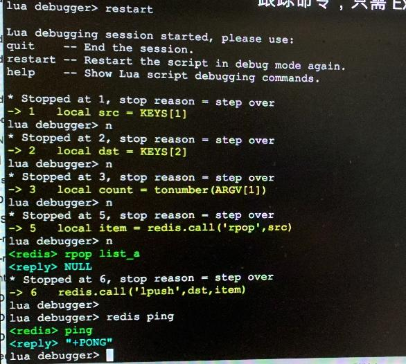
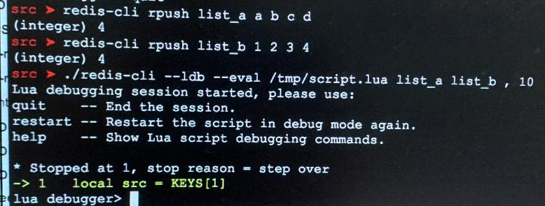
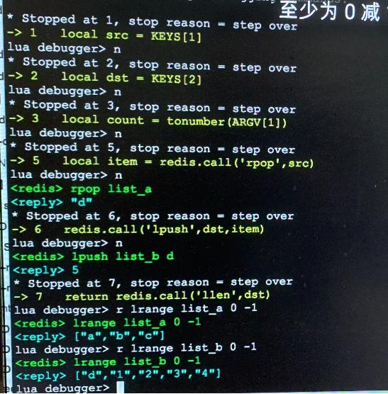
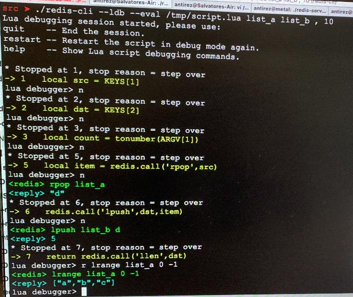
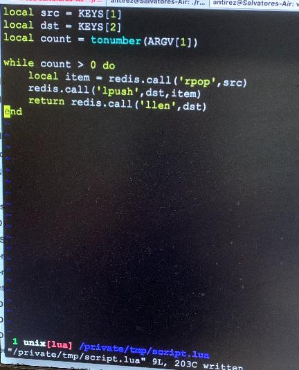

# Redis 作者 antirez 演示如何使用 Lua 调试器

> Redis 作者 antirez 演示如何使用 Redis 3.2 的新功能 —— Lua 调试器。

<iframe src="//player.bilibili.com/player.html?aid=9437433&bvid=BV1Ux411D7N1&cid=15596162&page=1" scrolling="no" border="0" frameborder="no" framespacing="0" allowfullscreen="true" height="600"> </iframe>

## Redis 执行 Lua 脚本

**命令行执行Lua**

```bash
./redis-cli --eval /tmp/script.lua
```

**命令行打开Debug模式**

```bash
./redis-cli --ldb --eval /tmp/script.lua
```

**如图所示**


## 完整的Debug调试界面



## Debug页面调试变量or调用Redis命令



## 先给key设置数据，然后在lua中操作







## 最终Lua代码



