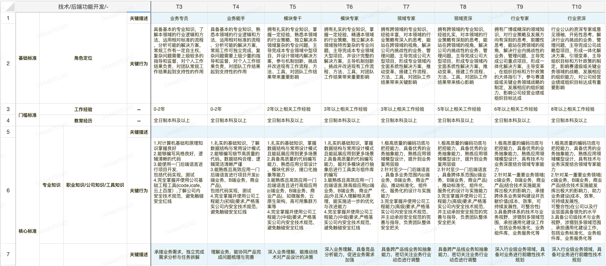
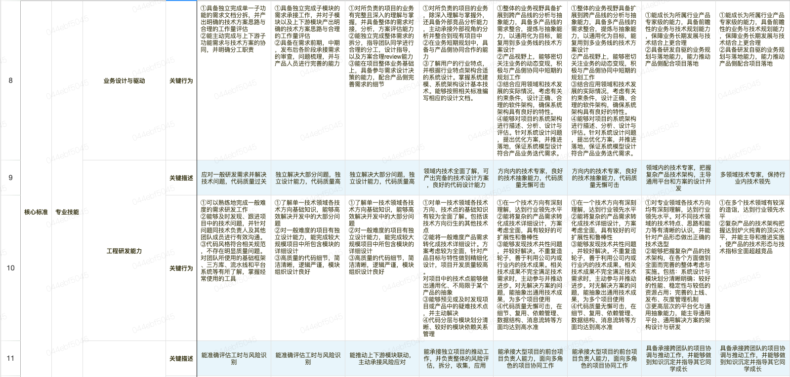
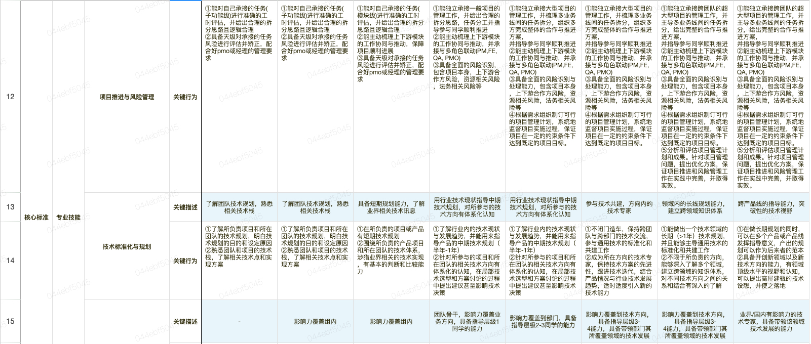
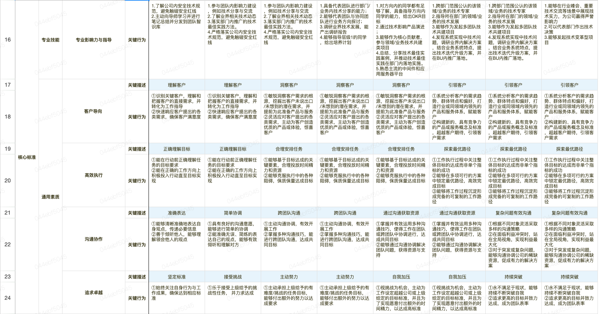

# 百度技术职级要求

## 展示效果





## 展示数据

```json
{
	"largeSequence": "技术",
	"smallSequence": "后端功能开发",
	"subSequence": "-",
	"titleList": [
		"技术/后端功能开发/-",
		"技术/后端功能开发/-",
		"技术/后端功能开发/-",
		"技术/后端功能开发/-",
		"T3",
		"T4",
		"T5",
		"T6",
		"T7",
		"T8",
		"T9",
		"T10"
	],
	"bodyList": [
		[
			"基础标准",
			"角色定位",
			"角色定位",
			"关键描述",
			"业务专员",
			"业务能手",
			"模块骨干",
			"模块专家",
			"领域专家",
			"领域资深",
			"行业专家",
			"行业资深"
		],
		[
			"基础标准",
			"角色定位",
			"角色定位",
			"关键行为",
			"具备基本的专业知识，了解本领域的行业逻辑和方法，运用相对标准的流程，分析可能的解决方案，常规工作有一定自主权，复杂问题需要上级较多的指导和监督，对个人工作结果负责，对团队常规工作结果起到支持性的作用",
			"具备基本的专业知识，熟悉本领域的行业逻辑和方法，运用相对标准的流程，分析可能的解决方案，常规工作可独立完成，复杂问题需要上级少量的指导和监督，对个人工作结果负责，对团队工作结果起到支持性的作用",
			"拥有扎实的专业知识，掌握一定经验，熟悉本领域的行业策略，独立解决本领域复杂的专业问题，主导完成本专业领域中型项目，并设计领域内解决方案，参与机制创新，挑战并改进现有工作流程、方法、工具，对团队工作结果带来重要影响",
			"拥有扎实的专业知识，掌握一定经验，精通本领域的行业策略，独立解决本领域独特而复杂的专业问题，主导完成本专业领域大型项目，并设计完整的解决方案，主导机制创新，挑战并改进现有工作流程、方法、工具，对团队工作结果带来重要影响",
			"拥有跨领域的专业知识，经验丰富，对本领域的行业策略有深入的思考，能站在跨领域的视角，解决公司内挑战性的业务、管理问题，主导完成公司大型项目，形成专业领域内全面系统性解决方案，推动变革，搭建工作流程、方法、工具，对团队工作结果带来关键影响",
			"拥有跨领域的专业知识，经验扎实，对本领域的行业策略有深刻的思考，能站在跨领域的视角，解决公司内挑战性的业务、管理问题，主导完成公司大型项目，形成专业领域内全面系统性解决方案，推动变革，搭建工作流程、方法、工具，对团队工作结果带来核心影响",
			"拥有广博或精深的领域知识，对行业策略及发展方向有深刻的思考，前瞻性思考，能站在跨领域的视角，解决行业内挑战性的业务、管理问题，主导完成公司重点项目，形成一体化解决方案，主导变革，在组织目标和方针政策的大体指引下，参与赛道级或关键业务领域战略的制定，发展相应的组织能力，影响公司经营业绩或组织目标达成",
			"行业公认的资深专家或意见领袖，开拓性思考，解决行业内挑战的业务、管理问题，主导完成公司战略型项目，形成一体化解决方案，引领变革，主导组织目标和方针政策的制定，影响赛道级或关键业务领域的战略，发展相应的组织能力，对公司经营业绩或组织目标达成有重要影响"
		],
		[
			"门槛标准",
			"工作经验",
			"工作经验",
			"—",
			"0-2年",
			"0-2年",
			"2年以上相关工作经验",
			"3年以上相关工作经验",
			"3年以上相关工作经验",
			"5年以上相关工作经验",
			"6年以上相关工作经验",
			"8年以上相关工作经验"
		],
		[
			"门槛标准",
			"教育经历",
			"教育经历",
			"—",
			"全日制本科及以上",
			"全日制本科及以上",
			"全日制本科及以上",
			"全日制本科及以上",
			"全日制本科及以上",
			"全日制本科及以上",
			"全日制本科及以上",
			"全日制本科及以上"
		],
		[
			"核心标准",
			"专业知识",
			"职业知识/公司知识/工具知识",
			"关键描述",
			"",
			"",
			"",
			"",
			"",
			"",
			"",
			""
		],
		[
			"核心标准",
			"专业知识",
			"职业知识/公司知识/工具知识",
			"关键行为",
			"1.对计算机基础和原理知识掌握良好\n2.能够编写风格良好，逻辑清晰的代码\n3.能使用一门后端语言进行项目开发, 包括代码实现，测试\n4.完全掌握并使用公司基础工程工具(icode,icafe，云上百度）,了解公司内安全技术规范，避免触碰安全红线",
			"1.扎实的基础知识，了解数据结构与常用设计模式\n2.能够编写细节高质量的代码。数据结构合理、逻辑简洁清晰严谨\n3.能熟练且高效应用一门后端语言进行项目开发(c端业务，B端业务，商业产品), 包括代码实现，测试\n4.完全掌握并使用公司工程能力(初级)要求,严格落实公司内安全技术规范，避免触碰安全红线",
			"1.扎实的基础知识，掌握数据结构与常用设计模式且能延展应用到更多场景\n2.具备高质量的代码编写能力，熟悉应用分层设计，模块化拆分，接口化抽象等能力\n3.能熟练且高效应用一门后端语言且进行高级应用(c端业务，B端业务，商业产品)，如微服务，云原生架构，高可用集群方案等\n4.完全掌握并使用公司工程能力(中级)要求,严格落实公司内安全技术规范，避免触碰安全红线",
			"1.扎实的基础知识，掌握数据结构与常用设计模式且能延展应用到更多场景\n2.具备高质量的代码编写能力，能对多模块进行抽象后进行工具类与组件库的编写\n3.能熟练且高效应用一门后端语言,除高级应用(c端业务，B端业务，商业产品)外且深入理解相关原理，能实施进一步的优化与改进能力\n4.完全掌握并使用公司工程能力(中级)要求,严格落实公司内安全技术规范，避免触碰安全红线",
			"1.极高质量的编码功底与把控能力，具备优秀的业务抽象能力，熟练应用领域模型设计，提升到业务复用层级\n2.针对至少一门后端语言，具备多业务范围内(c端业务，B端业务，商业产品)，推动标准化，组件化，服务化的设计与实施能力\n3.完全掌握并使用公司工程能力(高级)要求,严格落实公司内安全技术规范，并主动承担安全规范的完善与指导，负责团队整体安全把关",
			"1.极高质量的编码功底与把控能力，具备优秀的业务抽象能力，熟练应用领域模型设计，提升到业务复用层级\n2.针对至少一门后端语言，具备跨体系范围(c端业务，B端业务，商业产品)，推动标准化，组件化，服务化的设计与实施能力\n3.完全掌握并使用公司工程能力(高级)要求,严格落实公司内安全技术规范，并主动承担安全规范的完善与指导，负责团队整体安全把关",
			"1.极高质量的编码功底与把控能力，具备优秀的业务抽象能力，熟练应用领域模型设计，具有技术与业务深度结合领域专家能力\n2.针对某一重要业务领域(c端业务，B端业务，商业产品)结合技术实施能发挥出极大的影响力，承接跨体系业务架构建设并贡献价值(成本，效率，可持续发展性,  可整合性)\n3.具备跨体系的技术与业务视野，涉猎到多领域范围，承担通用化建设工作，包括业务标准化，业务组件库，业务服务化等",
			"1.极高质量的编码功底与把控能力，具备优秀的业务抽象能力，熟练应用领域模型设计，具有技术与业务深度结合领域专家能力\n2.针对某一重要业务领域(c端业务，B端业务，商业产品)结合技术实施能发挥出极大的影响力，助力业务建设(成本，效率，可持续发展性, 可整合性)在公司以及行业层面具备领先的水平 \n3.具备公司级技术与业务视野，涉猎到多领域范围，承担通用化建设工作，包括业务标准化，业务组件库，业务服务化等"
		],
		[
			"核心标准",
			"专业技能",
			"业务设计与驱动",
			"关键描述",
			"承接业务需求，独立完成需求分析与任务拆解",
			"理解业务，能协同产品完成问题梳理与完善",
			"深入业务理解，能推动技术对产品设计的决策",
			"深入业务理解，具备竞品分析能力，促进业务需求加强",
			"具备跨产品线业务知抽象能力，密切关注业务行业动态进行调整",
			"具备跨产品线业务知抽象能力，密切关注业务行业动态进行调整",
			"深入行业级业务领域，具备对业务进行前瞻性技术规划",
			"深入行业级业务领域，具备对业务进行前瞻性技术规划"
		],
		[
			"核心标准",
			"专业技能",
			"业务设计与驱动",
			"关键行为",
			"①具备独立完成单一子功能的需求文档分拆，并产出明确的技术方案思路与合理的工作量评估\n②能主动完成与上下游子功能需求与技术方案的协同，并明确分工职责",
			"①具备独立完成子模块的需求承接工作，并对子模块以及上下游模块产出明确的技术方案思路与合理的工作量评估\n②具备在需求前期，中期，发布后各阶段承接需求的审查，问题梳理，并与产品人员进行完善的能力",
			"①对所负责的项目的业务有完整且深入的理解与掌握，并具备整体的需求对接，分析，方案评估能力\n②能独立完成整体需求的拆分，指导团队同学进行合理的分工，设计指导，以及方案合理review能力\n③能在项目整体业务基础上，具备参与需求设计决策的能力，配合产品侧完善需求的细节",
			"①对所负责的项目的业务，除深入理解与掌握外，还具备外部竞品分析能力，主动承接外部视角的分析并整合到现有项目中\n②在业务短期规划中，具备与产品侧协同合作的能力\n③了解用户的行业特点，并根据行业特点架构合适的系统设计。掌握系统建模、系统架构设计基本技术。能够按照相关标准编写相应的设计文档。",
			"①整体的业务视野具备扩展到跨产品线的分析与抽象能力，具备多产品线的需求整合，提炼与抽象能力，以通用化为目标，能复用到多业务线的技术方案设计\n②产品视野上，能够密切关注业务的动态变现，积极与产品侧协同中短期的规划工作\n③结合应用领域和技术发展的实际情况，考虑有关约束条件，设计正确、合理的软件架构，确保系统架构具有良好的特性。\n④能够对项目的系统架构进行描述、分析、设计与评估。针对系统设计问题，提出优化方案，并推进落地，保证系统模型设计符合产品业务迭代需求。",
			"①整体的业务视野具备扩展到跨产品线的分析与抽象能力，具备多产品线的需求整合，提炼与抽象能力，以通用化为目标，能复用到多业务线的技术方案设计\n②产品视野上，能够密切关注业务的动态变现，积极与产品侧协同中短期的规划工作\n③结合应用领域和技术发展的实际情况，考虑有关约束条件，设计正确、合理的软件架构，确保系统架构具有良好的特性。\n④能够对项目的系统架构进行描述、分析、设计与评估。针对系统设计问题，提出优化方案，并推进落地，保证系统模型设计符合产品业务迭代需求。",
			"\n①能成长为所属行业产品专家级的能力，具备前瞻性的业务与技术规划能力，保障业务长期发展与技术结合上更合理\n②具备研发自驱的业务规划与落地能力，能力推动产品侧配合项目落地",
			"\n①能成长为所属行业产品专家级的能力，具备前瞻性的业务与技术规划能力，保障业务长期发展与技术结合上更合理\n②具备研发自驱的业务规划与落地能力，能力推动产品侧配合项目落地"
		],
		[
			"核心标准",
			"专业技能",
			"工程研发能力",
			"关键描述",
			"应对一般研发需求并解决技术问题，代码质量过关",
			"独立解决大部分问题，独立设计能力，代码质量高",
			"独立解决大部分问题，独立设计能力，代码质量高",
			"领域内技术全面了解，可产出完备的技术设计方案，良好的代码设计能力",
			"方向内的技术专家，良好的技术抽象能力，代码质量无懈可击",
			"方向内的技术专家，良好的技术抽象能力，代码质量无懈可击",
			"领域内的技术专家，把握复杂产品技术架构，主导通用平台和方案的设计开发",
			"多领域技术专家，保持行业内技术领先"
		],
		[
			"核心标准",
			"专业技能",
			"工程研发能力",
			"关键行为",
			"①可以熟练地完成一般难度的需求研发工作\n②能够及时发现、跟进项目中的技术问题，并针对问题同技术负责人及其他团队成员进行有效沟通。\n③代码风格符合相关规范，不存在明显质量问题。对团队所使用的基础框架、三方库、流水线和平台系统等有所了解，掌握经常使用的工具",
			"①了解单一技术领域各技术方向基础知识，能够高效解决开发中的大部分问题\n②对一般难度的项目有独立设计能力，能完成较大规模项目中所包含模块的详细设计\n③高质量的代码细节，简洁清晰，逻辑严谨，模块组织设计良好",
			"①了解单一技术领域各技术方向基础知识，能够高效解决开发中的大部分问题\n②对一般难度的项目有独立设计能力，能完成较大规模项目中所包含模块的详细设计\n③高质量的代码细节，简洁清晰，逻辑严谨，模块组织设计良好",
			"①对单一技术领域各技术方向、技术点的基础知识有较为全面了解。包括该技术方向衍生的其他技术点\n②能将一般难度产品需求转化成技术详细设计。方案考虑较为全面，针对产品目标与特性做到精细化设计，项目开发质量较高。 对项目中的技术点能够做出通用化、不局限于某个产品的抽象\n③能够预见或及时发现项目或产品中的疑难技术点，并主动解决\n④代码分层与模块划分清晰、较好的模块依赖关系管理",
			"①在一个技术方向有深刻理解，达到行业领先水平\n②能将复杂的产品需求转化成技术详细设计，方案考虑全面，具有较好的可扩展性和鲁棒性\n③能够发现技术共性问题，并较好解决。不重复造轮子，善于利用公司内或行业内的技术成果。相关技术成果不完全满足技术需求时，主动参与并推动进步。对无解决方案的问题，能抽象出通用技术成果，为多个项目使用\n④代码质量无懈可击，在细节、复用、依赖管理、数据结构、消息流转等方面均达到高水准",
			"①在一个技术方向有深刻理解，达到行业领先水平\n②能将复杂的产品需求转化成技术详细设计，方案考虑全面，具有较好的可扩展性和鲁棒性\n③能够发现技术共性问题，并较好解决。不重复造轮子，善于利用公司内或行业内的技术成果。相关技术成果不完全满足技术需求时，主动参与并推动进步。对无解决方案的问题，能抽象出通用技术成果，为多个项目使用\n④代码质量无懈可击，在细节、复用、依赖管理、数据结构、消息流转等方面均达到高水准",
			"①对专业领域各技术方向均有深刻理解，达到行业领先水平。对不同技术领域的技术特点、思路和能力等有清晰的认识，并能针对产品形态做出正确的技术选型\n②能够把握复杂产品的技术架构，在各个方面做到全面而完善的整体考虑与实施。包括：系统设计与模块划分清晰明确；较好的性能、稳定性与较低的资源占用；完善的上线、发布、灰度管理机制\n③更高层次的平台化与通用抽象能力，能主导通用平台、通用解决方案的架构设计与研发",
			"①在多个技术领域有较深的造诣，达到行业领先水平\n②复杂产品的技术架构把握达到炉火纯青的顶尖水平，并能主导和推进实施，使产品的技术形态与技术指标全面超越竞品"
		],
		[
			"核心标准",
			"专业技能",
			"项目推进与风险管理",
			"关键描述",
			"能准确评估工时与风险识别",
			"能准确评估工时与风险识别",
			"能推动上下游模块联动，主动承接风险应对",
			"能承接独立项目的推动工作，并负责整体的风险评估，拆分，收集，应用",
			"能承接大型项目的前台项目负责人能力，面向多角色的项目协同工作",
			"能承接大型项目的前台项目负责人能力，面向多角色的项目协同工作",
			"具备承接跨团队的项目协调与推动工作，并能够做到知识沉定并指导其它同学成长",
			"具备承接跨团队的项目协调与推动工作，并能够做到知识沉定并指导其它同学成长"
		],
		[
			"核心标准",
			"专业技能",
			"项目推进与风险管理",
			"关键行为",
			"①能对自己承接的任务(子功能级)进行准确的工时评估，并给出合理的拆分思路且逻辑合理\n②具备天级对承接的任务风险进行评估并矫正，配合好pmo或经理的管理要求",
			"①能对自己承接的任务(子功能级)进行准确的工时评估，并给出合理的拆分思路且逻辑合理\n②具备天级对承接的任务风险进行评估并矫正，配合好pmo或经理的管理要求",
			"①能对自己承接的任务(模块级)进行准确的工时评估，并给出合理的拆分思路且逻辑合理\n②能主动梳理上下游模块的工作协同与推动，保障项目顺利进展\n③具备天级对承接的任务风险进行评估并矫正，配合好pmo或经理的管理要求",
			"①能独立承接一般项目的管理工作，并给出合理的拆分思路，任务分工并指导参与同学顺利推进\n②能主动梳理上下游模块的工作协同与推动，并承接与多角色联动(PM,FE, QA, PMO) \n③具备全面的风险识别，包含项目本身，上下游合作方风险，资源相关风险，法务相关风险等",
			"①能独立承接大型项目的管理工作，并梳理多业务线间的任务拆分，组织多方完成整体的合作与推进方案， 并指导参与同学顺利推进\n②能主动梳理上下游模块的工作协同与推动，并承接与多角色联动(PM,FE, QA, PMO) \n③具备全面的风险识别与处理能力，包含项目本身，上下游合作方风险，资源相关风险，法务相关风险等\n④根据需求组织制订可行的项目管理计划，系统地监督项目实施过程，保证项目在一定的约束条件下达到既定的项目目标。",
			"①能独立承接大型项目的管理工作，并梳理多业务线间的任务拆分，组织多方完成整体的合作与推进方案， 并指导参与同学顺利推进\n②能主动梳理上下游模块的工作协同与推动，并承接与多角色联动(PM,FE, QA, PMO) \n③具备全面的风险识别与处理能力，包含项目本身，上下游合作方风险，资源相关风险，法务相关风险等\n④根据需求组织制订可行的项目管理计划，系统地监督项目实施过程，保证项目在一定的约束条件下达到既定的项目目标。",
			"①能独立承接跨团队的超大型项目的管理工作，并主导多业务线间的任务拆分，给出完整的合作与推进方案， 并指导参与同学顺利推进\n②能主动梳理上下游模块的工作协同与推动，并承接与多角色联动(PM,FE, QA, PMO) \n③具备全面的风险识别与处理能力，包含项目本身，上下游合作方风险，资源相关风险，法务相关风险等\n④根据需求组织制订可行的项目管理计划，系统地监督项目实施过程，保证项目在一定的约束条件下达到既定的项目目标。\n⑤分析和评估项目管理计划和成果。针对项目管理问题，提出优化方案，保证项目推进和风险管理工作在实践中完善，并取得实效。",
			"①能独立承接跨团队的超大型项目的管理工作，并主导多业务线间的任务拆分，给出完整的合作与推进方案， 并指导参与同学顺利推进\n②能主动梳理上下游模块的工作协同与推动，并承接与多角色联动(PM,FE, QA, PMO) \n③具备全面的风险识别与处理能力，包含项目本身，上下游合作方风险，资源相关风险，法务相关风险等\n④根据需求组织制订可行的项目管理计划，系统地监督项目实施过程，保证项目在一定的约束条件下达到既定的项目目标。\n⑤分析和评估项目管理计划和成果。针对项目管理问题，提出优化方案，保证项目推进和风险管理工作在实践中完善，并取得实效。"
		],
		[
			"核心标准",
			"专业技能",
			"技术标准化与规划",
			"关键描述",
			"了解团队技术规划，熟悉相关技术栈",
			"了解团队技术规划，熟悉相关技术栈",
			"具备短期规划能力，了解业界相关技术讯息",
			"用行业技术现状指导中期技术规划，对所参与的技术方向有体系化认知",
			"用行业技术现状指导中期技术规划，对所参与的技术方向有体系化认知",
			"参与技术共建，方向内的技术专家",
			"领域内的长线规划能力，建立跨领域知识体系",
			"跨产品线的指导能力，突破性的技术视野"
		],
		[
			"核心标准",
			"专业技能",
			"技术标准化与规划",
			"关键行为",
			"①了解所负责项目和所在团队的技术规划，明白技术规划的目的和设定原因\n②熟悉团队和项目的技术栈，了解相关技术点和实现方案",
			"①了解所负责项目和所在团队的技术规划，明白技术规划的目的和设定原因\n②熟悉团队和项目的技术栈，了解相关技术点和实现方案",
			"①在所负责的项目或产品有短期技术规划\n②围绕所负责的产品项目和所在团队的技术体系，涉猎业界相关的技术实现，有基本的判断和比较能力",
			"①了解行业内的技术现状与发展趋势，并能用来指导产品的中期技术规划（半年-1年）\n②针对所参与的项目和所在团队的相关技术方向有体系化的认知，在局部技术选型和方案讨论的过程中提出建议甚至影响技术决策",
			"①了解行业内的技术现状与发展趋势，并能用来指导产品的中期技术规划（半年-1年）\n②针对所参与的项目和所在团队的相关技术方向有体系化的认知，在局部技术选型和方案讨论的过程中提出建议甚至影响技术决策",
			"①不闭门造车，保持跨团队与跨部门的技术交流，参与通用技术的标准化和共建工作\n②成为所在方向的技术专家，保持技术方案的先进性，跟进技术迭代，结合产品情况与行业技术发展趋势，适时适度引入新的技术能力",
			"①能做出一个技术领域的长期（>1年）技术规划，并且能够主导通用技术的标准化和共建工作\n②不限于所负责的方向，能够深入了解多个领域，建立跨领域的知识体系，对不同技术方向之间的关系和结合有深入的了解",
			"①在做长期规划的同时，可以在多个产品或产品线发挥指导意义，产出的规划可以作为后来者的范本\n②具备开创新领域以及新技术方向的能力，有领域顶级水平的视野和认知，可以提出高屋建瓴的技术设想，并使之落地"
		],
		[
			"核心标准",
			"专业技能",
			"专业影响力与指导",
			"关键描述",
			"-",
			"影响力覆盖组内",
			"影响力覆盖组内",
			"团队骨干，影响力覆盖业务方向，具备指导层级1同学的能力",
			"影响力覆盖到部门，具备指导层级2-3同学的能力",
			" 影响力覆盖到技术方向，具备指导层级3-4能力，具备带领部门其所覆盖领域的技术发展",
			" 影响力覆盖到技术方向，具备指导层级3-4能力，具备带领部门其所覆盖领域的技术发展",
			"业界/国内有影响力的技术专家，具备带领该领域技术发展的能力"
		],
		[
			"核心标准",
			"专业技能",
			"专业影响力与指导",
			"关键行为",
			"1.了解公司内安全技术规范，避免触碰安全红线\n2.主动向导师学习并进行笔记总结并分发到团队智识库",
			"1.参与团队内影响力建设，例如技术分享与交流\n2.了解业界相关技术动态\n3.落实部门内推广的技术最佳实践方法。\n4.严格落实公司内安全技术规范，避免触碰安全红线",
			"1.参与团队内影响力建设，例如技术分享与交流\n2.了解业界相关技术动态\n3.落实部门内推广的技术最佳实践方法。\n4.严格落实公司内安全技术规范，避免触碰安全红线",
			"1.具备代表团队进行部门/业务内技术分享的能力；\n2.能够代表团队与协同团队进行业务方向探讨；\n3.调研业界技术发展，能产出调研报告 \n4.能够指导层级1的同学，给出培养计划",
			"1.对方向内的同学都有足够了解，具备指导方向内同学的能力，给出OKR目标 \n2.通过技术影响产品演进；\n3.能够作为核心贡献者，参与领域/业务技术共建类项目\n4.总结、分享技术最佳实践案例，并推动技术最佳实践在部门内落地实施。\n5.熟悉主流的中间件和应用服务器平台",
			"1.跨部门范围公认的该领域/业务的技术专家 \n2.指导所在部门的领域/业务的技术发展 \n3.能够作为发起多团队技术共建项目\n4.发现系统实现中技术问题，调研业界内解决方案，结合业务系统特点，提出技术迭代升级方案，并在BU内推广落地。",
			"1.跨部门范围公认的该领域/业务的技术专家 \n2.指导所在部门的领域/业务的技术发展 \n3.能够作为发起多团队技术共建项目\n4.发现系统实现中技术问题，调研业界内解决方案，结合业务系统特点，提出技术迭代升级方案，并在BU内推广落地。",
			"1.能够在行业峰会、重要技术交流等场景中展现技术实力，为公司赢得声誉影响力\n2.可以代表部门作出技术决策 \n3.能够发起技术变革型项目"
		],
		[
			"核心标准",
			"通用素质",
			"客户导向 ",
			"关键描述",
			"理解客户",
			"理解客户",
			"洞察客户",
			"洞察客户",
			"洞察客户",
			"引领客户",
			"引领客户",
			"引领客户"
		],
		[
			"核心标准",
			"通用素质",
			"客户导向 ",
			"关键行为",
			"①识别关键客户，理解和把握客户的直接需求，并转化为工作指导\n②快速响应客户提出的各类需求，确保客户满意度",
			"①识别关键客户，理解和把握客户的直接需求，并转化为工作指导\n②快速响应客户提出的各类需求，确保客户满意度",
			"①敏锐洞察客户需求的根源，挖掘出客户未说出口/未想到的潜在需求，并提前为此准备产品与服务\n②灵活应对客户提出的各类需求，主动为客户创造优质的产品或体验，惊喜客户",
			"①敏锐洞察客户需求的根源，挖掘出客户未说出口/未想到的潜在需求，并提前为此准备产品与服务\n②灵活应对客户提出的各类需求，主动为客户创造优质的产品或体验，惊喜客户",
			"①敏锐洞察客户需求的根源，挖掘出客户未说出口/未想到的潜在需求，并提前为此准备产品与服务\n②灵活应对客户提出的各类需求，主动为客户创造优质的产品或体验，惊喜客户",
			"①系统分析客户的需求趋势、群体特点和偏好，打造行业或同领域内领先的产品和服务体系，赋能客户\n②构建新的、具有竞争力的产品或服务概念及标准，超越客户期待，引领客户需求",
			"①系统分析客户的需求趋势、群体特点和偏好，打造行业或同领域内领先的产品和服务体系，赋能客户\n②构建新的、具有竞争力的产品或服务概念及标准，超越客户期待，引领客户需求",
			"①系统分析客户的需求趋势、群体特点和偏好，打造行业或同领域内领先的产品和服务体系，赋能客户\n②构建新的、具有竞争力的产品或服务概念及标准，超越客户期待，引领客户需求"
		],
		[
			"核心标准",
			"通用素质",
			"高效执行",
			"关键描述",
			"正确理解目标",
			"正确理解目标",
			"合理安排任务",
			"合理安排任务",
			"合理安排任务",
			"探索最优路径",
			"探索最优路径",
			"探索最优路径"
		],
		[
			"核心标准",
			"通用素质",
			"高效执行",
			"关键行为",
			"①能在行动前正确理解任务的目标要求\n②能在正确的工作方向上积极投入行动直至目标实现",
			"①能在行动前正确理解任务的目标要求\n②能在正确的工作方向上积极投入行动直至目标实现",
			"①能够基于目标达成的关键要素，合理投放时间精力和资源\n②能够克服执行中的各种阻碍，保质保量达成目标",
			"①能够基于目标达成的关键要素，合理投放时间精力和资源\n②能够克服执行中的各种阻碍，保质保量达成目标",
			"①能够基于目标达成的关键要素，合理投放时间精力和资源\n②能够克服执行中的各种阻碍，保质保量达成目标",
			"①工作执行过程中关注整体目标的达成而非单个指标的成功\n②能够在多项可行的方案中锁定最优路径，高效完成目标\n③能够将工作过程沉淀形成完备的可复制的工作路径",
			"①工作执行过程中关注整体目标的达成而非单个指标的成功\n②能够在多项可行的方案中锁定最优路径，高效完成目标\n③能够将工作过程沉淀形成完备的可复制的工作路径",
			"①工作执行过程中关注整体目标的达成而非单个指标的成功\n②能够在多项可行的方案中锁定最优路径，高效完成目标\n③能够将工作过程沉淀形成完备的可复制的工作路径"
		],
		[
			"核心标准",
			"通用素质",
			"沟通协作",
			"关键描述",
			"准确表达",
			"简单协调",
			"跨团队沟通",
			"跨团队沟通",
			"通过沟通获取资源",
			"通过沟通获取资源",
			"复杂问题有效沟通",
			"复杂问题有效沟通"
		],
		[
			"核心标准",
			"通用素质",
			"沟通协作",
			"关键行为",
			"①能够清晰准确地表达自身观点，传递必要信息\n②善于倾听他人，能够理解领会他人的观点",
			"①具有良好的沟通意愿，能够进行简单的协调\n②能准确无误、简练的表达自己的观点，能够有效倾听和理解对方",
			"①主动沟通协调，有效开展工作\n②掌握多种沟通技巧，能进行跨团队沟通，达成共同目标",
			"①主动沟通协调，有效开展工作\n②掌握多种沟通技巧，能进行跨团队沟通，达成共同目标",
			"①掌握并有效运用多种沟通技巧，使得工作在团队或跨团队中协调进行，达成共同目标\n②能够通过沟通协调解决团队问题，获得资源与支持",
			"①掌握并有效运用多种沟通技巧，使得工作在团队或跨团队中协调进行，达成共同目标\n②能够通过沟通协调解决团队问题，获得资源与支持",
			"①根据不同对象灵活采取多样的沟通策略\n②在面临利益冲突时，站在全局视角，实现利益最大化\n③对于突发或复杂问题，能够沟通协调公司的稀缺资源，促成有力的解决方案",
			"①根据不同对象灵活采取多样的沟通策略\n②在面临利益冲突时，站在全局视角，实现利益最大化\n③对于突发或复杂问题，能够沟通协调公司的稀缺资源，促成有力的解决方案"
		],
		[
			"核心标准",
			"通用素质",
			"追求卓越",
			"关键描述",
			"坚定标准",
			"接受挑战",
			"主动努力",
			"主动努力",
			"自我加压",
			"自我加压",
			"持续突破",
			"持续突破"
		],
		[
			"核心标准",
			"通用素质",
			"追求卓越",
			"关键行为",
			"①始终关注自身行为与工作成果，确保达到相应标准\n\n",
			"①乐于接受上级给予的挑战性任务， 并力求达成\n\n",
			"①主动承担上级给予的有难度/挑战的任务目标，能够付出额外的努力以达成要求",
			"①主动承担上级给予的有难度/挑战的任务目标，能够付出额外的努力以达成要求",
			"①视挑战为机会，主动为工作设定超越公司或上级给定的目标标准，并且为了实现愿意付出额外的时间精力，以达成高标准",
			"①视挑战为机会，主动为工作设定超越公司或上级给定的目标标准，并且为了实现愿意付出额外的时间精力，以达成高标准",
			"①永不满足于现状，能够持续不断突破自我\n②追求更高的目标并致力达成，成为团队表率",
			"①永不满足于现状，能够持续不断突破自我\n②追求更高的目标并致力达成，成为团队表率"
		]
	]
}
```