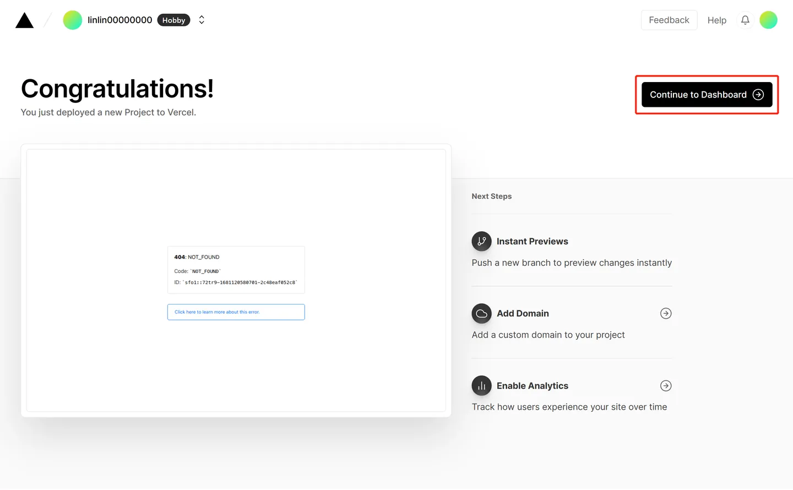
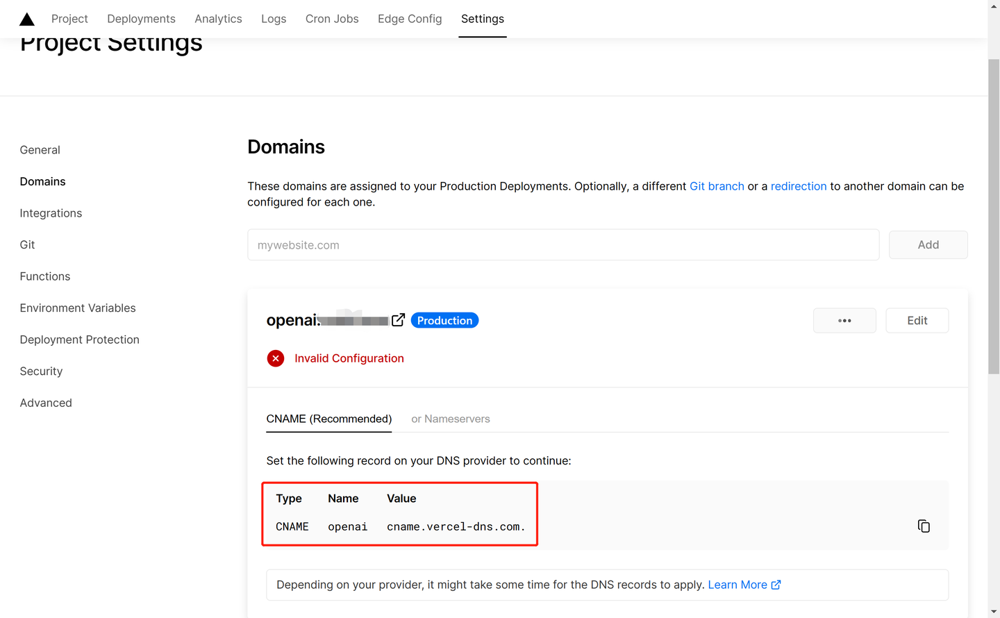

# 使用 Vercel 反代 openai

> 项目地址：[使用 Vercel 代理 openai](https://github.com/LinLin00000000/vercel-proxy-openai)

## **使用方法**  

**国内直连**

- 访问 openai api 时，将 "`http://api.openai.com`" 换成你的自定义域名，例如

```js
const host = 'YOUR DOMAIN' 
const url = `https://${host}/v1/chat/completions`
```

- 在其他 chatgpt 项目中，可以将变量 "`OPENAI_API_BASE_URL`" 设置为你的域名

**要求**  
一个域名（无需备案），没有的话可以在阿里云上买一个几块钱一年的  


  
## 部署

### 1. 点击下方链接一键部署
<center>[New Project - Vercel](https://vercel.com/new/clone?repository-url=https%3A%2F%2Fgithub.com%2FLinLin00000000%2Fvercel-proxy-openai&project-name=vercel-proxy-openai&repository-name=vercel-proxy-openai&root-directory=src)</center>
  
### 2. 用 Github 登录 Vercel

没有 Github 账户的去注册一个，网上很多教程就不展开了


### 3. 登录之后点击 Create 按钮


  
### 4. 等待创建

等十几秒钟就会创建好项目，然后进入仪表盘


  
### 5. 设置域名

进入到项目里之后，依次点击 `Settings` -> `Domains`，然后添加你的域名。添加的域名类型有两种，一种是一级域名(`http://xxxx.com`)和二级域名(`http://openai.xxxx.com`)，我个人推荐使用二级域名，因为一级域名一般用来做网站展示用，只能有一个，而二级域名可以有无限个（只要你有一个域名就可以自己创建无限个二级域名）


  
### 6. 添加域名

添加域名有三种方式，这里我们选第三种，因为简单


  
### 7. 添加事例

接下来会分两种情况，分为一级域名和二级域名，都有教程，以阿里云为例（其他厂商也是差不多的配置，很简单的）

#### 7.1 一级域名

添加一级域名后 Vercel 会提示让你添加 DNS 解析记录


在阿里云域名解析的解析设置里点击 添加记录，按照 Vercel 的提示配置好图中三个选项，点击确认


回 Vercel 点击 Refresh 按钮，出现下图所示的情况就表明配置完成了


  
#### 7.2 二级域名

> 以 openai 主机记录为例，可以改成自己喜欢的

添加二级域名后 Vercel 会提示让你添加 DNS 解析记录



在阿里云域名解析的解析设置里点击 添加记录，按照 Vercel 的提示配置好图中三个选项，点击确认


回 Vercel 点击 Refresh 按钮，出现下图所示的情况就表明配置完成了


  
接下来就可以愉快地使用 openai api 啦~