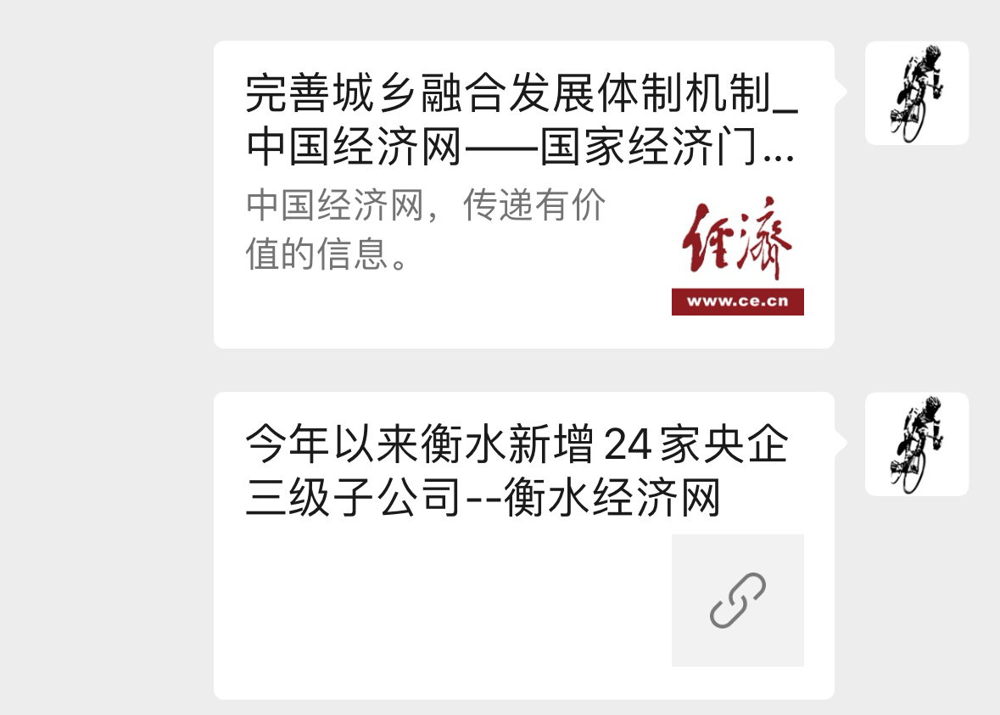

# PHP实现微信分享自定义文字和图片

## 微信JS-SDK文档

> 微信文档：附录1-JS-SDK使用权限签名算法
### jsapi_ticket

生成签名之前必须先了解一下jsapi_ticket，jsapi_ticket是公众号用于调用微信JS接口的临时票据。正常情况下，jsapi_ticket的有效期为7200秒，通过access_token来获取。由于获取jsapi_ticket的api调用次数非常有限，频繁刷新jsapi_ticket会导致api调用受限，影响自身业务，开发者必须在自己的服务全局缓存jsapi_ticket 。

1. 参考以下文档获取`access_token`（有效期7200秒，开发者必须在自己的服务全局缓存`access_token`）：
```bash
https://api.weixin.qq.com/cgi-bin/token?grant_type=client_credential&appid=APPID&secret=APPSECRET
```

2. 用第一步拿到的access_token 采用http GET方式请求获得jsapi_ticket（有效期7200秒，开发者必须在自己的服务全局缓存jsapi_ticket）：
```bash
https://api.weixin.qq.com/cgi-bin/ticket/getticket?access_token=ACCESS_TOKEN&type=jsapi
```
成功返回如下JSON：
```json
{
	"errcode":0,
	"errmsg":"ok",
	"ticket":"bxLdikRXVbTPdHSM05e5u5sUoXNKd8-41ZO3MhKoyN5OfkWITDGgnr2fwJ0m9E8NYzWKVZvdVtaUgWvsdshFKA",
	"expires_in":7200
}
```
获得`jsapi_ticket`之后，就可以生成JS-SDK权限验证的签名了。

### 签名算法

签名生成规则如下：参与签名的字段包括noncestr（随机字符串）, 有效的jsapi_ticket, timestamp（时间戳）, url（当前网页的URL，不包含#及其后面部分） 。对所有待签名参数按照字段名的ASCII 码从小到大排序（字典序）后，使用URL键值对的格式（即key1=value1&key2=value2…）拼接成字符串string1。这里需要注意的是所有参数名均为小写字符。对string1作sha1加密，字段名和字段值都采用原始值，不进行URL 转义。

即`signature=sha1(string1)`。 示例：
```
noncestr=Wm3WZYTPz0wzccnW
jsapi_ticket=sM4AOVdWfPE4DxkXGEs8VMCPGGVi4C3VM0P37wVUCFvkVAy_90u5h9nbSlYy3-Sl-HhTdfl2fzFy1AOcHKP7qg
timestamp=1414587457
url=http://mp.weixin.qq.com?params=value
```

1. 对所有待签名参数按照字段名的ASCII 码从小到大排序（字典序）后，使用URL键值对的格式（即key1=value1&key2=value2…）拼接成字符串string1：
```
jsapi_ticket=sM4AOVdWfPE4DxkXGEs8VMCPGGVi4C3VM0P37wVUCFvkVAy_90u5h9nbSlYy3-Sl-HhTdfl2fzFy1AOcHKP7qg&noncestr=Wm3WZYTPz0wzccnW&timestamp=1414587457&url=http://mp.weixin.qq.com?params=value
```
2. 对string1进行sha1签名，得到signature：
```
0f9de62fce790f9a083d5c99e95740ceb90c27ed
```

注意事项
1. 签名用的`noncestr`和`timestamp`必须与`wx.config`中的`nonceStr`和`timestamp`相同。
2. 签名用的url必须是调用JS接口页面的完整URL。
3. 出于安全考虑，开发者必须在服务器端实现签名的逻辑。

**总结一下就是：**
1. 先获取：`access_token`
2. 再获取：`jsapi_ticket`
3. 拼接字符串后进行`sha1`加密得到：`signature`

因为要写到服务端，下面用php实现。

## PHP实现signature


填入自己的appid和secret
因为要保存数据，需要两个文件（当然也可以存到数据库或者session）
到服务器里别忘改权限，不然写不进去


代码如下：
```php
/**
 * 微信公众号分享 
 *
 * 微信 JS 接口签名校验工具: https://mp.weixin.qq.com/debug/cgi-bin/sandbox?t=jsapisign
 */

class WechatShare() {
	privite $appid;
	privite $secret;
	privite $data_path;
	
	privite $token;
	privite $ticket;
	
	public function __construct($appid, $secret, $data_path = '') {
		$this->appid  = $appid;
		$this->secret = $secret;
		if (empty($data_path)) {
			$data_path = __DIR__;
		}
		$this->data_path = $data_path;
	}
	
	// get_sign 生成分享数据
	public function get_sign($url) {
		if (!$this->get_token()) {
			throw new Exception('get wechat token failed!');
		}
		
		if (!$this->get_ticket()) {
			throw new Exception('get wechat ticket failed!');
		}
		
		// 进行sha1签名
		$timestamp = time();
		$nonce_str = $this->create_nonce_str();
		$sign_str  = "jsapi_ticket={$ticket}&noncestr={$nonce_str}&timestamp={$timestamp}&url={$url}";
		$sha_str   = sha1($sign_str);
		$signPackage = [
			"appId"     => $this->appid,
			"nonceStr"  => $nonce_str,
			"timestamp" => $timestamp,
			"signature" => $sha_str,
		];
		return $signPackage;
	}
	
	// get_token 获取请求 Token
	protect function get_token() {
		$token_path = $this->data_path . '/wechat_token.txt';
		$token_data = file_get_contents($token_path);
		
		$time = 7200;
		if (!empty($token_data)) {
			$token_data = json_decode($token_data, true);
			$time       = time() - $token_data['time'];
		}
		
		if ($time > 3600) {
			$token_url  = "https://api.weixin.qq.com/cgi-bin/token?grant_type=client_credential&appid={$this->appid}&secret={$this->secret}";
			$token_res  = $this->https_request($token_url);
			$token_res  = json_decode($token_res, true);
			$token      = $token_res['access_token'];
			$token_data = [
				'time'  => time(),
				'token' => $token,
			];
			
			$res = file_put_contents($token_path, json_encode($token_data));
			if (!$res) {
				return false;
			}
		} else {
			$token = $token_data['token'];
		}
		
		$this->token = $token;
		return true;
	}

	// get_ticket 获取请求 Ticket
	protect function get_ticket() {
		$ticket_path = $this->data_path . '/wechat_ticket.txt';
		$ticket_data = file_get_contents($ticket_path);
		
		$time = 7200;
		if (!empty($ticket_data)) {
			$ticket_data = json_decode($ticket_data, true);
			$time       = time() - $ticket_data['time'];
		}
		
		if ($time > 3600) {
			$ticket_url  = "https://api.weixin.qq.com/cgi-bin/ticket/getticket?access_token={$this->token}&type=jsapi";
			$ticket_res  = $this->https_request($ticket_url);
			$ticket_res  = json_decode($ticket_res, true);
			$ticket      = $ticket_res['ticket'];
			$ticket_data = [
				'time'   => time(),
				'ticket' => $ticket,
			];
			
			$res = file_put_contents($ticket_path, json_encode($ticket_data));
			if (!$res) {
				return false;
			}
		} else {
			$ticket = $ticket_data['ticket'];
		}
		
		$this->ticket = $ticket
		
		return true;
	}

	// create_nonce_str 随机字符串
	protect function create_nonce_str($length = 16) {
		$chars = "abcdefghijklmnopqrstuvwxyzABCDEFGHIJKLMNOPQRSTUVWXYZ0123456789";
		$str   = "";
		for ($i = 0; $i < $length; $i++) {
			$str .= substr($chars, mt_rand(0, strlen($chars) - 1), 1);
		}
		return $str;
	}
	
	// https_request 模拟 http 请求
	protect function https_request($url, $data = null){
		// curl 初始化
		$curl = curl_init();
		// curl 设置
		curl_setopt($curl, CURLOPT_URL, $url);
		curl_setopt($curl, CURLOPT_SSL_VERIFYPEER, FALSE);
		curl_setopt($curl, CURLOPT_SSL_VERIFYHOST, FALSE);
		// 判断 $data get  or post
		if ( !empty($data) ) {
			curl_setopt($curl, CURLOPT_POST, 1);
			curl_setopt($curl, CURLOPT_POSTFIELDS, $data);
		}
		curl_setopt($curl, CURLOPT_RETURNTRANSFER, 1);
		// 执行
		$res = curl_exec($curl);
		curl_close($curl);
		return $res;
	}
}
```

这里是返回的前端需要的数据：
```php
$signPackage = [
	"appId"     =>  $appid,
	"nonceStr"  => $nonceStr,
	"timestamp" => $timestamp,
	"signature" => $sha_str,
];
```

前端通过请求接口获取数据

## 前端配置使用

**引入js，然后调用sdk里的方法**
```js
<script type="text/javascript" src="https://cdn.bootcdn.net/ajax/libs/jquery/1.8.3/jquery.min.js"></script>
<script src="http://res.wx.qq.com/open/js/jweixin-1.6.0.js"></script>
<script type="text/javascript">
$(function(){
	var urll = location.href; //页面url#前的完整url,可alert弹出查看
	var ajaxurl = 'http://iskill.com/wechat/get_signature?pd=xx&url=' + encodeURIComponent(urll);
	
	$.ajax({
		url: ajaxurl,
		type: "GET",
		dataType: "jsonp",
		success: function(ress) { //成功则执行JS-SDK
			console.log("share ok");
			//执行JS_SDK
			wx.config({
				debug: false, // 开启调试模式,调用的所有api的返回值会在客户端alert出来，若要查看传入的参数，可以在pc端打开，参数信息会通过log打出，仅在pc端时才会打印。
				appId: ress.app_id,        // 必填，公众号的唯一标识
				timestamp: ress.timestamp, // 必填，生成签名的时间戳
				nonceStr: ress.noncestr,   // 必填，生成签名的随机串
				signature: ress.signature, // 必填，签名
				jsApiList: ['updateAppMessageShareData','updateTimelineShareData'] // 必填，需要使用的JS接口列表
			});
			wx.ready(function () {   //需在用户可能点击分享按钮前就先调用
				var shareData = {
					title: document.title,     // 分享标题
					desc: '程序人生，人生程序。', // 分享描述
					link: location.href,       // 分享链接，该链接域名或路径必须与当前页面对应的公众号JS安全域名一致
					imgUrl: 'https://iskill.site/assets/images/logo.png', // 分享图标
					success: function () {
						// 设置成功
						console.log('set sharedata success.')
					}
				};
				wx.updateAppMessageShareData(shareData);
				wx.updateTimelineShareData(shareData);
			});
			wx.error(function(res) {
				console.log("Error:", res)
			});
		},
		error: function() {}
	})
})
</script>
```

## 分享后效果



- 第一条是接入sdk后自定义的分享效果
- 第二条是微信默认的分享效果
