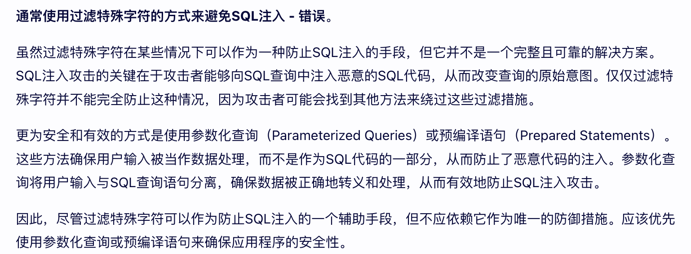

# Laravel面试题

>  1. [2021年PHP-Laravel面试题](https://blog.csdn.net/wuxianbing2012/article/details/113565388)

1、PHP的哪些语言特征，在合适的场景可以**显著**减少程序的内存开销？
 - [x] Generator
 - [ ] Trait
 - [ ] Type hint
 - [ ] SPL

**解析**：
- **Generator** 生成器具体详解可以参考: https://blog.51cto.com/chinalx1/2089327  
如果不考虑用Generator来实现协程，那么**Generator的一个最大的作用就是为含有大量数据的集合（当前这些数据集是规则的，就像range所返回的那些数据）的遍历节省空间**。  
- **Trait** 详细了解参考: https://blog.csdn.net/lemony521/article/details/78322652  
是一种代码复用技术，为PHP的单继承限制提供了一套灵活的代码复用机制。  
- **Type hint** 类型提示  
从PHP5开始，我们可以使用类型提示来指定定义函数时，函数接收的参数类型。如果在定义函数时，指定了参数的类型，那么当我们调用函数时，如果实参的类型与指定的类型不符，那么PHP会产生一个致命级别的错误(Catchable fatal error)。  
- **SPL** PHP标准库  
SPL，PHP 标准库（Standard PHP Library） ，从 PHP 5.0 起内置的组件和接口，并且从 PHP5.3 已逐渐的成熟。SPL 其实在所有的 PHP5 开发环境中被内置，同时无需任何设置。

2、对于PHP的自动加载描述正确的是
  - [ ] 自动加载函数只支持按Class / Interface / Trait 名加载，不能按 function名加载
  - [x] Composer的自动加载是通过 `__autoload` 函数实现的
  - [ ] 在文件顶部 use 的时候会载入对应的类
  - [x] 现在大多数类库都遵循 PSR0 规范

**解析：**
- **自动加载**的主要实现方式 __autoload 与 SPL 标准库提供的spl_autoload_register 函数两种，目前主流多是后一种。  
	两种方式的详解介绍可以参考:  
	- https://www.jb51.net/article/166979.htm  
	- https://www.jb51.net/article/31279.htm  
- **spl_autoload_register 函数用法就是装载自定义的加载函数，所以自动加载函数能按function名加载。**  
- **Composer的自动加载是通过 __autoload 函数实现的**  
- **在文件顶部 use 的时候会载入对应的类**  
	这里并不是，只用在具体调用类时才会加载类，lazy loading的意思。  
	可以参考:  https://blog.csdn.net/weixin_39610956/article/details/115148899  
- **现在大多数类库都遵循PSR0 规范**  
	PSR0实际是对实现自动加载的一种规范标准，PSR4是对PSR0的一些补充，**简单说目前大多项目都会使用autoload自动加载机制，那么遵循PSR0规范也是必然的**。

3、对于 Trait 描述正确的是
  - [x] 子类中引入的 Trait 里的方法会覆盖父类的方法
  - [ ] 在Trait中不可以调用引用类里的方法
  - [ ] 一个类无法同时引入两个包含相同方法的 Trait
  - [ ] 可以用来减少重复代码

**解析：**
关于Trait 的介绍在第一题中有链接可以阅读学习下。  
**子类中引入的 Trait 里的方法会覆盖父类的方法**  
这是正确的，Trait的优先级：`自身方法>trait的方法>继承的方法`
**在Trait中不可以调用引用类里的方法**  
**这是错误的！**

4、下列对 Composer 描述正确的是
  - [ ] 一般情况下应该把 PHPUnit 包放在 require 段
  - [x] composer.json 不仅可以指定依赖的 PHP 库，还能指定依赖的 PHP 扩展
  - [x] Library 类型的项目，需要把 composer.lock 文件提交到版本库中
  - [x] 拿到一个 Project 类型的项目时，需要通过 composer update 来安装对应的依赖包

**解释：**
- https://yiyan.baidu.com/share/NDqpGXqf3f

5、下列对 JWT 的描述正确的是
  - [ ] 有两个部分组成，分别是荷载(payload)和校验段
  - [x] Token不变的情况下，过期后不可以续期
  - [x] 可以不设置过期时间
  - [ ] 经常被用于传输加密的数据

**解释：**
- https://yiyan.baidu.com/share/2ASuOvLA9p

6、如果一个包遵循 Semantic Version，下列哪些版本升级大概率不会出问题：
  - [x] 1.0.0 -> 1.0.1
  - [x] 1.0.0 -> 1.1.0
  - [x] 1.0.0 -> 1.1.1
  - [ ] 1.0.0 -> 2.0.0

**解析：**
版本号通常由三部分组成：主版本号（MAJOR）、次版本号（MINOR）和补丁版本号（PATCH）。根据Semantic Versioning的规则：
- 主版本号：当你做了不兼容的API修改时，你需要更新主版本号。
- 次版本号：当你做了向下兼容的功能性新增时，你需要更新次版本号。
- 补丁版本号：当你做了向下兼容的问题修正时，你需要更新补丁版本号。

7、按照 RESTful 的规范，修改文章的展示隐藏应该使用哪一种路由
  - [ ] Post / article/{id}/hidden
  - [ ] Put /article/{id}
  - [ ] Patch /article/{id}
  - [x] Put / article/{id}/hidden

**解释：**
- https://yiyan.baidu.com/share/flaPZ7AAeO

在 RESTful 的规范中，修改资源的属性或状态通常应该使用 `PATCH` 或 `PUT` 方法，具体取决于你是否想替换整个资源还是只更新资源的部分属性。然而，对于修改文章的展示隐藏状态这样的操作，通常我们只会更新一个特定的属性而不是整个资源。
选项 `Put /article/{id}` 和 `Patch /article/{id}` 虽然方法合适（分别用于替换整个资源和更新部分属性），但路由本身并没有明确表达修改展示隐藏状态的意图。

选项 `Put / article/{id}/hidden` 使用了 `PUT` 方法，虽然路由尝试表达修改隐藏状态的意图，但如前所述，`PUT` 用于替换整个资源，而不是部分属性。

因此，为了遵循 RESTful 的最佳实践，并且清晰地表达我们的意图，我们应该选择后者。

8、通常使用过滤特殊字符的方式来避免SQL注入
  - [ ] 正确
  - [x] 错误

**解释：**

9、只要项目中使用 PDO 的 prepare 就能完全避免 SQL 注入
  - [ ] 正确
  - [x] 错误

**解释：**

10、CSRF 攻击是因为没有对用户输入进行转义导致的
  - [ ] 正确
  - [x] 错误

**解释：**

11、使用 Authentication Header 认证的API，用 LocalStorage 存储 Token 的项目不可能出现 CSRF 漏洞
  - [ ] 正确
  - [x] 错误

**解释：**

12、为了避免 XSS 攻击，需要在写入数据库前对其转义，从数据库读取后反转义
  - [ ] 正确
  - [x] 错误

**解释：**

13、允许来自跨域的请求，可以在哪层面设置
  - [ ] 浏览器JS
  - [x] Nginx
  - [x] PHP
  - [ ] Redis

**解释：**

14、OAuth 的 AccessToken 过期后只能让用户重新发起授权申请来获得新的 AccessToken
  - [ ] 正确
  - [x] 错误

**解释：**

15、下列对 Laravel 的描述正确的是
  - [ ] 在业务代码中应该通过 env() 函数读取 .env 文件中的值
  - [ ] 路由模型绑定 （Route Model Binding）是中间件实现的
  - [ ] Laravel 的 Session 使用的是 PHP 原生的 Session
  - [x] 按关联关系筛选数据可以用 with 或者 whereHas

**解释：**

16、你正在开发中的分支和 develop 分支出现冲突时
  - [ ] 冲突的出现是团队协作不好，需要组长协调好团队之间的工作
  - [ ] 通常是团队中水平较低的开发人员导致的，需要帮助他们提高Git水平
  - [x] 出现冲突时需要和相关的开发人员确认解决方案
  - [x] 在自己的分支上执行 rebase 命令以减少未来的冲突
  - [ ] 目前还没有遇到过

**解释：**

17、Git flow 中，release 分支可以从以下哪些分支开出
  - [ ] master
  - [x] develop
  - [ ] feature
  - [ ] bugfix
  - [ ] release

**解释：**

18、你在 PHP 工程中使用过以下哪些工具？
  - [x] PHPUnit
  - [x] PHP-CS-Fixer
  - [x] PHPStan

**解释：**

