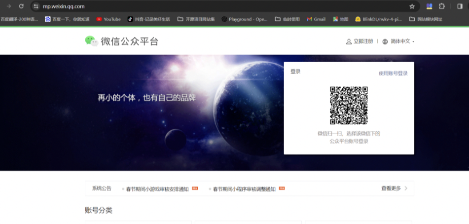
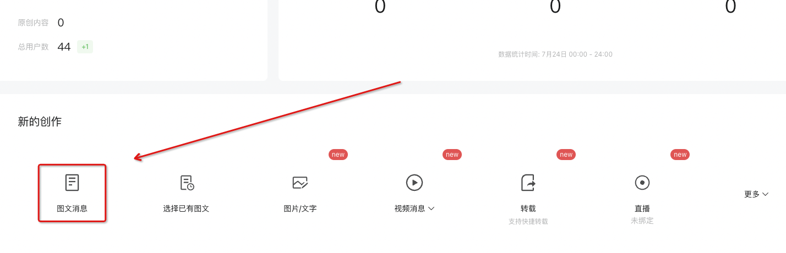
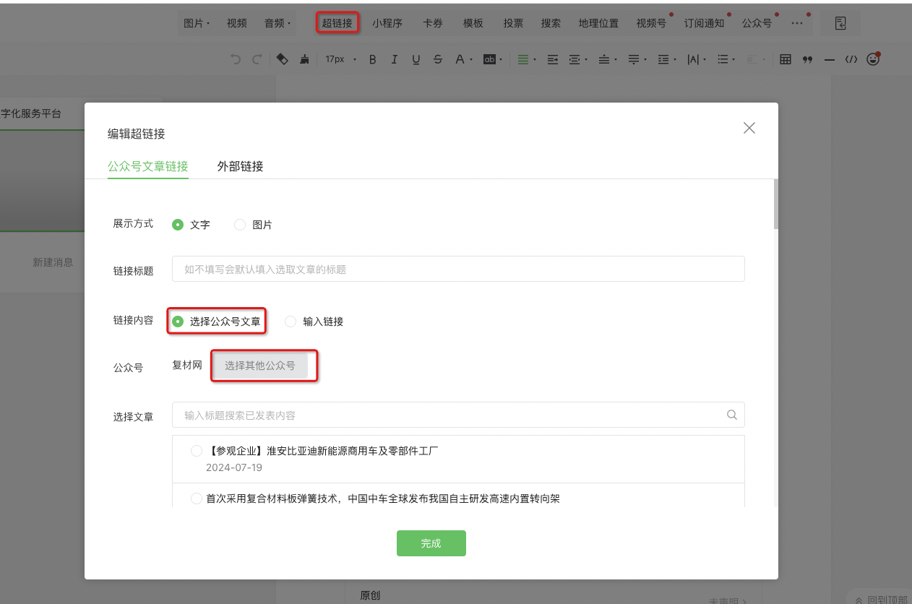
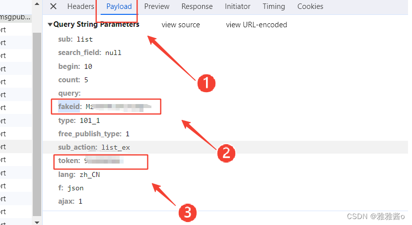

# 使用python爬取微信公众号文章

1、什么是爬虫？
在座的各位可能经常听到一个词，叫“爬虫”，这是一种能够悄无声息地将网站数据下载至本地设备的程序。利用爬虫，您无需亲自访问特定网站，逐个点击并手动下载所需数据。相反，爬虫能够全自动地为您完成这项任务，从网站上获取您所需的信息，并将其下载到您的设备上，而整个过程无需您进行任何干预。

2、搜索引擎就是一种爬虫
实际上，我们每天使用的搜索引擎就是一种爬虫技术的体现。它会不间断地在网络上爬取各个网站的数据，并将这些数据存储到搜索引擎的数据库中。当用户输入关键词进行搜索时，搜索引擎会从它的数据库中检索相关信息，并将结果返回给用户。

3、使用定向爬虫爬取微信公众号文章链接
当然，我们今天主要探讨的是定向爬虫，即专门针对某一特定网站进行爬取的工具。在爬取微信公众号文章这一领域，存在多种类型的爬虫，包括基于API的爬虫、模拟浏览器行为的爬虫、利用RSS订阅的爬虫，以及专用的爬虫工具等类型。我们今天探讨的主题就是模拟浏览器行为的爬虫，通过这个爬虫程序，我们可以轻松将某个公众号下的全部文章链接爬取到本地设备上。

#### 4、公众号文章定向爬虫程序解析

为了成功地从某一微信公众号上爬取文章，我们首先需要获取这些文章的网址链接。为此，我们可以使用一段Python脚本来帮助我们实现这一目标。接下来，我将展示这段脚本程序，以便大家了解如何获取微信公众号文章的链接。

```python
 
# -*- coding: UTF-8 -*-
import requests
import time
import pandas as pd
import math
import random
 
user_agent_list = [
    'Mozilla/5.0 (Windows NT 6.1; WOW64) AppleWebKit/537.36 (KHTML, like Gecko) '
    'Chrome/45.0.2454.85 Safari/537.36 115Browser/6.0.3',
    'Mozilla/5.0 (Macintosh; U; Intel Mac OS X 10_6_8; en-us) AppleWebKit/534.50 (KHTML, like Gecko) Version/5.1 Safari/534.50',
    'Mozilla/5.0 (Windows; U; Windows NT 6.1; en-us) AppleWebKit/534.50 (KHTML, like Gecko) Version/5.1 Safari/534.50',
    'Mozilla/5.0 (Windows NT 6.1; rv:2.0.1) Gecko/20100101 Firefox/4.0.1',
    'Mozilla/5.0 (Macintosh; Intel Mac OS X 10_7_0) AppleWebKit/535.11 (KHTML, like Gecko) Chrome/17.0.963.56 Safari/535.11',
    'Mozilla/5.0 (compatible; MSIE 9.0; Windows NT 6.1; Trident/5.0',
    'Mozilla/5.0 (Windows NT 6.1; rv:2.0.1) Gecko/20100101 Firefox/4.0.1',
    "Mozilla/5.0 (Linux; Android 6.0; Nexus 5 Build/MRA58N) AppleWebKit/537.36 (KHTML, like Gecko) Chrome/77.0.3865.75 Mobile Safari/537.36",
]
 
# 目标url
url = "https://mp.weixin.qq.com/cgi-bin/appmsg"
cookie = "这里换成你拷贝出来的cookie值"
 
# 使用Cookie，跳过登陆操作
 
data = {
    "token": "20884314",
    "lang": "zh_CN",
    "f": "json",
    "ajax": "1",
    "action": "list_ex",
    "begin": "0",
    "count": "5",
    "query": "",
    "fakeid": "这里进行替换",
    "type": "9",
}
headers = {
        "Cookie": cookie,
        "User-Agent": "Mozilla/5.0 (Linux; Android 6.0; Nexus 5 Build/MRA58N) AppleWebKit/537.36 (KHTML, like Gecko) Chrome/77.0.3865.75 Mobile Safari/537.36",
 
    }
content_json = requests.get(url, headers=headers, params=data).json()
count = int(content_json["app_msg_cnt"])
print(count)
page = int(math.ceil(count / 5))
print(page)
content_list = []
# 功能：爬取IP存入ip_list列表
 
for i in range(page):
    data["begin"] = i * 5
    user_agent = random.choice(user_agent_list)
    headers = {
        "Cookie": cookie,
        "User-Agent": user_agent,
 
    }
    ip_headers = {
        'User-Agent': user_agent
    }
    # 使用get方法进行提交
    content_json = requests.get(url, headers=headers, params=data).json()
    # 返回了一个json，里面是每一页的数据
    for item in content_json["app_msg_list"]:
        # 提取每页文章的标题及对应的url
        items = []
        items.append(item["title"])
        items.append(item["link"])
        t = time.localtime(item["create_time"])
        items.append(time.strftime("%Y-%m-%d %H:%M:%S", t))
        content_list.append(items)
    print(i)
    if (i > 0) and (i % 10 == 0):
        name = ['title', 'link', 'create_time']
        test = pd.DataFrame(columns=name, data=content_list)
        test.to_csv("url.csv", mode='a', encoding='utf-8')
        print("第" + str(i) + "次保存成功")
        content_list = []
        time.sleep(random.randint(60,90))
    else:
        time.sleep(random.randint(15,25))
 
name = ['title', 'link', 'create_time']
test = pd.DataFrame(columns=name, data=content_list)
test.to_csv("url.csv", mode='a', encoding='utf-8')
print("最后一次保存成功")
```

实际上，要让爬虫程序能够针对特定微信公众号爬取文章链接，你需要准备以下个参数：你的微信公众号的`cookies`、`token`以及`fakeid`。这三者缺一不可。这三个参数在程序中的位置如下：

如果你不知道如何获取这三个参数，你可以参看下面的操作。

#### 5、定向爬虫程序的三个关键参数获取

为了获取上面提到的这三个参数，首先你需要准备一个微信公众号，没有的话去注册一个。


在成功登录到微信公众平台后，在首页点击图文消息新建一篇公众号文章。



在公众号文章页内，点击”超链接“，在新页面内，公众号选择”选择其他公号“，在搜索栏搜素目标微信公众号，找到后点击确认。




接下来，按下键盘上的F12，在打开的开发者工具界面内，在顶部点击"network"菜单栏，新界面内点击"Fetch/XHR",这样就过滤了大量的信息。


返回至文章页面，在右下角找到并点击翻页按钮。此时，你会注意到右侧的开发者工具界面内容有所刷新。请从中选择最新出现的选项。随后，新页面将会弹出，请在此页面中选择“header”标签。进入“header”界面后，你可以查看到相关的cookies信息。请复制此处的cookies值以备后用。


随后切换到payload界面内，在这里你可以看到“fakeid”和“token”这两个参数对应的值，将其复制下来。

6、运行python爬虫程序
完成爬虫程序的三个参数设置之后，您就可以着手运行程序了。不过在此之前，请确保您的电脑上已经安装了Python环境。一旦Python环境配置妥当，您还需要安装程序运行所必需的几个依赖项。以下是具体的安装命令：
```bash
pip install requests pandas
```

接下来，请使用IDLE打开您刚刚完成三个参数设置的Python爬虫程序，并运行程序即可导出公众号历史文章列表。

